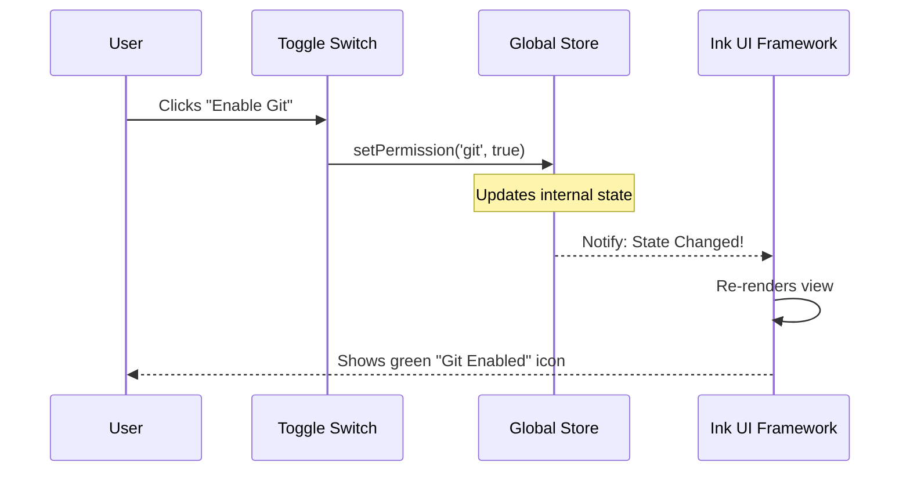

# Chapter 1: State Management

Welcome to the `claudeCode` codebase! If you are new here, you might be wondering: *How does the application remember what I just asked it to do?*

That is where **State Management** comes in. It is the very first concept we need to understand because it powers everything else.

## What is State Management?

Imagine you are cooking a complex meal. You have a mental list of ingredients you need, steps you've finished, and what is currently in the oven. That "mental list" is your **State**.

If you walked out of the kitchen and immediately forgot everything (the oven temp, the chopped onions, the recipe), disaster would strike!

In `claudeCode`, **State Management** acts as the application's brain. It is a central place (a "Store") that holds all the important information while the program is running.

### The Central Use Case: "Remembering the Mission"

Let's look at a simple scenario:
**You ask `claudeCode` to: "Fix the bug in `server.js`."**

To succeed, the application needs to store three things immediately:
1.  **The Task:** "Fix the bug in `server.js`."
2.  **Permissions:** Does the user allow us to edit files?
3.  **Status:** Is the AI currently thinking or working?

Without State Management, the moment the AI tried to open the file, it would forget why it opened it!

## Key Concepts

We keep our state organized in a "Store." You can think of the Store as a giant JavaScript object that looks like this:

```javascript
// A simplified view of the Global Store
{
  task: "Fix bug in server.js",
  isThinking: true,
  permissions: {
    canEditFiles: true,
    canRunCommands: false
  },
  activeTeammates: []
}
```

### 1. The Store (The Single Source of Truth)
We don't keep data scattered inside different files. We keep it all in one place. This way, if the **Permission System** changes a setting, the **UI** knows about it instantly.

### 2. Slices (Categories)
Because the application is big, we group data into categories (or "slices").
*   **Task State:** What are we doing?
*   **Settings:** How should the tool behave?
*   **Teammates:** Who is helping us? (More on this in [Teammates](16_teammates.md)).

## How to Use State

In our code, we use special functions (often called "hooks") to read from and write to the store.

### Reading Data
Here is how a component asks for the current task description.

```typescript
import { useTaskState } from './state/store';

function TaskDisplay() {
  // Read the current description from the store
  const { description } = useTaskState();

  return description; // Output: "Fix bug in server.js"
}
```
*Explanation: We simply call `useTaskState` to grab the data we need. If the task changes, this variable updates automatically.*

### Updating Data
When the user gives a new command, we need to update the store.

```typescript
import { setTaskDescription } from './state/actions';

function updateMission(newMission) {
  // Check if mission is valid
  if (newMission) {
    // This updates the Global Store immediately
    setTaskDescription(newMission); 
  }
}
```
*Explanation: We don't change variables directly. We call an "Action" function (`setTaskDescription`). This ensures the data is saved safely.*

## Under the Hood: How it Works

What happens when you change the state? It's a cycle.

1.  **Action:** A user or an internal process triggers a change.
2.  **Update:** The Store updates the specific value.
3.  **Notification:** The Store tells all parts of the app, "Hey, something changed!"
4.  **Reaction:** The UI re-draws itself to show the new data.

Here is a visual flow of updating a permission setting:



### Internal Implementation Code

Deep inside the `state/` directory, we define exactly what our state looks like. We use a library (similar to `jotai` or `zustand`) to create these data containers.

Here is a simplified look at how a state "atom" (a tiny piece of state) is created.

```typescript
// state/atoms.ts
import { atom } from 'state-library';

// 1. Define the default state for permissions
const defaultPermissions = {
  canEditFiles: false,
  canRunShell: false,
};

// 2. Create the state container
export const permissionsAtom = atom(defaultPermissions);
```
*Explanation: We define the starting values. `permissionsAtom` is now a shared container that can be imported anywhere in the app.*

Later, in [Chapter 8: Permission & Security System](08_permission___security_system.md), we will see how these exact atoms are used to block dangerous commands if the state says `false`.

## Why is this important for later?

Almost every feature we will build relies on this chapter:

*   **[Ink UI Framework](02_ink_ui_framework.md):** Needs state to know *what* to draw on the screen.
*   **[Cost Tracking](19_cost_tracking.md):** Needs state to keep a running total of tokens used.
*   **[Teammates](16_teammates.md):** Needs state to list which AI agents are currently active in the chat.

## Conclusion

You have learned that **State Management** is the memory of `claudeCode`. It is a single, central box where we keep track of tasks, settings, and permissions. By using "hooks," we can read this data or update it from anywhere in the application.

Now that we have data stored, we need a way to show it to the user.

[Next Chapter: Ink UI Framework](02_ink_ui_framework.md)

---

Generated by [Code IQ](https://github.com/adityasoni99/Code-IQ)