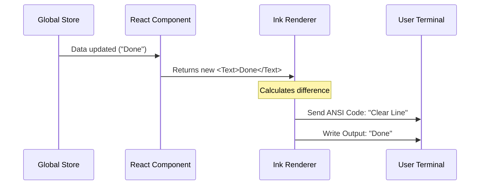

# Chapter 2: Ink UI Framework

In the previous [State Management](01_state_management.md) chapter, we learned how `claudeCode` remembers information (like "Fix the bug"). However, data sitting in memory is invisible.

Now, we need to answer the question: **How do we show this information to the user inside a terminal window?**

## What is the Ink UI Framework?

Usually, when you write a terminal script, you use `console.log`. The text prints, the screen scrolls down, and the old text is gone forever. This works for simple scripts, but it feels like using a typewriter.

`claudeCode` feels more like a modern app. It has:
*   Loading spinners that animate.
*   Text that changes color.
*   Layouts that stay in place while data updates.

We achieve this using **Ink**. Ink allows us to build terminal interfaces using **React** (the same technology used for websites), but instead of rendering HTML `<div>` tags, it renders text to your terminal output.

### The Central Use Case: "The Status Dashboard"

Imagine you gave the AI a task. You don't want a wall of scrolling text. You want a clean dashboard that stays at the bottom of the screen saying:

**[ Spinner ] Working on: Fix server.js...**

If the state changes from "Working" to "Done," the text should update instantly *without* printing a new line.

## Key Concepts

To build this UI, we use three main building blocks.

### 1. React Components
Just like building with LEGO bricks, we build the interface out of small, reusable pieces.
*   **`<Text>`**: Used for displaying words (like a `<span>` or `<p>` in HTML).
*   **`<Box>`**: Used for layout (like a `<div>`). It holds other components.

### 2. Flexbox Layouts
Since terminal windows can be any size, we can't use fixed positions. We use "Flexbox."
*   **Column:** Stacking items top-to-bottom.
*   **Row:** Placing items side-by-side.

### 3. Interactive Hooks
These allow the terminal to listen to your keyboard. For example, pressing "Arrow Up" to select a command in history.

## How to Use the Ink UI

Let's build our "Status Dashboard" using the data we stored in Chapter 1.

### Step 1: Basic Structure
Here is how we create a simple box with text.

```tsx
import React from 'react';
import { Box, Text } from 'ink';

function StatusDashboard() {
  return (
    <Box borderStyle="round" borderColor="green">
      <Text>System Online</Text>
    </Box>
  );
}
```
*Explanation: This draws a box with rounded corners and a green border. Inside, it says "System Online".*

### Step 2: Connecting to State
Now, let's make it dynamic. We will pull the "task description" from the [State Management](01_state_management.md) store.

```tsx
import { useTaskState } from './state/store';
import { Text, Box } from 'ink';

function CurrentTask() {
  // Grab the data from our Global Store
  const { description } = useTaskState();

  return (
    <Box padding={1}>
      <Text bold>Current Mission: </Text>
      <Text color="blue">{description}</Text>
    </Box>
  );
}
```
*Explanation: If `description` changes in the store, this component automatically re-runs ("re-renders") and updates the text in the terminal immediately.*

### Step 3: Layouts (Rows and Columns)
Let's put a "Spinner" next to the text. We need them side-by-side.

```tsx
import { Spinner } from '@inkjs/ui';

function LoadingBar() {
  return (
    <Box flexDirection="row" gap={1}>
      <Text color="green"><Spinner /></Text>
      <Text>Thinking...</Text>
    </Box>
  );
}
```
*Explanation: `flexDirection="row"` tells Ink to put the items next to each other, like books on a shelf. `gap={1}` adds a space between them.*

## Under the Hood: How it Works

How does React code turn into terminal characters? It uses a **Custom Renderer**.

When you change the state (e.g., update the task name), the following happens:

1.  **State Change:** The Store updates.
2.  **Re-render:** React calculates what the new UI should look like.
3.  **Diffing:** Ink compares the new UI to the old UI.
4.  **Painting:** Ink sends special control codes (ANSI codes) to the terminal to erase specific lines and write new ones.

Here is the flow:



### Internal Implementation Code

Deep in the `ui/` folder, we initialize the Ink instance. This is the entry point of the visual application.

```tsx
// ui/index.tsx
import { render } from 'ink';
import App from './App';

// This function starts the UI Framework
export function startUI() {
  // Mounts the React App to the terminal stdout
  render(<App />);
}
```

We also handle user input (keyboard presses) using the `useInput` hook. This is crucial for features requiring confirmation, which we will see in [Chapter 7: Shell Safety Checks](07_shell_safety_checks.md).

```tsx
import { useInput } from 'ink';

function InputHandler() {
  // Listen for keystrokes
  useInput((input, key) => {
    if (input === 'q') {
      // Exit the app if 'q' is pressed
      process.exit(0);
    }
  });

  return null; // This component renders nothing visible
}
```

## Why is this important for later?

The UI Framework is the "face" of every tool we will build:

*   **[Query Engine](03_query_engine.md):** The user types their question into an Ink `<TextInput>`.
*   **[WebSearchTool](12_websearchtool.md):** We display search results in a neat list using `<Box>` layouts.
*   **[Teammates](16_teammates.md):** We show avatars and names of different AI agents using colorful `<Text>` components.

## Conclusion

You have learned that the **Ink UI Framework** allows `claudeCode` to behave like a rich application rather than a simple script. By combining **React components** with our **State**, we can create interactive, updating dashboards right in the command line.

Now that we have a brain (State) and a face (UI), we need ears. How does the application understand what the user wants to do?

[Next Chapter: Query Engine](03_query_engine.md)

---

Generated by [Code IQ](https://github.com/adityasoni99/Code-IQ)