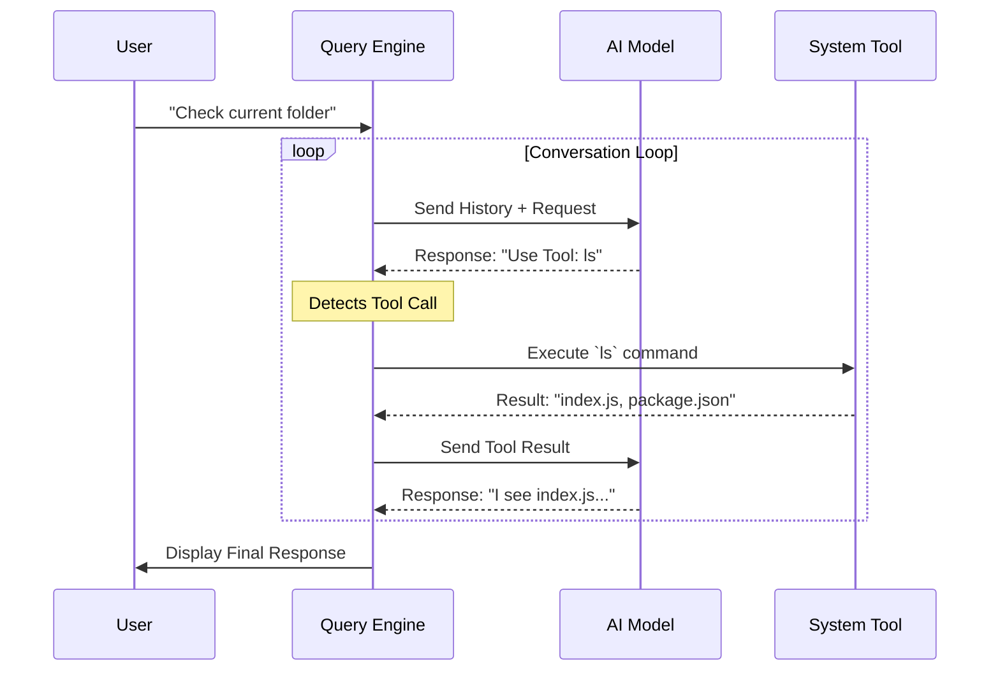

# Chapter 3: Query Engine

In the previous chapters, we built the application's memory in [State Management](01_state_management.md) and its face in the [Ink UI Framework](02_ink_ui_framework.md).

But right now, our application is like a person who can remember things and smile, but can't hold a conversation. If you type a question, nothing processes it.

Enter the **Query Engine**. This is the logic that connects user input to the AI model, decides what to do next, and keeps the conversation going.

## What is the Query Engine?

The Query Engine is the "Project Manager" of the application. It doesn't inherently know how to edit files or search the web. Instead, it coordinates everything.

Its job is to take your request, package it up with all the necessary context (history, permissions), send it to the AI (Claude), and then handle the AI's response—whether that response is a chat message or a command to run code.

### The Central Use Case: " The Conversation Loop"

Imagine you ask: **"Read `data.txt` and tell me what it says."**

Here is what the Query Engine must manage:
1.  **Package:** Grab your text and the current file path.
2.  **Send:** Send this to Claude.
3.  **Interpret:** Claude replies: "I need to run the `cat` command."
4.  **Execute:** The Engine runs the command.
5.  **Loop:** The Engine takes the *result* of the command and sends it *back* to Claude.
6.  **Finalize:** Claude replies: "The file contains a list of names." The Engine shows this to you.

Without the Query Engine, the AI would just stop after step 3, waiting for someone to run the command.

## Key Concepts

### 1. Context Assembly
Before we talk to the AI, we need to give it context. We can't just send "fix it." We need to send:
*   The conversation history (what we said before).
*   The current working directory.
*   The list of available tools (Can we edit files? Can we use Git?).

### 2. The Tool-Use Loop
This is the most critical part. Modern AIs don't just talk; they can "call functions."
*   If the AI replies with **Text**, the loop ends, and we show it to the user.
*   If the AI replies with a **Tool Call** (like "write file"), the Engine executes it and automatically feeds the result back into the chat.

### 3. Streaming
We don't want to wait 10 seconds for the whole answer. The Query Engine receives the answer in tiny chunks (tokens) so the [Ink UI Framework](02_ink_ui_framework.md) can display typing animations in real-time.

## How to Use the Query Engine

From a code perspective, using the engine is surprisingly simple because all the complexity is hidden inside.

We usually call a main function, often named `processUserMessage` or `submitQuery`.

### Starting a Request
Here is how the UI triggers the engine when the user hits "Enter."

```typescript
import { queryEngine } from './engine';

async function handleUserSubmit(userText) {
  // 1. Start the engine with the user's text
  const response = await queryEngine.submit({
    text: userText,
    mode: 'auto' // Let the AI decide what to do
  });
  
  return response;
}
```
*Explanation: We pass the user's text into the engine. The engine takes over control until the task is done or it needs user input.*

### Handling the Stream
To show text appearing in real-time, we listen to events.

```typescript
queryEngine.on('chunk', (token) => {
  // Update the UI via State Management
  updateCurrentResponse((prev) => prev + token);
});
```
*Explanation: Every time the AI generates a word, the engine emits a 'chunk' event. We grab that word and add it to our display.*

## Under the Hood: How it Works

The Query Engine is essentially a `while` loop that keeps running until the AI says "I'm done."

Let's trace the flow when a user says "List files."

1.  **Input:** User types "List files".
2.  **API Call:** Engine sends "List files" + Context to Claude.
3.  **Decision:** Claude returns a structured message: `ToolCall: ls`.
4.  **Execution:** Engine detects the tool call, runs `ls` in the terminal.
5.  **Feedback:** The terminal output ("file1.txt, file2.txt") is captured.
6.  **Loop:** Engine sends the output *back* to Claude as a "Tool Result".
7.  **Final:** Claude reads the result and generates text: "You have two files..."

Here is the visual flow:



### Internal Implementation Code

The core of the engine is a recursive function (a function that calls itself).

```typescript
// engine/loop.ts

async function runLoop(messages) {
  // 1. Send current history to the AI
  const response = await callClaudeAPI(messages);

  // 2. Check if the AI wants to use a tool
  if (response.hasToolCall) {
    // Execute the tool (e.g., run a shell command)
    const result = await executeTool(response.toolName, response.args);
    
    // 3. Add result to history and LOOP AGAIN
    const newHistory = [...messages, response, result];
    return runLoop(newHistory); // <--- Recursion
  }

  // 4. If no tool, we are done. Return the text.
  return response.text;
}
```
*Explanation: This simplified code shows the heartbeat of `claudeCode`. It calls the API. If the API asks for a tool, it runs it and calls `runLoop` again immediately. It only stops when `response.hasToolCall` is false.*

### Safety Checks
Before executing the tool in step 2 above, the Engine checks with the **Permission System**.

```typescript
// Inside executeTool...
import { checkPermission } from './security';

async function executeTool(name, args) {
  // Ask: Is this safe?
  const isAllowed = await checkPermission(name);

  if (!isAllowed) {
    throw new Error("User denied permission");
  }

  // Run the tool...
}
```
*Explanation: This ensures the AI doesn't delete files without your permission. We will cover this in detail in [Chapter 8: Permission & Security System](08_permission___security_system.md).*

## Why is this important for later?

The Query Engine is the hub. It connects to almost every other chapter:

*   **[FileEditTool](04_fileedittool.md):** The Engine is what calls this tool when the AI wants to write code.
*   **[Git Integration](05_git_integration.md):** When you ask to "commit changes," the Engine drives this process.
*   **[Context Management](14_model_context_protocol__mcp_.md):** The Engine gathers data using the MCP standard before every request.

## Conclusion

You have learned that the **Query Engine** is the active brain of the application. It manages the delicate dance between the user, the AI model, and the computer's tools. It uses a loop to perform complex tasks step-by-step without the user needing to type constantly.

But what happens when the Engine decides it needs to modify your code? It hands that job off to a specialist.

[Next Chapter: FileEditTool](04_fileedittool.md)

---

Generated by [Code IQ](https://github.com/adityasoni99/Code-IQ)