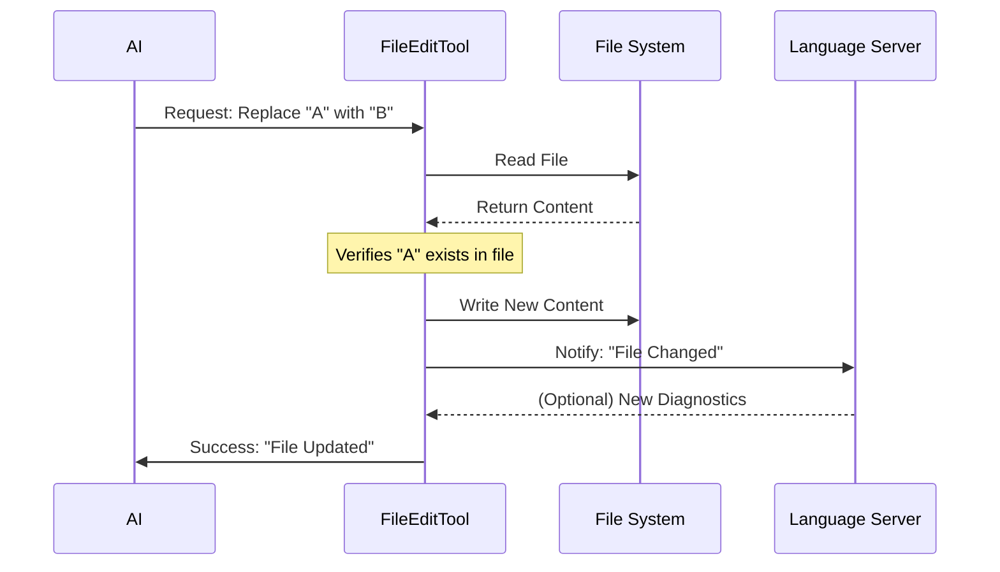

# Chapter 4: FileEditTool

In the previous [Query Engine](03_query_engine.md) chapter, we built the "brain" that decides *what* to do. But a brain without hands cannot build anything.

Now, we introduce the **FileEditTool**. This is the application's "hands." It is the specific tool `claudeCode` uses to modify your source code safely and accurately.

## What is the FileEditTool?

Writing code into a file seems simple: just open the file and paste the new code, right?

**Wrong.** In a complex software project, "just pasting" is dangerous.
*   What if the file is 5,000 lines long? Rewriting the whole thing wastes time and AI tokens.
*   What if the file changed while the AI was thinking?
*   What if the new code has a syntax error?

The **FileEditTool** solves these problems. It performs **surgical, atomic edits**. Instead of rewriting a whole file, it locates a specific piece of code and swaps it out for a new version.

### The Central Use Case: "The Port Change"

Imagine you ask `claudeCode`: **"Change the server port from 3000 to 8080 in `config.js`."**

The Query Engine will decide to call the FileEditTool. The tool's job is to:
1.  Open `config.js`.
2.  Find exactly where "3000" is defined.
3.  Change it to "8080" without touching anything else.
4.  Save the file.

## Key Concepts

### 1. Search and Replace (The "Patch" Method)
We don't use line numbers (e.g., "Change line 50") because line numbers change easily. Instead, we use **Context**.
To change a file, the AI must provide:
*   **`old_string`**: The exact code that currently exists.
*   **`new_string`**: The code we want to put there.

If the tool cannot find `old_string`, it refuses to edit. This prevents the AI from editing the wrong part of the file.

### 2. Staleness Checks
Before editing, the tool checks: "Has this file been modified by the user since I last read it?"
If you saved the file manually while the AI was thinking, the tool stops and asks for a refresh. This prevents "overwrite conflicts."

### 3. LSP Integration (The Spellchecker)
LSP (Language Server Protocol) is the technology that powers VS Code's red squiggly lines.
When `FileEditTool` saves a file, it notifies the LSP system. If the edit caused a massive syntax error, the system knows immediately.

## How to Use FileEditTool

The `FileEditTool` is primarily designed to be called by the AI, not by humans directly. However, understanding its input structure helps you understand how the AI thinks.

### The Input Structure
The AI sends a JSON object like this to the tool:

```json
{
  "file_path": "src/config.js",
  "old_string": "const PORT = 3000;",
  "new_string": "const PORT = 8080;"
}
```

### Example: Handling the Edit
Here is a simplified view of how the tool handles that input in code.

```typescript
// A simplified mental model of the tool's logic
function performEdit(input) {
  const fileContent = readFile(input.file_path);

  // 1. Safety Check: Does the text actually exist?
  if (!fileContent.includes(input.old_string)) {
    throw new Error("Cannot find the code to replace!");
  }

  // 2. Perform the swap
  const newContent = fileContent.replace(
    input.old_string, 
    input.new_string
  );
  
  // 3. Save
  writeFile(input.file_path, newContent);
}
```
*Explanation: The core logic is a strict search-and-replace. If the `old_string` is essentially a "safety key". If it doesn't match, the lock won't open.*

## Under the Hood: How it Works

When the FileEditTool runs, a lot happens in a split second to ensure safety.

1.  **Permission Check:** Do we have rights to write to this folder?
2.  **Validation:** logic checks if the file exists and isn't too large (e.g., over 1GB).
3.  **Read:** It reads the file from the disk.
4.  **Locate:** It tries to find the `old_string`.
5.  **Write:** It saves the new content.
6.  **Notify:** It tells VS Code and the LSP "I changed this file!"

Here is the flow:



### Internal Implementation Code

Let's look at the real code in `tools/FileEditTool/FileEditTool.ts`.

#### 1. Defining the Tool
We use a builder pattern to define the tool's behavior and help text.

```typescript
// tools/FileEditTool/FileEditTool.ts
export const FileEditTool = buildTool({
  name: 'EditFile', 
  // Helps the AI know when to use this
  description: 'A tool for editing files',
  
  // The shape of data the AI must provide
  inputSchema: inputSchema(), 
  
  // The function that runs when called
  async call(input, context) { ... } 
});
```

#### 2. The Validation Phase
Before writing, we ensure the file is safe to touch.

```typescript
// Inside validateInput function
const { size } = await fs.stat(fullFilePath);

// 1. Block massive files to prevent memory crashes
if (size > MAX_EDIT_FILE_SIZE) {
  return { 
    result: false, 
    message: 'File is too large to edit.' 
  };
}

// 2. Check for "Staleness" (User modified file recently?)
if (lastWriteTime > lastRead.timestamp) {
  return { result: false, message: 'File was modified externally.' };
}
```
*Explanation: This code acts as a bouncer. If the file is too big (over 1GB) or if the user changed it behind the AI's back, it rejects the edit immediately.*

#### 3. The Execution Phase
This is where the actual writing happens. Note the notification to other systems.

```typescript
// Inside the call() function

// 1. Calculate the new file content
// getPatchForEdit handles the find-and-replace logic
const { updatedFile } = getPatchForEdit({ ... });

// 2. Write to disk
writeTextContent(absoluteFilePath, updatedFile, encoding);

// 3. Notify the Language Server (LSP)
const lspManager = getLspServerManager();
if (lspManager) {
  // Tells the intelligent engine code has changed
  lspManager.changeFile(absoluteFilePath, updatedFile);
}
```
*Explanation: After writing the bytes to disk, we manually trigger `lspManager`. This ensures that if the AI introduced a bug, the system knows about it instantly so it can warn the user.*

## Why is this important for later?

The FileEditTool is the foundation for any persistent change:

*   **[Git Integration](05_git_integration.md):** Once the FileEditTool saves a file, we usually want to commit that change to Git.
*   **[Permission & Security System](08_permission___security_system.md):** This tool checks the security rules before every single write.
*   **[Auto-Mode Classifier](10_auto_mode_classifier.md):** The classifier uses the diffs generated by this tool to decide if the task is complete.

## Conclusion

You have learned that the **FileEditTool** is a precise instrument. It doesn't just "dump" code into a file; it verifies context, checks for conflicts, and integrates with the development environment to ensure stability.

Now that we have modified the code, we need to save our progress safely.

[Next Chapter: Git Integration](05_git_integration.md)

---

Generated by [Code IQ](https://github.com/adityasoni99/Code-IQ)