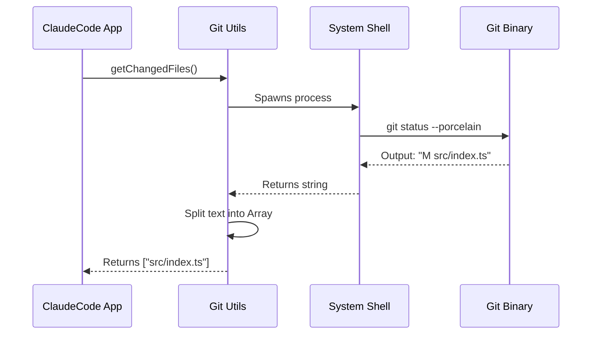

# Chapter 5: Git Integration

In the previous [FileEditTool](04_fileedittool.md) chapter, we gave `claudeCode` the "hands" to modify your code files. But anyone who has written code knows that saving a file is only half the battle.

The other half is **Version Control**.

If the AI makes a mistake, we need to be able to undo it. If the AI makes 10 changes, we might want to group them into a "Commit." This is where **Git Integration** comes in.

## What is Git Integration?

Git is complex. It involves branches, remotes, staging areas, and sometimes complex folder structures called "worktrees."

If we just blindly ran `git` commands in the terminal, we might crash if the user doesn't have Git installed, or if we are inside a folder that isn't actually a repository.

The **Git Integration** module is a set of utilities that answers three critical questions safely:
1.  **"Where am I?"** (Are we inside a Git repo?)
2.  **"What changed?"** (Which files did the AI just edit?)
3.  **"Is it safe?"** (Are there uncommitted changes we might overwrite?)

### The Central Use Case: "The Context Check"

Imagine you ask `claudeCode`: **"Summarize my recent changes."**

To answer this, the application needs to:
1.  Find the root of your project (where the `.git` folder lives).
2.  Run a "diff" to see what looks different from the last commit.
3.  Return that list to the [Query Engine](03_query_engine.md).

Without this integration, the AI is blind to the project's history.

## Key Concepts

### 1. The Git Root (The Anchor)
Every Git project has a "root" folder. This is where the hidden `.git` directory lives.
*   If you are in `src/utils/`, the root is `../../`.
*   We must find this root before running any commands, or Git will get confused.

### 2. Worktrees (The Virtual Window)
Advanced Git users use "Worktrees." This allows you to have the *same* project checked out in two different folders at the same time (e.g., one folder for "main" branch, one for "feature" branch).
Our integration handles this automatically so the AI doesn't need to know the difference.

### 3. Dirty vs. Clean
*   **Clean:** All changes are saved and committed.
*   **Dirty:** You have modified files that haven't been committed yet.
Knowing this is crucial for the [Auto-Mode Classifier](10_auto_mode_classifier.md) to decide if a task is "finished."

## How to Use Git Utilities

These utilities are usually helper functions imported from `utils/git.ts`.

### Finding the Root
Here is how we determine where the project starts.

```typescript
import { findGitRoot } from './utils/git';
import { getCwd } from './utils/cwd';

// 1. Get where the user currently is
const currentDir = getCwd();

// 2. Walk up the tree to find .git
const root = findGitRoot(currentDir);

if (!root) {
  console.log("Not in a git repository!");
}
```
*Explanation: `findGitRoot` looks at the current folder. If it doesn't see `.git`, it checks the parent folder, and so on, until it hits the top of the drive.*

### Checking for Changes
The AI often needs to know if the workspace is "Clean."

```typescript
import { getIsClean } from './utils/git';

async function checkStatus() {
  // Returns true if no files are modified
  const isSafe = await getIsClean();

  if (!isSafe) {
    console.log("You have uncommitted changes.");
  }
}
```
*Explanation: This wraps `git status`. If Git returns output, it means things are "dirty" (changed).*

### Getting the Remote URL
To help the AI understand the project context (e.g., "Is this an open source library?"), we fetch the remote origin.

```typescript
import { getRemoteUrl } from './utils/git';

async function identifyProject() {
  const url = await getRemoteUrl();
  // Output might be: "git@github.com:anthropics/claude-code.git"
  return url;
}
```

## Under the Hood: How it Works

The Git Integration doesn't reinvent Git. It acts as a **translator**. It runs standard Git commands in the background and converts the messy text output into nice JavaScript objects.

Here is the flow when checking for changed files:



### Internal Implementation Code

Let's look at `utils/git.ts` to see how this is actually implemented.

#### 1. Walking the Tree (Finding Root)
This logic mimics how Git itself finds the root directory.

```typescript
// utils/git.ts (Simplified)
import { statSync } from 'fs';
import { join, dirname } from 'path';

const findGitRootImpl = (startPath) => {
  let current = startPath;
  
  // Loop until we reach the top of the drive
  while (current !== root) {
    // Check if .git exists here
    if (pathExists(join(current, '.git'))) {
      return current; // Found it!
    }
    // Move up one level
    current = dirname(current);
  }
  return null; 
};
```
*Explanation: We use a `while` loop to climb up the directory tree. We check for `.git` at every step. We use `memoization` (caching) in the real code so we don't scan the hard drive every single time.*

#### 2. Resolving Worktrees
This is the complex part. Sometimes `.git` isn't a folder—it's a **file** pointing to another folder.

```typescript
// utils/git.ts (Simplified Logic)

const resolveCanonicalRoot = (gitRoot) => {
  // Read the .git item
  const gitContent = readFileSync(join(gitRoot, '.git'), 'utf-8');

  // If it starts with "gitdir:", it's a worktree!
  if (gitContent.startsWith('gitdir:')) {
    // Follow the path to find the REAL git folder
    const realPath = gitContent.slice(8).trim();
    return resolve(realPath);
  }
  
  return gitRoot;
};
```
*Explanation: Worktrees are basically "shortcuts." This function follows the shortcut to find where the actual history database is stored. This ensures that even if you are in a worktree, the AI knows the real project identity.*

#### 3. Executing Git Commands
We use a helper to run the commands safely without crashing the app if Git fails.

```typescript
// utils/git.ts
import { execFileNoThrow } from './execFileNoThrow.js';

export const getChangedFiles = async () => {
  // Run: git status --porcelain (machine readable format)
  const { stdout } = await execFileNoThrow(
    'git', 
    ['status', '--porcelain']
  );

  // Turn text output into an array of filenames
  return stdout
    .split('\n')
    .map(line => line.substring(3)); // Remove "M  " prefix
}
```
*Explanation: `execFileNoThrow` ensures that if Git crashes or isn't installed, our app doesn't crash. It just returns an error code which we handle gracefully.*

## Why is this important for later?

This chapter provides the "Project Awareness" needed for advanced features:

*   **[BashTool](06_bashtool.md):** While Git Integration handles *status* checks, `BashTool` is what allows the AI to actually run `git commit` or `git push`.
*   **[Permission & Security System](08_permission___security_system.md):** We use `findGitRoot` to limit the AI's access. We might say: "You can only edit files *inside* this Git repository."
*   **[Teammates](16_teammates.md):** Teammates (other AI agents) use the git commit history to understand what you were working on yesterday.

## Conclusion

You have learned that **Git Integration** is the compass of `claudeCode`. It tells the application where the project boundaries are, what has been changed, and how to navigate complex setups like worktrees.

Now that the AI can read the project status, what if it needs to run other commands? Like listing directories, installing packages, or running tests?

[Next Chapter: BashTool](06_bashtool.md)

---

Generated by [Code IQ](https://github.com/adityasoni99/Code-IQ)