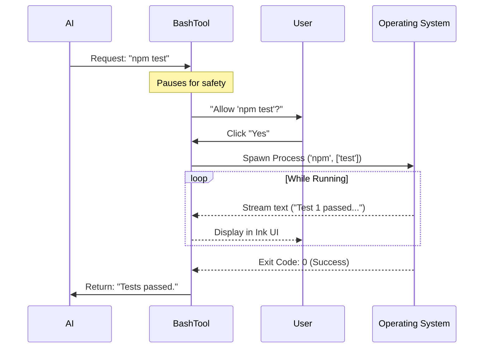

# Chapter 6: BashTool

In the previous [Git Integration](05_git_integration.md) chapter, we gave `claudeCode` the ability to understand the history of your project. It can look around and see what files have changed.

But seeing isn't enough. To be a true coding assistant, the AI needs to **act**. It needs to run tests, install packages, start servers, and move files.

Enter the **BashTool**.

## What is the BashTool?

The `BashTool` is the application's ability to type into your terminal.

If the **[FileEditTool](04_fileedittool.md)** is the "Text Editor," the **BashTool** is the "Command Line." It allows the AI to execute shell commands just like a human developer would.

### The Central Use Case: "Running the Tests"

Imagine you ask: **"Run the tests and fix any errors."**

1.  The AI writes code using the FileEditTool.
2.  Now it needs to verify the fix.
3.  The AI calls **BashTool** with the command `npm test`.
4.  The tool runs the command on your computer.
5.  The tool captures the output (e.g., "Tests Failed") and sends it back to the AI.
6.  The AI reads the error and tries again.

Without `BashTool`, the AI is just a text generator. With it, the AI becomes an operator.

## Key Concepts

### 1. The Shell Session
When you open a terminal, you are in a "Session." If you type `cd src`, you stay in the `src` folder for the next command.
`BashTool` tries to maintain this continuity so the AI doesn't get lost.

### 2. Standard Output (stdout) vs. Standard Error (stderr)
Computers speak in two streams:
*   **stdout:** "Here is the normal result." (e.g., File list).
*   **stderr:** "Something went wrong." (e.g., File not found).
The `BashTool` captures both so the AI knows exactly what happened.

### 3. Exit Codes
Every command finishes with a number.
*   **0:** Success!
*   **Non-Zero (1, 127, etc.):** Failure.
The AI uses this number to quickly decide if its plan worked or failed.

## How to Use BashTool

Like the other tools, this is designed for the AI to use. However, understanding the input helps you understand the AI's behavior.

### The Input Structure
The AI sends a simple object containing the command string.

```json
{
  "command": "npm install lodash"
}
```

### Example: Chained Commands
The AI can run multiple things at once using standard shell syntax.

```json
{
  "command": "cd src && ls -la"
}
```
*Explanation: This moves into the `src` folder AND lists the files immediately. This is efficient because it saves a "turn" in the conversation.*

## Under the Hood: How it Works

When the AI requests a command, we don't just blindly run it. We have to spawn a "Sub-process."

1.  **Request:** AI sends `npm test`.
2.  **Permission:** (Crucial!) The app asks the user: "Allow this?" (More on this in [Shell Safety Checks](07_shell_safety_checks.md)).
3.  **Spawn:** Node.js creates a new process on your OS.
4.  **Stream:** As the test runs, text flows from the process to our application.
5.  **Result:** When the process stops, we package the text and exit code back to the AI.

Here is the flow:



### Internal Implementation Code

The implementation involves two parts: the **Execution Logic** (running the code) and the **Permission UI** (asking the user).

#### 1. The Permission Request (UI)
Before running anything, we mount a React component to ask the user. This uses the **[Ink UI Framework](02_ink_ui_framework.md)**.

```tsx
// components/permissions/BashPermissionRequest.tsx (Simplified)

export function BashPermissionRequest({ command, onDone }) {
  // Show the user what command is about to run
  return (
    <PermissionDialog title="Bash command">
      <Text color="yellow">{command}</Text>
      <Text>Do you want to proceed?</Text>
      {/* Handled by user input keys (y/n) */}
      <Select 
        options={['yes', 'no']} 
        onSelect={(val) => val === 'yes' ? onDone() : exit()} 
      />
    </PermissionDialog>
  );
}
```
*Explanation: This component intercepts the flow. The tool cannot proceed until `onDone()` is called, which only happens if the user selects 'yes'.*

#### 2. Executing the Command
Once approved, we use Node.js utilities to run the command.

```typescript
// tools/BashTool/runCommand.ts (Simplified)
import { spawn } from 'child_process';

function runShellCommand(commandString) {
  // Spawn the command in a shell
  const child = spawn(commandString, { shell: true });

  let output = '';

  // Listen for data chunks
  child.stdout.on('data', (data) => {
    output += data; // Collect the text
  });

  // Return a promise that resolves when the command finishes
  return new Promise((resolve) => {
    child.on('close', (code) => {
      resolve({ output, exitCode: code });
    });
  });
}
```
*Explanation: We use `spawn` with `{ shell: true }`. We accumulate all the text into `output`. When the process emits `close`, we finish the job.*

### Handling Long-Running Commands
What if the user runs a server that never stops?
The `BashTool` includes a **timeout mechanism**. If a command runs too long without output, or if the user presses `Ctrl+C`, the tool sends a "kill signal" to the process to stop it cleanly.

## Why is this important for later?

The BashTool is powerful, but power brings danger.

*   **[Shell Safety Checks](07_shell_safety_checks.md):** We can't let the AI run `rm -rf /` by accident. The next chapter explains how we analyze commands *before* running them.
*   **[Auto-Mode Classifier](10_auto_mode_classifier.md):** The classifier looks at the `Exit Code` from the BashTool to decide if the AI completed its task successfully.
*   **[Computer Use](18_computer_use.md):** Later, we will see how this concept expands beyond the terminal to controlling the mouse and keyboard.

## Conclusion

You have learned that the **BashTool** is the "hands" of `claudeCode` in the terminal. It spawns processes, captures output, and reports back to the AI. It transforms the AI from a passive advisor into an active participant in your development workflow.

However, giving an AI access to your terminal requires strict supervision. How do we ensure it acts safely?

[Next Chapter: Shell Safety Checks](07_shell_safety_checks.md)

---

Generated by [Code IQ](https://github.com/adityasoni99/Code-IQ)