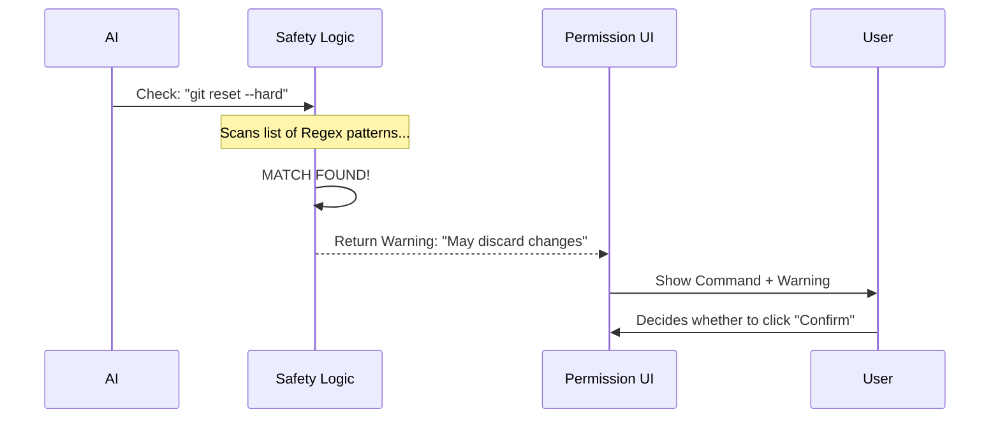

# Chapter 7: Shell Safety Checks

In the previous [BashTool](06_bashtool.md) chapter, we gave `claudeCode` the ability to run terminal commands. We described this as giving the AI "hands."

But imagine if those hands tried to delete your entire hard drive by accident.

Power requires control. This is where **Shell Safety Checks** come in. Before any command is actually executed by the **BashTool**, it must pass through a safety inspection to see if it is potentially destructive.

## What are Shell Safety Checks?

This module acts like a **Safety Inspector** at a construction site. It doesn't necessarily stop work, but it flags dangerous activities and puts up a big yellow "CAUTION" sign.

It is a logic layer that sits between the AI's request and the actual execution of the command. It analyzes the text of the command to predict if it will cause permanent data loss.

### The Central Use Case: "The Accidental Reset"

Imagine you ask `claudeCode`: **"Start over and clean up the git history."**

The AI, trying to be helpful, might decide to run:
`git reset --hard HEAD~1`

This command is destructive. It permanently deletes your recent work.

**Without Safety Checks:** The command runs, and your work vanishes instantly.
**With Safety Checks:** The system detects the pattern `git reset --hard` and pauses. It displays: **"Warning: This command may discard uncommitted changes."**

## Key Concepts

To understand how we catch these commands, we use two simple concepts.

### 1. Pattern Matching (Regex)
We don't "understand" the command deeply like a compiler. Instead, we look for "dangerous shapes" in the text using **Regular Expressions (Regex)**.
*   **Safe:** `ls`, `cd`, `echo`
*   **Suspicious:** `rm`, `truncate`, `drop`

### 2. The Warning Label
This system doesn't usually *block* the user (you might actually *want* to delete files). Instead, it generates a **Warning Message**. This message is passed to the **[Ink UI Framework](02_ink_ui_framework.md)** so it can be displayed in red or yellow text when asking for permission.

## How to Use Safety Checks

This feature is essentially a function that takes a string (the command) and returns a warning (or null).

### Example: Checking a Command

```typescript
import { getDestructiveCommandWarning } from './safety';

const command = "rm -rf ./src";

// 1. Ask the safety inspector
const warning = getDestructiveCommandWarning(command);

if (warning) {
  // Output: "Note: may recursively force-remove files"
  console.log("DANGER:", warning);
} else {
  console.log("This command looks safe.");
}
```
*Explanation: We pass the scary command into the function. Because it contains `rm -rf`, the function recognizes a destructive pattern and returns a specific warning message.*

## Under the Hood: How it Works

When the **BashTool** receives a command from the AI, the flow looks like this:

1.  **Input:** AI suggests `git push --force`.
2.  **Scan:** The Safety Check loops through a list of known "bad" patterns.
3.  **Match:** It finds that `push` + `--force` matches a rule.
4.  **Flag:** It returns the warning text associated with that rule.
5.  **UI:** The Permission Screen displays the command *plus* the warning.

Here is the visual flow:



### Internal Implementation Code

The core of this logic is located in `tools/BashTool/destructiveCommandWarning.ts`. It is surprisingly simple: it is mostly a list of rules.

#### 1. Defining the Rules
We create a list of objects. Each object has a `pattern` (what to look for) and a `warning` (what to say).

```typescript
// tools/BashTool/destructiveCommandWarning.ts

const DESTRUCTIVE_PATTERNS = [
  {
    // Looks for "rm" followed by "-rf"
    pattern: /(^|[;&|\n]\s*)rm\s+-[a-zA-Z]*f/,
    warning: 'Note: may force-remove files',
  },
  {
    // Looks for "git reset --hard"
    pattern: /\bgit\s+reset\s+--hard\b/,
    warning: 'Note: may discard uncommitted changes',
  },
  // ... dozens of other patterns
];
```
*Explanation: We use Regular Expressions (the weird looking characters like `\b` and `\s+`). These allow us to match `rm -rf` even if there are extra spaces or flags involved.*

#### 2. The Check Function
This function simply loops through the list above.

```typescript
export function getDestructiveCommandWarning(command: string) {
  // Loop through every known dangerous pattern
  for (const { pattern, warning } of DESTRUCTIVE_PATTERNS) {
    
    // If the command matches the pattern...
    if (pattern.test(command)) {
      return warning; // Return the specific warning text
    }
  }
  
  return null; // Looks safe!
}
```
*Explanation: This is a classic "Early Return" function. The moment it finds *one* dangerous thing, it stops looking and reports it. If it finishes the loop without finding anything, it returns `null`.*

## Why is this important for later?

This chapter acts as the first line of defense in our security strategy:

*   **[Permission & Security System](08_permission___security_system.md):** The next chapter handles the *enforcement* of these checks. While Chapter 7 detects the danger, Chapter 8 decides whether to block it entirely or ask the user.
*   **[BashTool](06_bashtool.md):** This logic is imported directly into the BashTool so every command is scanned.
*   **[Auto-Mode Classifier](10_auto_mode_classifier.md):** If `claudeCode` is running in "Auto Mode" (without user supervision), these safety checks might automatically pause the execution to prevent the AI from doing damage while you are away from the keyboard.

## Conclusion

You have learned that **Shell Safety Checks** are essentially a spell-checker for danger. By using a list of known destructive patterns (Regex), we can catch commands like `rm -rf` or `git reset` before they happen. This gives the user a chance to say "No!"

But detecting danger is only one part of security. How do we manage the overall permissions of the application? Can we restrict the AI to read-only mode?

[Next Chapter: Permission & Security System](08_permission___security_system.md)

---

Generated by [Code IQ](https://github.com/adityasoni99/Code-IQ)