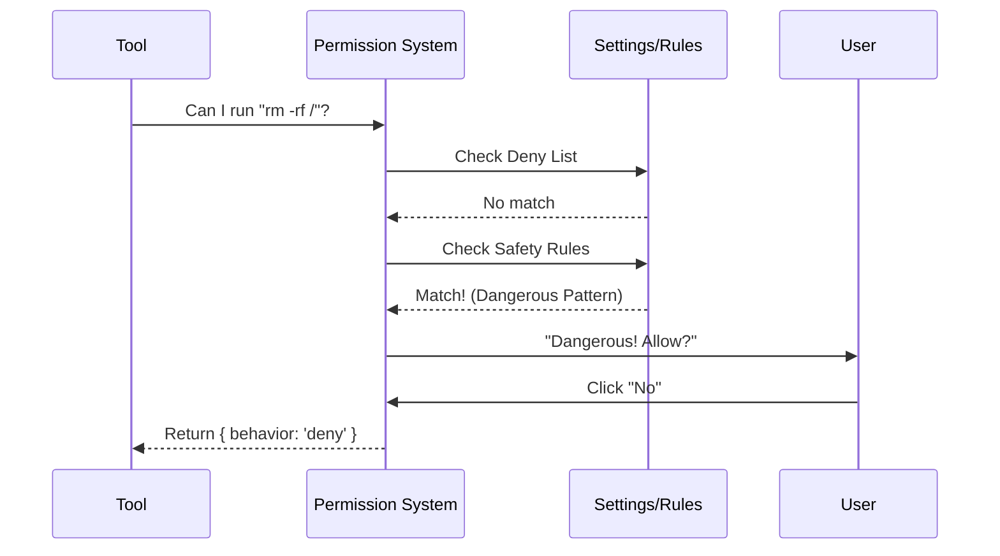

# Chapter 8: Permission & Security System

In the previous [Shell Safety Checks](07_shell_safety_checks.md) chapter, we learned how to detect dangerous commands like `rm -rf`. But detecting danger is only the first step.

Now we face a bigger challenge: **Enforcement.**

If the AI wants to read a file, should we let it? If it wants to run a test, do we need to ask the user? If we ask for every single action, the user will get annoyed. If we never ask, the user might lose data.

The **Permission & Security System** is the judge. It balances safety with convenience.

## What is the Permission System?

Think of the Permission System as a **Bouncer** at a club. Every time a tool (like the [BashTool](06_bashtool.md) or [FileEditTool](04_fileedittool.md)) wants to do something, it must show its ID to the bouncer.

The bouncer has three responses:
1.  **Allow:** "Go right in." (The command runs immediately).
2.  **Deny:** "You're banned." (The command is blocked).
3.  **Ask:** "I need to check with the manager." (The user sees a popup to confirm).

### The Central Use Case: "The Auto-Refactor"

Imagine you ask `claudeCode` to: **"Rename the `utils` folder to `helpers` and update all imports."**

This might involve 20 different file edits.
*   **Without a Permission System:** You have to click "Yes" 20 times.
*   **With a Permission System:** You approve the first "Rename" action, and the system automatically allows the subsequent file updates because they are part of the same trusted task.

## Key Concepts

### 1. The Decision Triad
Every permission check returns a **Decision** object. It tells the application what to do next.

*   **`behavior`**: Can be `'allow'`, `'deny'`, or `'ask'`.
*   **`message`**: If denied or asking, this explains why (e.g., "This command deletes files").

### 2. Modes (The "Threat Level")
The system operates in different modes stored in [State Management](01_state_management.md):
*   **Strict (Default):** Ask for almost everything.
*   **Auto:** Use an internal AI classifier to guess if an action is safe. If it looks like a standard "read" or "test" command, allow it. If it looks weird, ask.

### 3. Persistent Rules
If you tell the system "Always allow `npm test`," it remembers this. These rules are saved so you don't have to repeat yourself. We will learn exactly how these strings work in [Rule Matching](09_rule_matching.md).

## How to Use the System

The [Query Engine](03_query_engine.md) typically handles this process automatically before running a tool. However, understanding the flow is vital.

### Checking Permissions
Here is how a tool asks for permission before running.

```typescript
import { hasPermissionsToUseTool } from './utils/permissions';

async function executeTool(toolName, input) {
  // 1. Ask the system: Can I do this?
  const decision = await hasPermissionsToUseTool(toolName, input);

  // 2. Handle the decision
  if (decision.behavior === 'deny') {
    throw new Error("Permission Denied");
  }

  if (decision.behavior === 'ask') {
    // Show UI prompt to user (Block until they click Yes/No)
    await promptUser(decision.message); 
  }

  // 3. If we get here, we can run the tool
  runTool(input);
}
```
*Explanation: We never run the tool immediately. We await the decision. If the behavior is 'ask', the code pauses completely until the human intervenes.*

## Under the Hood: How it Works

The permission logic is a waterfall. It checks a series of conditions in order. If any condition is met, it stops and returns the decision.

1.  **Deny Rules:** Is this specific command on a blacklist? -> **DENY**
2.  **Ask Rules:** Did the user specifically say "Always ask me about this"? -> **ASK**
3.  **Safety Checks:** Did [Shell Safety Checks](07_shell_safety_checks.md) flag this as dangerous? -> **ASK**
4.  **Auto Mode:** Is Auto Mode on? Does the AI classifier think this is safe? -> **ALLOW**
5.  **Default:** If nothing else matches -> **ASK**

Here is the flow:



### Internal Implementation Code

The core logic lives in `utils/permissions/permissions.ts`.

#### 1. The Main Check Function
This function orchestrates the waterfall logic described above.

```typescript
// utils/permissions/permissions.ts

export async function hasPermissionsToUseTool(tool, input, context) {
  // 1. Check strict Deny rules first
  const denyRule = getDenyRuleForTool(context, tool);
  if (denyRule) {
    return { behavior: 'deny', message: 'Denied by rule' };
  }

  // 2. Check if the tool asks for permission logic
  // (e.g. BashTool checks if command is "dangerous")
  const toolResult = await tool.checkPermissions(input, context);
  
  // 3. If the tool itself says "Ask", we might override it in Auto Mode
  if (toolResult.behavior === 'ask') {
    return handleAutoMode(toolResult, context);
  }

  return toolResult;
}
```
*Explanation: We check strict rules first. Then we ask the tool itself (e.g., the BashTool checks its regex patterns). Finally, we check if "Auto Mode" can bypass the prompt.*

#### 2. Auto Mode Logic
This is where the magic happens. If the user enabled Auto Mode, we try to avoid disturbing them.

```typescript
// utils/permissions/permissions.ts (Simplified)

async function handleAutoMode(result, context) {
  const { mode } = context.toolPermissionContext;

  // If we are in 'auto' mode...
  if (mode === 'auto') {
    // ...and the action isn't visibly dangerous
    if (!result.isDestructive) {
      // Auto-approve it!
      return { 
        behavior: 'allow', 
        decisionReason: 'Auto Mode Enabled' 
      };
    }
  }
  
  // Otherwise, stick with the original decision (Ask)
  return result;
}
```
*Explanation: If the tool returns 'ask', but Auto Mode is on, we upgrade the decision to 'allow', UNLESS it was flagged as destructive.*

#### 3. The User Interface
If the final decision is `'ask'`, we render a React component using the [Ink UI Framework](02_ink_ui_framework.md). This happens in `BashPermissionRequest.tsx`.

```tsx
// components/permissions/BashPermissionRequest.tsx

export function BashPermissionRequest({ command, onDone, onReject }) {
  // Show the command to the user
  return (
    <PermissionDialog title="Bash Command">
      <Text>{command}</Text>
      
      <Select 
        options={['Yes', 'Yes (Always allow this)', 'No']} 
        onSelect={(choice) => {
           if (choice === 'No') onReject();
           else onDone(); // Proceed
        }} 
      />
    </PermissionDialog>
  );
}
```
*Explanation: This dialog halts the application. It waits for the user to select an option. If they choose "Always allow," we save a new rule to the State Store.*

## Why is this important for later?

The Permission System is the backbone of trust in `claudeCode`.

*   **[Rule Matching](09_rule_matching.md):** In the next chapter, we will learn the specific syntax (like `npm test:*`) used to create persistent permission rules.
*   **[Auto-Mode Classifier](10_auto_mode_classifier.md):** We mentioned "Auto Mode" uses AI to decide if a command is safe. Chapter 10 explains how that AI classifier works.
*   **[Feature Gating](13_feature_gating.md):** Some permissions might be locked behind feature flags or enterprise settings.

## Conclusion

You have learned that the **Permission & Security System** acts as a gatekeeper. It checks every tool request against a set of rules, modes, and safety checks. It ensures that the powerful tools we built in previous chapters (FileEdit, Bash, Git) are used safely and responsibly.

But how exactly does the system know that `npm test` matches the rule `npm *`?

[Next Chapter: Rule Matching](09_rule_matching.md)

---

Generated by [Code IQ](https://github.com/adityasoni99/Code-IQ)