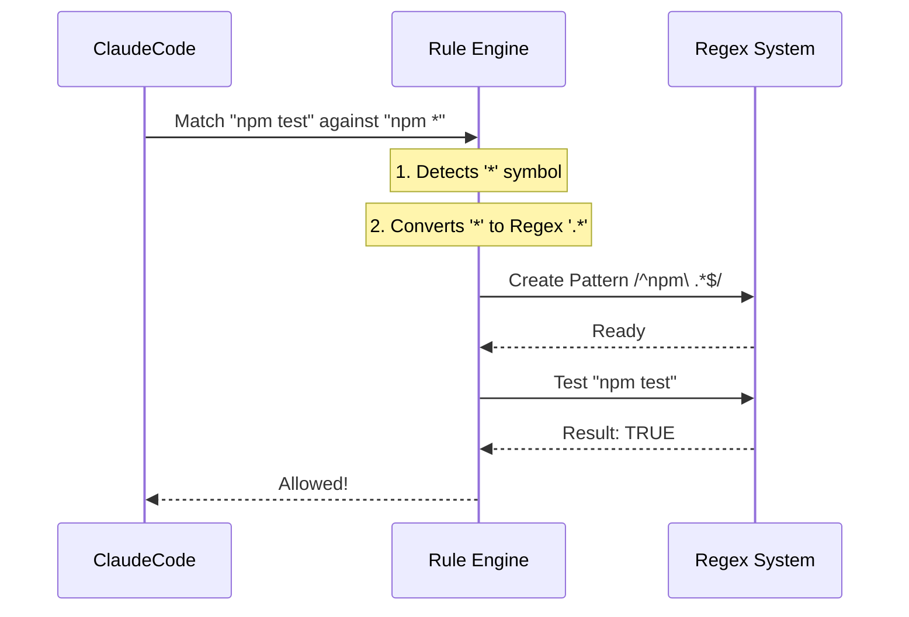

# Chapter 9: Rule Matching

In the previous [Permission & Security System](08_permission___security_system.md) chapter, we built a "Bouncer" that stops the AI from running commands without your approval.

However, if you had to approve *every single command* individually, you would quickly get frustrated.
*   "Allow `ls -la`?" -> Yes.
*   "Allow `ls src`?" -> Yes.
*   "Allow `ls tests`?" -> Yes.

We need a way to say: **"Just allow all `ls` commands!"**

This is where **Rule Matching** comes in. It is the logic that allows us to create flexible permission slips using patterns instead of exact text.

## What is Rule Matching?

Rule Matching is the engine that compares a specific command (like `git commit -m "wip"`) against a stored permission rule (like `git commit *`).

If they match, the [Permission & Security System](08_permission___security_system.md) grants access immediately, saving you from a pop-up.

### The Central Use Case: "The Test Runner"

Imagine you are working on a project where you run tests frequently. You want to allow the AI to run any test command.

The AI might try:
1.  `npm test`
2.  `npm test -- --watch`
3.  `npm test utils.js`

Instead of saving three separate rules, we want to save **one** rule: `npm test *`.

## Key Concepts

We support three types of matching logic.

### 1. Exact Match
This is the strictest rule.
*   **Rule:** `npm test`
*   **Matches:** `npm test`
*   **Does NOT Match:** `npm test --watch` (Too long!)

### 2. Prefix Match (Legacy)
This uses a special syntax with a colon: `command:*`. It means "Start with this, and match anything after."
*   **Rule:** `npm:*`
*   **Matches:** `npm install`, `npm test`, `npm start`

### 3. Wildcard Match (The Modern Standard)
This uses the asterisk `*` character. It is the most flexible.
*   **Rule:** `git commit *`
*   **Matches:** `git commit -m "fix"`, `git commit -am "wip"`
*   **Does NOT Match:** `git push` (The start is wrong)

## How to Use Rule Matching

While this logic mostly runs inside the system, understanding it helps you write better rules in your configuration.

### Example: Wildcard Logic
Here is how the code decides if a command fits a pattern.

```typescript
import { matchWildcardPattern } from './utils/ruleMatching';

// 1. Define a flexible rule
const rule = "npm run *";

// 2. The AI wants to run this:
const command = "npm run build --prod";

// 3. Check if it matches
const isAllowed = matchWildcardPattern(rule, command);

console.log(isAllowed); // Output: true
```
*Explanation: The function sees the `*` and understands it can be replaced by "build --prod".*

### Example: Escaping
What if your filename actually contains a star? Like `image_*.png`? You can escape it with a backslash `\`.

```typescript
// Rule: Delete strict patterns only
const rule = "rm image_\\*.png"; 

// Command matching the literal character '*'
const cmd = "rm image_*.png";

console.log(matchWildcardPattern(rule, cmd)); // Output: true
```
*Explanation: Because we used `\\*`, the system treats the star as a normal text character, not a magic wildcard.*

## Under the Hood: How it Works

Computers don't natively understand "wildcards." They understand **Regular Expressions** (Regex).

Our Rule Matching engine is essentially a **Translator**. It takes your simple human-readable rule (`git *`) and converts it into a complex Regex pattern (`^git\ .*$`) that the computer can execute.

Here is the flow of a match request:



### Internal Implementation Code

The magic happens in `utils/permissions/shellRuleMatching.ts`.

#### 1. Categorizing the Rule
First, we look at the string to decide which strategy to use.

```typescript
// utils/permissions/shellRuleMatching.ts

export function parsePermissionRule(rule: string) {
  // 1. Is it the old syntax? (e.g. "npm:*")
  if (permissionRuleExtractPrefix(rule)) {
    return { type: 'prefix', prefix: ... };
  }

  // 2. Does it have stars? (e.g. "npm *")
  if (hasWildcards(rule)) {
    return { type: 'wildcard', pattern: rule };
  }

  // 3. Otherwise, it must be exact
  return { type: 'exact', command: rule };
}
```
*Explanation: This function acts as a sorter. It checks for specific characters (`:*` or `*`) to determine the complexity of the rule.*

#### 2. The Wildcard Translator
This is the most complex part. We need to turn `*` into `.*` (Regex for "anything"), but we must be careful not to break real stars (escaped ones).

```typescript
// utils/permissions/shellRuleMatching.ts

export function matchWildcardPattern(pattern, command) {
  // 1. Hide "real" stars (escaped ones like \*)
  // We swap them with a placeholder text so Regex doesn't get confused
  let processed = pattern.replace(/\\\*/g, 'ESCAPED_STAR_PLACEHOLDER');

  // 2. Escape other Regex symbols (like brackets or dots)
  // This ensures '.' matches a dot, not "any character"
  const escaped = escapeRegexCharacters(processed);

  // 3. Turn the "magic" stars into Regex wildcards
  const withWildcards = escaped.replace(/\*/g, '.*');
  
  // 4. Create the Regex object
  const regex = new RegExp(`^${withWildcards}$`, 's');
  
  return regex.test(command);
}
```
*Explanation: We perform a "Search and Replace" dance. We hide the literal stars, convert the magic stars to regex code, and then build a RegExp object to do the final check.*

## Why is this important for later?

Rule Matching is a small utility that makes the entire system usable.

*   **[BashTool](06_bashtool.md):** Every time the BashTool runs, it checks these rules first.
*   **[Auto-Mode Classifier](10_auto_mode_classifier.md):** In the next chapter, we will discuss "Auto Mode." Rule Matching is one of the ways Auto Mode determines if it can proceed without bothering the user.
*   **[Feature Gating](13_feature_gating.md):** Sometimes we use matching to enable features for specific file types (e.g., `*.ipynb`).

## Conclusion

You have learned that **Rule Matching** is the translator between human intentions ("Allow git commands") and computer logic (Regex). By supporting **Exact**, **Prefix**, and **Wildcard** matches, we make the security system flexible enough for real-world development.

Now that we can verify commands against rules, what if we want the AI to run entirely on its own, making decisions without us?

[Next Chapter: Auto-Mode Classifier](10_auto_mode_classifier.md)

---

Generated by [Code IQ](https://github.com/adityasoni99/Code-IQ)