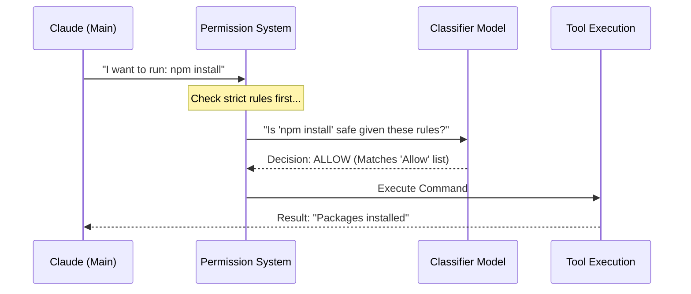

# Chapter 10: Auto-Mode Classifier

In the previous [Rule Matching](09_rule_matching.md) chapter, we learned how to create strict permission rules like "Always allow `npm test`."

But software development is messy. Sometimes, you want to allow a command *only if* it is part of a specific context. For example: "Allow file edits, but only if they are just fixing typos in documentation."

Strict rules cannot handle "context." Strict rules don't understand "typos."

Enter the **Auto-Mode Classifier**. This is a smaller, faster AI model that acts as a judge. It looks at the tool the main AI wants to use and decides: *"Is this safe enough to auto-approve, or should I ask the human?"*

## What is the Auto-Mode Classifier?

The **Auto-Mode Classifier** is a safety guard that runs inside the [Permission & Security System](08_permission___security_system.md).

When you run `claudeCode` in "Auto Mode" (allowing it to work without constant supervision), we still need to prevent disasters. We can't just turn off all security. Instead, we use a secondary AI model to classify every action into two buckets:
1.  **Safe / Routine:** Go ahead. (e.g., Reading a file, running a read-only script).
2.  **Risky / Ambiguous:** Stop and ask the user. (e.g., Deleting a database, pushing to the `main` branch).

### The Central Use Case: "The Documentation Fix"

Imagine you ask: **"Fix the spelling errors in all `.md` files."**

The main AI (Claude) decides to edit 50 files.
*   **Without Classifier:** You have to click "Approve" 50 times.
*   **With Classifier:** The classifier looks at the edits. It sees they are just text changes in markdown files. It classifies this as "Safe" based on your settings. It auto-approves all 50 edits. You sit back and relax.

## Key Concepts

### 1. The "YOLO" Model
Internally, we sometimes call this the "YOLO" (You Only Look Once) classifier. It is designed to be fast. It doesn't write code; it just looks at a proposed action and gives a Thumbs Up or Thumbs Down.

### 2. The Three Rule Categories
To help the classifier make decisions, we give it instructions in three categories:
*   **Allow:** Things that are definitely okay (e.g., "Editing tests").
*   **Soft Deny:** Things that require a human check (e.g., "Editing configuration files").
*   **Environment:** Facts about your project (e.g., "This is a sandbox environment, so deleting files is fine").

### 3. The Critique System
Writing rules for an AI is hard. How do you know if your rule is clear?
`claudeCode` includes a **Critique Handler**. You can write draft rules, and the system will analyze them and tell you if they are ambiguous or dangerous.

## How to Use the Classifier

As a user, you interact with the classifier by configuring its rules in your settings file. `claudeCode` provides CLI tools to help you manage this.

### Viewing Default Rules
You can see what rules the AI already follows by running a command.

```typescript
// cli/handlers/autoMode.ts
import { getDefaultExternalAutoModeRules } from '../../utils/permissions/yoloClassifier.js';

function showDefaults() {
  // Get the hardcoded default safety rules
  const defaults = getDefaultExternalAutoModeRules();
  
  // Print them to the screen
  console.log(defaults);
}
```
*Explanation: This outputs the baseline logic, such as "Always allow reading files" or "Ask before using the BrowserTool."*

### Critiquing Your Rules
This is the most powerful feature. If you add a custom rule like *"Allow edits to non-critical files,"* the Critique system might warn you: *"What defines a 'critical' file? Be more specific."*

```bash
# In your terminal
claude auto-mode critique
```

This triggers a check where a separate AI model reads your rules and "grades" them.

## Under the Hood: How it Works

When the [Query Engine](03_query_engine.md) proposes a tool call, the request is sent to the Classifier.

1.  **Context Assembly:** We gather the tool name, arguments, and your custom rules.
2.  **Prompting:** We send this to the Classifier Model.
3.  **Decision:** The model returns a classification.
4.  **Enforcement:** If "Safe," the tool runs. If "Risky," the [Ink UI Framework](02_ink_ui_framework.md) prompts you for permission.

Here is the flow:



### Internal Implementation Code

The code in `cli/handlers/autoMode.ts` manages the configuration and the "Critique" feature.

#### 1. Merging Configuration
We respect your custom rules over the defaults.

```typescript
// cli/handlers/autoMode.ts (Simplified)

export function autoModeConfigHandler() {
  const userConfig = getAutoModeConfig();
  const defaults = getDefaultExternalAutoModeRules();

  // If user defined specific sections, use them. 
  // Otherwise use defaults.
  const effectiveRules = {
    allow: userConfig.allow || defaults.allow,
    soft_deny: userConfig.soft_deny || defaults.soft_deny,
    environment: userConfig.environment || defaults.environment,
  };
  
  writeRules(effectiveRules);
}
```
*Explanation: This logic ensures that if you write custom "Allow" rules, they completely replace the default "Allow" rules, giving you full control.*

#### 2. The Critique Logic
We use the [Query Engine](03_query_engine.md)'s ability to call models (`sideQuery`) to review your rules.

```typescript
// cli/handlers/autoMode.ts (Simplified)

const CRITIQUE_PROMPT = 
  "You are an expert reviewer. Critique these rules for clarity...";

export async function autoModeCritiqueHandler() {
  // 1. Get the rules the user wrote
  const userRules = getAutoModeConfig();

  // 2. Ask the AI to judge them
  const response = await sideQuery({
    system: CRITIQUE_PROMPT,
    messages: [{ 
      role: 'user', 
      content: JSON.stringify(userRules) 
    }]
  });

  // 3. Print the AI's advice
  console.log(response.text);
}
```
*Explanation: We are using AI to debug AI configuration! `sideQuery` is a helper that sends a one-off message to an LLM without messing up the main conversation history.*

## Why is this important for later?

The Auto-Mode Classifier allows `claudeCode` to scale from a simple chatbot to an autonomous agent.

*   **[NotebookEditTool](11_notebookedittool.md):** In the next chapter, we look at editing Jupyter Notebooks. The classifier helps determine if running a notebook cell is safe.
*   **[AgentTool](15_agenttool.md):** When we start using "Agents" (sub-workers), the classifier monitors their behavior to ensure they don't go rogue.
*   **[Cost Tracking](19_cost_tracking.md):** Every time the classifier runs, it uses tokens. We need to track the cost of these "safety checks."

## Conclusion

You have learned that the **Auto-Mode Classifier** is the "Super-Ego" of the application. It provides intelligent, context-aware permission checks that strict rules cannot handle. It allows the user to define high-level policies (like "Trust me in the `dev` folder") while staying safe.

Now that we understand how the AI decides *if* it can edit files, let's look at a very specific type of file that requires special handling: Data Science Notebooks.

[Next Chapter: NotebookEditTool](11_notebookedittool.md)

---

Generated by [Code IQ](https://github.com/adityasoni99/Code-IQ)