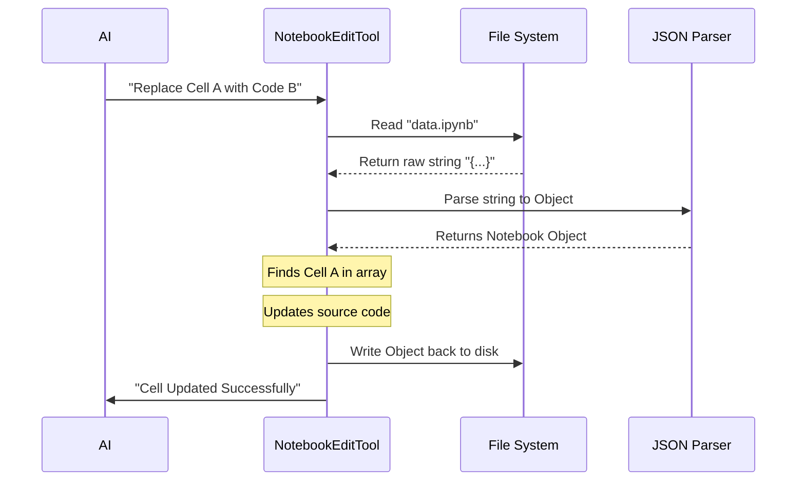

# Chapter 11: NotebookEditTool

In the previous [Auto-Mode Classifier](10_auto_mode_classifier.md) chapter, we discussed how the AI decides if an action is safe enough to perform automatically.

Now, we need to talk about a specific type of file that is notoriously difficult for AI to edit: **Jupyter Notebooks (`.ipynb`)**.

If you use [FileEditTool](04_fileedittool.md) on a standard text file, it works perfectly. But if you try to use standard text editing tools on a Notebook, you will likely corrupt the file and break the JSON structure.

Enter the **NotebookEditTool**. This is a specialized instrument designed to perform surgery on Data Science notebooks without breaking them.

## What is the NotebookEditTool?

To a human, a Jupyter Notebook looks like a document with text and code blocks.
To a computer, a `.ipynb` file is actually a giant, messy **JSON object**.

If you change one comma in the wrong place in that JSON file, the entire notebook becomes unreadable by Jupyter.

The **NotebookEditTool** solves this by treating the file as a **Structure**, not just a string of text. It parses the JSON, finds the specific "Cell" you want to change, updates it safely, and saves the file back to disk.

### The Central Use Case: "Fixing the Experiment"

Imagine you are a Data Scientist. You have a notebook `experiments.ipynb` with 50 cells.
**You ask `claudeCode`: "Update the plotting code in the third cell to use Seaborn instead of Matplotlib."**

The tool needs to:
1.  Open `experiments.ipynb`.
2.  Navigate specifically to **Cell #3**.
3.  Swap the code inside that cell.
4.  Leave the other 49 cells (and their output images) completely untouched.

## Key Concepts

### 1. The Cell
In a notebook, content is divided into chunks called **Cells**.
*   **Code Cells:** Python code that runs.
*   **Markdown Cells:** Text for documentation.

The tool operates at the **Cell Level**, not the line level.

### 2. Cell ID
Every cell has a unique identifier (e.g., `"cell-8472"`). This allows the AI to target a specific block of code even if you move other cells around.

### 3. Edit Modes
Because notebooks are structured lists, we support three specific actions:
*   **Replace:** "Change the code inside this cell."
*   **Insert:** "Add a new cell after this one."
*   **Delete:** "Remove this cell entirely."

## How to Use NotebookEditTool

This tool is used automatically by the AI when it detects a `.ipynb` extension. However, understanding the input helps you understand how the AI "thinks" about your notebooks.

### The Input Structure
The AI sends a structured command telling the tool exactly which block to modify.

```json
{
  "notebook_path": "analysis/data.ipynb",
  "edit_mode": "replace",
  "cell_id": "83j2-s9d1",
  "new_source": "import seaborn as sns\nsns.histplot(data)"
}
```
*Explanation: The AI specifies the file, the specific cell ID to target, and the new code to inject.*

### Example: Inserting a New Cell
If the AI wants to add documentation, it uses the `insert` mode.

```json
{
  "notebook_path": "analysis/data.ipynb",
  "edit_mode": "insert",
  "cell_type": "markdown",
  "new_source": "# Data Analysis Section"
}
```
*Explanation: This adds a new markdown header into the notebook list.*

## Under the Hood: How it Works

The process is different from editing a normal text file. We must Load -> Parse -> Modify -> Save.

1.  **Read:** The tool reads the raw file content.
2.  **Validate:** It checks if the file is valid JSON (not corrupted).
3.  **Parse:** It converts the text into a JavaScript Object (the Notebook structure).
4.  **Locate:** It loops through the `cells` array to find the matching ID.
5.  **Modify:** It updates that specific object in the array.
6.  **Write:** It converts the whole object back to a string and saves it.

Here is the visual flow:



### Internal Implementation Code

Let's look at `tools/NotebookEditTool/NotebookEditTool.ts` to see how we handle this safely.

#### 1. Validation Logic
Before we do anything, we ensure we are working with the right file type.

```typescript
// tools/NotebookEditTool/NotebookEditTool.ts (Simplified)

async validateInput({ notebook_path, edit_mode }) {
  // 1. Check extension
  if (!notebook_path.endsWith('.ipynb')) {
    return { result: false, message: 'Must be a .ipynb file' };
  }

  // 2. Read file to ensure it exists
  const content = readFileSync(notebook_path);
  
  // 3. Ensure it is valid JSON
  if (!isValidJSON(content)) {
    return { result: false, message: 'Notebook is corrupted' };
  }
}
```
*Explanation: We reject the request immediately if the file isn't a notebook or if the JSON is broken. This prevents us from making a bad file worse.*

#### 2. The Modification Logic
This is the core "surgery." We load the JSON, find the array index, and swap the data.

```typescript
// Inside the call() function

// 1. Parse the file content into an object
const notebook = JSON.parse(fileContent);

// 2. Find the index of the cell we want to change
const cellIndex = notebook.cells.findIndex(c => c.id === cell_id);

// 3. Perform the edit (Replace example)
if (edit_mode === 'replace') {
  // Update the source code
  notebook.cells[cellIndex].source = new_source;
  
  // Clear old outputs (graphs/logs) since code changed
  notebook.cells[cellIndex].outputs = [];
}
```
*Explanation: Notice how we clear `outputs`. If you change code, the old graph is now outdated, so we remove it to keep the notebook clean.*

#### 3. Saving the Result
Finally, we write the file back to disk.

```typescript
// Saving the file
import { writeTextContent } from '../../utils/file';

// 1. Convert object back to text (with nice indentation)
const updatedContent = JSON.stringify(notebook, null, 1);

// 2. Write to disk
writeTextContent(fullPath, updatedContent);

// 3. Notify State Management that file changed
updateFileHistoryState(fullPath);
```
*Explanation: We use `JSON.stringify` to turn our object back into the text format that Jupyter expects.*

## Why is this important for later?

The NotebookEditTool is a great example of a "Specialized Tool."

*   **[WebSearchTool](12_websearchtool.md):** In the next chapter, we will see another specialized tool that doesn't edit files, but retrieves information from the outside world.
*   **[Feature Gating](13_feature_gating.md):** Since not every developer uses Python, this tool might be hidden or disabled for users who only work in JavaScript.
*   **[Permission & Security System](08_permission___security_system.md):** Just like `FileEditTool`, this tool must pass security checks before writing to your disk.

## Conclusion

You have learned that the **NotebookEditTool** allows `claudeCode` to safely edit Jupyter Notebooks. Instead of treating them as text files, it respects their internal JSON structure, ensuring that cells are updated cleanly without corrupting the document.

Now that we can edit code and notebooks, what if the AI needs information it doesn't have? What if it needs to look up documentation online?

[Next Chapter: WebSearchTool](12_websearchtool.md)

---

Generated by [Code IQ](https://github.com/adityasoni99/Code-IQ)