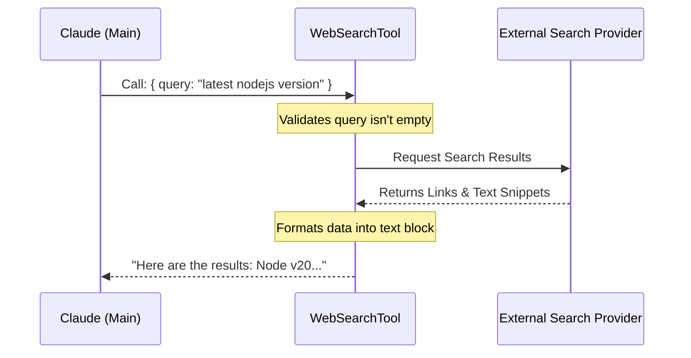

# Chapter 12: WebSearchTool

In the previous [NotebookEditTool](11_notebookedittool.md) chapter, we learned how to manipulate local data science files. We gave `claudeCode` the ability to be a careful editor.

However, a good developer doesn't just look at their own code. They look at documentation, StackOverflow, and GitHub issues.

By default, an AI model is like an encyclopedia printed last year. It knows everything *up to that date*, but it doesn't know about the JavaScript library released yesterday.

Enter the **WebSearchTool**. This tool gives the agent a live connection to the internet, allowing it to fetch up-to-date information.

## What is the WebSearchTool?

The **WebSearchTool** acts as a research assistant. When `claudeCode` realizes it doesn't know the answer (or needs to check the latest version of a package), it uses this tool to "Google it."

### The Central Use Case: "The Deprecated Function"

Imagine you ask: **"Why is my code failing with `Error: useHistory is not exported from react-router-dom`?"**

The AI might remember an old version of React Router. But with the WebSearchTool, it can:
1.  **Search:** "react-router-dom useHistory replacement"
2.  **Read:** Find the migration guide v5 to v6.
3.  **Learn:** "Ah, `useHistory` was replaced by `useNavigate`."
4.  **Answer:** Tell you exactly how to fix your code based on today's standards.

## Key Concepts

### 1. The Query
Just like you type keywords into a search bar, the AI generates a **Query String**. It tries to be specific to get the best technical results.

### 2. Domain Control
Searching the *entire* web can be noisy. This tool supports:
*   **Allowed Domains:** "Only search `developer.mozilla.org`."
*   **Blocked Domains:** "Don't search `reddit.com`."
This keeps the information high-quality and relevant.

### 3. Structured Results
The tool doesn't just return a screenshot. It returns structured data:
*   **Titles** of pages.
*   **URLs** (Links).
*   **Snippets** (Summaries of the content).

## How to Use WebSearchTool

The AI uses this tool automatically when it lacks information. However, you can see how it requests a search by looking at its input structure.

### The Input Structure
The AI sends a JSON object requesting a search.

```json
{
  "query": "python 3.12 release notes new features",
  "allowed_domains": ["python.org", "docs.python.org"]
}
```

### The Output Structure
The tool replies with a summary found on the web.

```json
{
  "query": "python 3.12 release notes new features",
  "results": [
    {
      "title": "What's New In Python 3.12",
      "url": "https://docs.python.org/3/whatsnew/3.12.html"
    }
  ],
  "durationSeconds": 0.8
}
```
*Explanation: The AI reads this `results` array to formulate its final answer to you.*

## Under the Hood: How it Works

Unlike the [FileEditTool](04_fileedittool.md) which touches your hard drive, this tool reaches out to an external API.

Interestingly, `claudeCode` often delegates this task. It asks a specialized version of the Claude model (or a specific API endpoint) to perform the search and summarize the findings.

Here is the flow:



### Internal Implementation Code

The implementation is located in `tools/WebSearchTool/WebSearchTool.ts`. Let's break down the key parts.

#### 1. Defining the Tool
We define the tool using `buildTool`, setting its name and description so the AI knows when to use it.

```typescript
// tools/WebSearchTool/WebSearchTool.ts
export const WebSearchTool = buildTool({
  name: 'web_search',
  
  // Helps the AI understand the tool's purpose
  description: (input) => `Claude wants to search for: ${input.query}`,
  
  // The shape of data the AI must provide
  inputSchema: inputSchema(), 
  
  // Is it safe to run alongside other tools? Yes.
  isConcurrencySafe: () => true,
  
  // ... implementation details
});
```

#### 2. Validation
Before searching, we check if the request makes sense.

```typescript
async validateInput(input) {
  const { query, allowed_domains, blocked_domains } = input;

  // 1. We need a query to search!
  if (!query.length) {
    return { result: false, message: 'Error: Missing query' };
  }

  // 2. You can't both Allow AND Block domains (logic conflict)
  if (allowed_domains?.length && blocked_domains?.length) {
    return { 
      result: false, 
      message: 'Cannot specify both allowed and blocked domains' 
    };
  }
  return { result: true };
}
```
*Explanation: This ensures we don't send empty or contradictory requests to the search API.*

#### 3. Execution (The Call)
The `call` function is where the magic happens. We actually stream the request to a model capable of browsing.

```typescript
// Inside async call(...)
const userMessage = createUserMessage({
  content: 'Perform a web search for: ' + query,
});

// We create a stream to the API
const queryStream = queryModelWithStreaming({
  messages: [userMessage],
  tools: [], // We might pass specific browser tools here
  // ... options
});

// We wait for the stream to finish and collect results
for await (const event of queryStream) {
  // Logic to capture search hits as they arrive...
}
```
*Explanation: We use `queryModelWithStreaming` (discussed in [Query Engine](03_query_engine.md)) to delegate the heavy lifting of searching and summarizing to the backend API.*

#### 4. Formatting the Output
Once we have the data, we need to turn it into a string the AI can read.

```typescript
mapToolResultToToolResultBlockParam(output, toolUseID) {
  const { query, results } = output;
  
  let formatted = `Web search results for: "${query}"\n\n`;

  // Loop through results and add links
  results.forEach(result => {
    if (result.content) {
      formatted += `Links: ${jsonStringify(result.content)}\n\n`;
    }
  });

  return {
    type: 'tool_result',
    content: formatted.trim(),
  };
}
```
*Explanation: This converts the raw JSON into a readable text block. The AI reads this text to learn the information.*

## Safety and Permissions

Because this tool sends data (your query) to the outside world, it interacts with the [Permission & Security System](08_permission___security_system.md).

Usually, `WebSearchTool` is flagged as "ReadOnly" (it doesn't change your files), but some users might want to block it to prevent data leaks. The `checkPermissions` function handles this.

```typescript
async checkPermissions(_input) {
  return {
    behavior: 'passthrough', // Usually safe
    message: 'WebSearchTool requires permission.',
    // Suggest adding a rule to allow it permanently
    suggestions: [{ type: 'addRules', rules: [{ toolName: 'web_search' }] }]
  };
}
```

## Why is this important for later?

The WebSearchTool is a bridge to the outside world.

*   **[Teammates](16_teammates.md):** Later, we will see that different AI agents have different skills. One "Teammate" might be a dedicated Researcher who uses this tool constantly.
*   **[Model Context Protocol (MCP)](14_model_context_protocol__mcp_.md):** This tool is a built-in example of fetching external context. In Chapter 14, we will learn how to build *custom* tools that fetch data from *your* private databases.

## Conclusion

You have learned that the **WebSearchTool** is `claudeCode`'s window to the present. By validating queries and connecting to a search API, it allows the AI to answer questions about topics that didn't exist when the model was trained.

Now that we have a powerful set of tools (File Editing, Notebooks, Web Search), we need a way to turn them on or off depending on who is using the application.

[Next Chapter: Feature Gating](13_feature_gating.md)

---

Generated by [Code IQ](https://github.com/adityasoni99/Code-IQ)