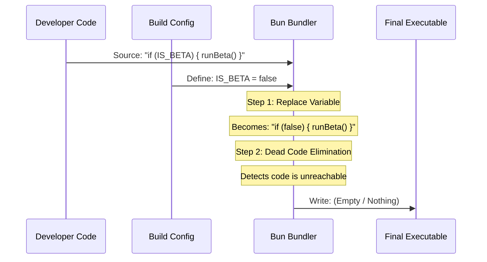

# Chapter 13: Feature Gating

In the previous [WebSearchTool](12_websearchtool.md) chapter, we gave `claudeCode` access to the internet. Before that, in [NotebookEditTool](11_notebookedittool.md), we gave it access to data science files.

We are adding powerful features rapidly. But here is a problem: **Not every user needs every feature.**

*   Maybe a corporate user wants to disable the **WebSearchTool** for security.
*   Maybe the **Computer Use** feature is experimental and should only be available to developers debugging the app.
*   Maybe we want to ship a "Light" version of the app that loads faster.

We need a way to turn features on and off efficiently. This is called **Feature Gating**.

## What is Feature Gating?

Feature Gating is like a fuse box for your application. It allows you to enable or disable entire sections of functionality based on configuration.

In `claudeCode`, we use a specific technique called **Compile-Time Feature Flagging** using our bundler, **Bun**.

### The Central Use Case: "Hiding the Experimental Tool"

Imagine we are building a new tool called "SuperTool," but it crashes 50% of the time. We want the code to exist in our project so we can work on it, but we **do not** want regular users to even see it exists.

If we just use a normal `if` statement, the code is still shipped to the user—it's just hidden. With **Compile-Time Gating**, the dangerous code is physically removed from the final file before it is sent to the user.

## Key Concepts

### 1. The Magic Variable
We use special variables in our code that look like normal variables (e.g., `IS_DEBUG_MODE`). However, these variables are not defined in the code files. They are injected by the build system.

### 2. Dead Code Elimination
This is the superpower of this chapter.
If the build system sees:
```javascript
if (false) {
  launchNuclearMissiles();
}
```
It knows that code can *never* run. So, it simply deletes the entire block from the final file. This makes the application smaller and safer.

### 3. The Bundler (Bun)
We use **Bun** to package all our files into one executable. Bun is responsible for performing the "Search and Replace" that makes feature gating work.

## How to Use Feature Gating

Feature gating is mostly set up in the build configuration, but as a developer contributing to `claudeCode`, you need to know how to write code that *can* be gated.

### Writing Gated Code
You treat the feature flag like a global constant.

```typescript
// features/experimental.ts

// 1. Check the magic variable
if (process.env.ALLOW_EXPERIMENTAL_TOOLS) {
  
  // 2. If true, register the tool
  registerTool('SuperTool', SuperToolDefinition);
  
} else {
  console.log("Experimental tools are disabled.");
}
```
*Explanation: When we build the app, `process.env.ALLOW_EXPERIMENTAL_TOOLS` will be replaced by either `true` or `false`.*

### The Result
If we set the flag to `false` during the build, the final output code that the user receives looks like this:

```javascript
// The if-statement was removed!
console.log("Experimental tools are disabled.");
```
*Explanation: The risky `registerTool` code is gone completely.*

## Under the Hood: How it Works

The process happens before the application ever starts running. It happens during the **Build Step**.

1.  **Source:** You write code with flags.
2.  **Config:** The build script (`build.ts`) defines the values of those flags.
3.  **Bundle:** Bun reads the code, swaps the variables for values (`true`/`false`), and deletes unreachable code.
4.  **Output:** A clean, optimized file is created.

Here is the visual flow:



### Internal Implementation Code

The magic configuration lives in the build script. This is where we tell Bun what the "Magic Variables" actually equal.

#### 1. The Build Configuration
We use `Bun.build` and the `define` property.

```typescript
// scripts/build.ts
await Bun.build({
  entrypoints: ['./src/index.ts'],
  outdir: './dist',
  
  // This is the Feature Gating logic
  define: {
    // We replace string patterns with actual values
    'process.env.IS_DEV': JSON.stringify(false),
    'process.env.ENABLE_MCP': JSON.stringify(true),
    'process.env.ENABLE_COMPUTER_USE': JSON.stringify(false),
  },
});
```
*Explanation: The `define` object tells Bun: "Every time you see `process.env.IS_DEV` in the code, replace it with `false`."*

#### 2. Gating a Dangerous Feature
Let's see how this protects the [Computer Use](18_computer_use.md) feature, which allows the AI to move the mouse.

```typescript
// tools/ComputerUse/index.ts

export function getComputerTools() {
  // Check the compile-time flag
  if (process.env.ENABLE_COMPUTER_USE === 'true') {
    return [ComputerTool, KeyboardTool];
  }
  
  // If disabled, return nothing
  return [];
}
```
*Explanation: If the build script sets this to 'false', the `ComputerTool` code is never exposed to the rest of the app. It's as if it doesn't exist.*

#### 3. Integration with Permissions
We often combine Feature Gating with the [Permission & Security System](08_permission___security_system.md).

```typescript
// utils/permissions/index.ts

export function getDefaultPermissions() {
  const defaults = { allowFileEdit: true };

  // Only enable this permission if the FEATURE is enabled
  if (process.env.ENABLE_MCP) {
    defaults.allowMcp = true;
  }
  
  return defaults;
}
```
*Explanation: This ensures that the permission system doesn't even look for rules related to features that have been turned off.*

## Why is this important for later?

Feature Gating is essential for managing the complexity of the upcoming chapters:

*   **[Model Context Protocol (MCP)](14_model_context_protocol__mcp_.md):** This is a complex new standard. We use gating to enable it gradually for users.
*   **[Computer Use](18_computer_use.md):** This feature is powerful but risky. We gate it so standard users don't accidentally let the AI take over their mouse.
*   **[Cost Tracking](19_cost_tracking.md):** In enterprise builds (gated via a flag), we might enable stricter logging to track every token spent.

## Conclusion

You have learned that **Feature Gating** is the ability to turn features on or off during the build process. By using **Bun's `define` feature**, we can remove experimental or restricted code from the final application entirely. This keeps `claudeCode` lightweight, safe, and adaptable for different types of users.

Now that we know how to turn features on, let's look at one of the most exciting gated features: a way to connect the AI to *any* external data source.

[Next Chapter: Model Context Protocol (MCP)](14_model_context_protocol__mcp_.md)

---

Generated by [Code IQ](https://github.com/adityasoni99/Code-IQ)