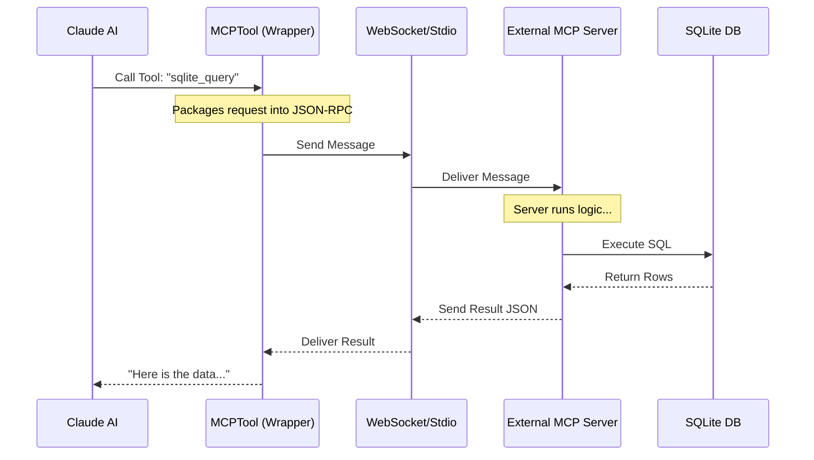

# Chapter 14: Model Context Protocol (MCP)

In the previous [Feature Gating](13_feature_gating.md) chapter, we learned how to turn specific features on and off.

Up until now, we have built hard-coded tools: [FileEditTool](04_fileedittool.md) for files, [BashTool](06_bashtool.md) for the terminal, and [WebSearchTool](12_websearchtool.md) for the internet.

But what if you want to connect `claudeCode` to your **Postgres database**? Or your **Slack workspace**? Or a custom **Internal API**?

Building a new hard-coded tool for every single service in the world is impossible. We need a "Universal Adapter."

Enter the **Model Context Protocol (MCP)**.

## What is MCP?

Think of `claudeCode` as a computer.
*   **Hard-coded tools** (like FileEdit) are soldered directly onto the motherboard. They are fast but hard to change.
*   **MCP** is like a **USB Port**.

You can plug *any* compatible device (Server) into the USB port, and the computer instantly knows how to use it.

**MCP** allows `claudeCode` to connect to external data sources and tools without us having to write new code inside the application. We simply "plug in" an MCP Server, and the AI gains new superpowers immediately.

### The Central Use Case: "The Database Query"

Imagine you have a local SQLite database named `customers.db`. You want to ask the AI:
**"How many users signed up last week?"**

Without MCP, the AI cannot see inside that binary database file.
**With MCP**, you connect a "SQLite MCP Server."
1.  The AI asks the server: "What tables do you have?"
2.  The server replies: "Users, Orders."
3.  The AI sends a SQL query via MCP.
4.  The server executes it and returns the data.

## Key Concepts

### 1. The Client (Host)
`claudeCode` acts as the **MCP Client**. It is the host. It is responsible for finding available servers and sending messages to them.

### 2. The Server
This is a small program running separately (on your computer or a remote server). It defines:
*   **Resources:** Data it can read (like database rows).
*   **Tools:** Functions it can run (like "Execute SQL").

### 3. Transports
How do the Client and Server talk?
*   **Stdio:** They talk via standard input/output (like pipes in a terminal). Great for local scripts.
*   **WebSocket:** They talk over a network connection. Great for remote servers.

## How to Use MCP

In `claudeCode`, we don't "write" MCP tools manually. We define a **Generic Wrapper**.

When `claudeCode` starts, it looks at your configuration. If you have an MCP server configured, `claudeCode` asks it: *"What tools do you have?"*

If the server has a tool named `query_db`, `claudeCode` dynamically creates a tool definition for it.

### The Configuration
Users typically provide a config file to tell `claudeCode` where the servers are.

```json
{
  "mcpServers": {
    "sqlite": {
      "command": "uvx",
      "args": ["mcp-server-sqlite", "--db-path", "./customers.db"]
    }
  }
}
```

### The Result
Once connected, the AI sees a new tool in its list.

*   **Tool Name:** `sqlite_query`
*   **Description:** "Run a read-only SQL query"
*   **Inputs:** `{ sql: string }`

The AI uses this tool exactly like it uses [BashTool](06_bashtool.md), but the execution happens outside of `claudeCode`.

## Under the Hood: How it Works

The implementation relies on a **Generic MCP Tool**. This is a chameleon. It pretends to be whatever tool the external server says it is.

When the AI calls an MCP tool, `claudeCode` acts as a messenger.

1.  **AI Request:** "Call `sqlite_query` with `SELECT * FROM users`."
2.  **Lookup:** The App finds the correct MCP Client connection.
3.  **Transport:** The App sends a JSON message over WebSocket or Stdio.
4.  **Execution:** The external server runs the SQL.
5.  **Response:** The server sends the JSON result back.

Here is the flow:



### Internal Implementation Code

The core logic is in `tools/MCPTool/MCPTool.ts`.

#### 1. The Generic Wrapper
Unlike specific tools (like `FileEditTool`) that have strict schemas, the `MCPTool` must be flexible because we don't know what the external server requires until runtime.

```typescript
// tools/MCPTool/MCPTool.ts
import { buildTool } from '../../Tool.js'
import { z } from 'zod/v4'

export const MCPTool = buildTool({
  isMcp: true, // Flag to treat this differently
  name: 'mcp', // Placeholder name
  
  // We accept ANY input object because the schema defines itself dynamically
  inputSchema: lazySchema(() => z.object({}).passthrough()),

  // This function is overridden at runtime by the specific MCP Client
  async call() {
    return { data: '' } 
  }
});
```
*Explanation: `z.object({}).passthrough()` means "accept any arguments." This is necessary because one MCP tool might need a `sql` string, while another might need a `channel_id`.*

#### 2. The Transport Layer
We need a way to send messages. Here is a simplified look at the `WebSocketTransport` in `utils/mcpWebSocketTransport.ts`.

```typescript
// utils/mcpWebSocketTransport.ts

export class WebSocketTransport {
  // 1. Connect to the socket
  constructor(private ws: WebSocketLike) {
    // Listen for incoming messages
    this.ws.on('message', (data) => {
      const message = JSON.parse(data);
      this.onmessage?.(message); // Notify the system
    });
  }

  // 2. Send outgoing messages
  async send(message: JSONRPCMessage): Promise<void> {
    const json = JSON.stringify(message);
    this.ws.send(json);
  }
}
```
*Explanation: This is pure plumbing. It takes a JavaScript object, turns it into a text string (`JSON.stringify`), and shoots it over the wire. It listens for replies and passes them back up.*

#### 3. The UI List
We need to show the user what tools are available. We use the [Ink UI Framework](02_ink_ui_framework.md) to render the list.

```tsx
// components/mcp/MCPToolListView.tsx

export function MCPToolListView({ server }) {
  // Get all tools from the Global State
  const mcpTools = useAppState(s => s.mcp.tools);

  // Filter to show only tools for this server
  const serverTools = filterToolsByServer(mcpTools, server.name);

  return (
    <Dialog title={`Tools for ${server.name}`}>
      {/* List them in a Select menu */}
      <Select 
        options={serverTools.map(t => ({ label: t.name }))} 
        onSelect={/* Handle selection */} 
      />
    </Dialog>
  );
}
```
*Explanation: This component reads the [State Management](01_state_management.md) store to find loaded tools and displays them so the user can inspect what capabilities the AI currently has.*

## Permissions and Safety

Because MCP tools connect to the outside world, they are subject to the [Permission & Security System](08_permission___security_system.md).

When an external server registers a tool, it can flag itself as:
*   **ReadOnly:** Safe to run (e.g., "Get Weather").
*   **Destructive:** Dangerous (e.g., "Drop Database Table").

`claudeCode` uses these flags to decide whether to prompt the user for confirmation.

## Why is this important for later?

MCP is the future of extensibility for `claudeCode`.

*   **[AgentTool](15_agenttool.md):** In the next chapter, we discuss "Agents." Agents can be essentially wrapped as MCP servers, allowing one AI to call another AI as a tool.
*   **[Teammates](16_teammates.md):** MCP allows us to define "Teammates" that have specialized knowledge bases (like a "Legal Expert" connected to a law database).
*   **[Computer Use](18_computer_use.md):** We can even expose the computer's screen and mouse as an MCP resource!

## Conclusion

You have learned that the **Model Context Protocol (MCP)** acts as a universal connector. Instead of writing code to add new features, we can plug in external servers that provide tools and data. `claudeCode` uses a generic wrapper and a transport layer (WebSocket or Stdio) to communicate with these servers seamlessly.

Now that we have a way to plug in external capabilities, what if we want to plug in *another AI* entirely?

[Next Chapter: AgentTool](15_agenttool.md)

---

Generated by [Code IQ](https://github.com/adityasoni99/Code-IQ)