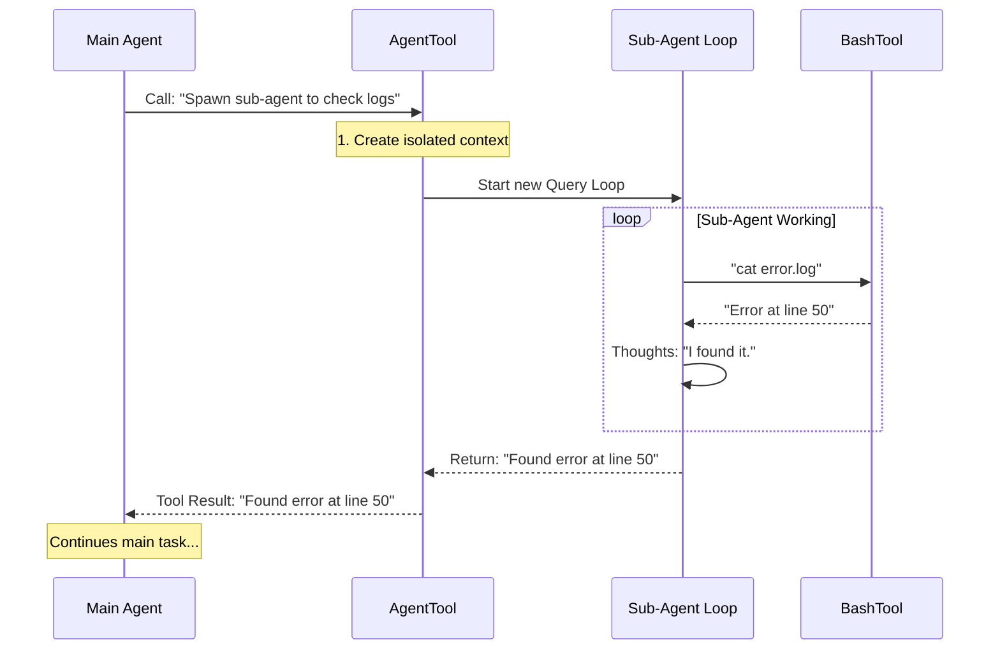

# Chapter 15: AgentTool

In the previous [Model Context Protocol (MCP)](14_model_context_protocol__mcp_.md) chapter, we learned how to extend `claudeCode` by connecting it to external tools and data sources. We gave the AI more "hands."

But sometimes, having more hands isn't enough. Sometimes, the task is so big (like "Refactor this entire legacy module") that a single AI agent gets overwhelmed, distracted, or runs out of context memory.

We don't just need more hands. We need more **Brains**.

Enter the **AgentTool**. This allows the main AI to spawn "Sub-Agents"—temporary worker AIs—to handle complex sub-tasks and report back only when finished.

## What is the AgentTool?

Think of the main `claudeCode` session as a **Project Manager**.
If you ask the manager to "Research a topic and write a report," they *could* do it themselves. But it is more efficient to hire a **Contractor** (Sub-Agent).

1.  **Manager:** "Contractor, go read these 50 files and summarize them."
2.  **Contractor:** (Works independently for 5 minutes, reading, thinking, taking notes...)
3.  **Contractor:** "Here is the summary."
4.  **Manager:** (Receives the neat summary without seeing the messy 5 minutes of work).

The **AgentTool** is the mechanism that allows this delegation. It encapsulates an entire AI conversation loop inside a single tool call.

### The Central Use Case: "The Deep Dive"

Imagine you ask: **"Check all 20 documentation files and tell me if we mention 'deprecated_api'."**

*   **Without AgentTool:** The main AI reads file 1, then file 2... The conversation history fills up with "Read file 1... Read file 2..." eventually hitting the memory limit.
*   **With AgentTool:** The main AI spawns a sub-agent. The sub-agent does the messy reading. It returns a single sentence: *"I found mentions in doc3.md and doc9.md."* The main history remains clean.

## Key Concepts

### 1. Recursion (Loops within Loops)
We learned about the "Conversation Loop" in [Query Engine](03_query_engine.md).
The AgentTool simply starts **another** Query Engine loop inside the current one.
*   The Main Agent waits.
*   The Sub-Agent runs its own loop (Think -> Act -> Observe).
*   When the Sub-Agent is done, the Main Agent resumes.

### 2. Context Isolation
The Sub-Agent starts with a fresh "mind." It doesn't necessarily carry all the baggage of the main conversation. This is crucial for performance and accuracy. It focuses *only* on the specific task assigned.

### 3. Tool Inheritance
Does the Sub-Agent get to use the terminal?
Yes. The AgentTool constructs a "Context" for the child that allows it to access the same capabilities (like [BashTool](06_bashtool.md) or [FileEditTool](04_fileedittool.md)) that the parent has, but tracked separately.

## How to Use AgentTool

This tool is used automatically by the system when it detects a complex task, or specifically by "Teammates" (which we will cover in the next chapter).

### The Input Structure
The Main AI calls the tool with a prompt and a definition of the worker.

```json
{
  "agent_name": "ResearchBot",
  "task": "Read src/utils.ts and explain what it does.",
  "tools": ["FileEditTool", "BashTool"]
}
```

### The Output
The tool returns the final text response from the Sub-Agent.

```text
"I have read src/utils.ts. It contains helper functions for date formatting."
```

## Under the Hood: How it Works

The implementation of `AgentTool` is essentially a recursive function call. It pauses the current agent, creates a new `ToolUseContext`, runs a new `query()` loop, and waits for it to finish.

Here is the flow:



### Internal Implementation Code

The core logic resides in `tools/AgentTool/runAgent.ts`. This file coordinates the creation and execution of the worker.

#### 1. Setting up the Context
First, we create a specialized environment for the sub-agent. We determine what tools it is allowed to use.

```typescript
// tools/AgentTool/runAgent.ts

// We figure out which tools the sub-agent gets
const resolvedTools = useExactTools
  ? availableTools 
  : resolveAgentTools(agentDefinition, availableTools).resolvedTools;

// We create a new "Context" object (memory, permissions, etc.)
const agentToolUseContext = createSubagentContext(toolUseContext, {
  agentType: agentDefinition.agentType,
  messages: initialMessages,
  // Sync agents share the parent's terminal (AbortController)
  abortController: isAsync ? new AbortController() : parentController,
});
```
*Explanation: `createSubagentContext` is like setting up a new desk for a new employee. We give them their own tools and their own message history (`initialMessages`).*

#### 2. Initializing MCP (Skills)
If the sub-agent needs special tools (like a specific database connection via [Model Context Protocol (MCP)](14_model_context_protocol__mcp_.md)), we initialize them here.

```typescript
// Connect to agent-specific MCP servers
const { 
  clients: mergedMcpClients, 
  cleanup: mcpCleanup 
} = await initializeAgentMcpServers(
  agentDefinition, 
  parentContext.mcpClients
);
```
*Explanation: The sub-agent inherits the parent's tools, plus it can load its own specific "Skills" (defined as MCP servers).*

#### 3. The Recursive Loop
This is the heart of the feature. We import the `query` function (the same engine that drives the main app) and run it for the sub-agent.

```typescript
import { query } from '../../query.js';

// Start the loop!
for await (const message of query({
  messages: initialMessages,
  systemPrompt: agentSystemPrompt,
  toolUseContext: agentToolUseContext, // The new isolated context
  maxTurns: 20, // Prevent infinite loops
})) {
  
  // If the sub-agent speaks, we might log it or just wait
  if (isRecordableMessage(message)) {
    recordSidechainTranscript(message);
  }
}
```
*Explanation: We run `query()` exactly like the main application does. However, we trap the messages inside `recordSidechainTranscript` instead of printing them directly to the main user output. This keeps the main chat clean.*

#### 4. Cleaning Up
When the sub-agent finishes (or crashes), we must clean up resources.

```typescript
try {
  // ... Run the loop ...
} finally {
  // 1. Disconnect MCP servers specific to this agent
  await mcpCleanup();
  
  // 2. Kill any background processes (like a server the agent started)
  killShellTasksForAgent(agentId);
  
  // 3. Free up memory
  agentToolUseContext.readFileState.clear();
}
```
*Explanation: Since the sub-agent might have opened database connections or started background scripts, the `finally` block ensures we don't leave "zombie" processes running.*

## Why is this important for later?

The AgentTool is the foundation for advanced AI collaboration:

*   **[Teammates](16_teammates.md):** In the next chapter, we will see how we use `AgentTool` to create persistent personas (like "Architect" or "QA Tester") that you can summon by name.
*   **[Cost Tracking](19_cost_tracking.md):** Sub-agents can use a lot of tokens. We need to track the cost of a sub-agent separately from the main agent.

## Conclusion

You have learned that the **AgentTool** allows `claudeCode` to scale its intelligence. By spawning isolated Sub-Agents, the main AI can delegate complex tasks like research or large-scale refactoring without clogging up its own memory or context window. It uses recursion to run a fresh instance of the Query Engine, complete with its own tools and permissions.

Now that we have the ability to spawn generic sub-agents, let's give them names and personalities.

[Next Chapter: Teammates](16_teammates.md)

---

Generated by [Code IQ](https://github.com/adityasoni99/Code-IQ)