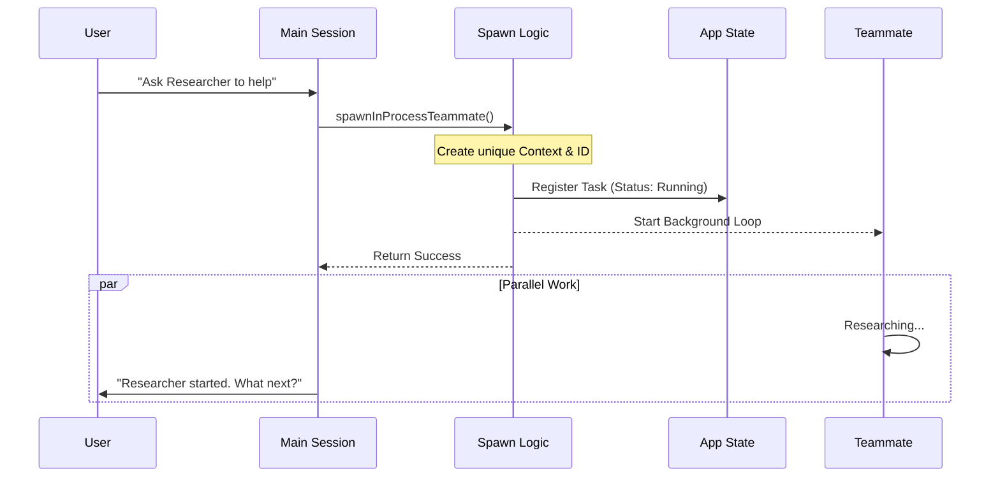

# Chapter 16: Teammates

In the previous [AgentTool](15_agenttool.md) chapter, we learned how to spawn "Sub-Agents" to handle complex tasks. However, those sub-agents were blocking. While the sub-agent was thinking, the main application was frozen, waiting for the result.

But what if you want to keep working while an AI helper does something else in the background?

Enter **Teammates**.

## What are Teammates?

**Teammates** are independent AI agents that run alongside your main session. Unlike standard sub-agents, they don't block you. You can ask a teammate to "Research this library," and while they are reading documentation in the background, you can continue coding with the main agent.

### The Central Use Case: "The Background Researcher"

Imagine you are fixing a bug. You need to know how a specific API works, but you don't want to lose your train of thought in the code.

1.  **You:** "Spawn a researcher to find out how `React.useId` works."
2.  **System:** Creates a "Researcher" teammate.
3.  **You:** Continue typing code in the main prompt.
4.  **Researcher (Background):** Googles, reads docs, summarizes.
5.  **Researcher:** Pings you 2 minutes later: "Here is how `useId` works..."

Without Teammates, you would have to sit and watch a loading spinner for 2 minutes.

## Key Concepts

### 1. In-Process Concurrency
We don't launch a whole new terminal window. Teammates run inside the same Node.js process as the main application. We use JavaScript's asynchronous nature to let them work "in parallel" with the user.

### 2. Identity & Context Isolation
Every teammate needs a name (e.g., "Researcher", "QA") and a specific job. Most importantly, they need their own **Context**.
If the Teammate changes a variable in its memory, it shouldn't accidentally change a variable in the Main Agent's memory. We use something called `AsyncLocalStorage` to keep their brains separate.

### 3. The Abort Controller
Since teammates run in the background, we need a way to stop them. If you quit the app, or if the teammate gets stuck, we need a "Kill Switch." Each teammate has its own `AbortController`.

## How to Use Teammates

While users trigger teammates via chat, developers trigger them via code. Here is how we define a "spawn" configuration.

### The Input Configuration
To spawn a teammate, we need to know who they are and what they should do.

```typescript
const spawnConfig = {
  name: "Researcher",
  teamName: "CoreTeam",
  // The mission we give them
  prompt: "Read the docs for React 18 and summarize concurrency.",
  // Visuals for the UI
  color: "blue",
  planModeRequired: false
};
```

### The Output (What happens?)
When triggered, the system returns a success object containing the **Agent ID**.

```typescript
{
  success: true,
  agentId: "Researcher@CoreTeam",
  taskId: "task_12345",
  // A handle to kill the agent if needed
  abortController: AbortController {} 
}
```

## Under the Hood: How it Works

Spawning a teammate is a delicate operation. We have to create a new "virtual thread" inside our application.

1.  **Request:** The user asks for help.
2.  **Identity:** We generate a unique ID (`Name@Team`).
3.  **Context:** We create a dedicated memory space (Context) for this agent.
4.  **Registration:** We tell [State Management](01_state_management.md) "Hey, there's a new active agent!" so the UI can show a spinner.
5.  **Execution:** The agent starts its own loop (Think -> Act -> Observe) independently.

Here is the visual flow:



### Internal Implementation Code

The core logic is in `utils/swarm/spawnInProcess.ts`.

#### 1. Creating the Identity
First, we generate a deterministic ID and a control switch (AbortController).

```typescript
// utils/swarm/spawnInProcess.ts

export async function spawnInProcessTeammate(config, context) {
  const { name, teamName } = config;

  // 1. Create a unique ID (e.g., "Researcher@CoreTeam")
  const agentId = formatAgentId(name, teamName);
  
  // 2. Create a "Kill Switch" specific to this agent
  // If the main app dies, this stays alive until explicitly killed
  const abortController = createAbortController();
  
  // ...
}
```
*Explanation: We create `abortController` immediately. This allows us to cancel the teammate's specific task later without killing the whole application.*

#### 2. Creating the Context
This is the most important part. We use `createTeammateContext` to isolate the agent.

```typescript
// utils/swarm/spawnInProcess.ts

// 3. Create the isolated environment
const teammateContext = createTeammateContext({
  agentId,
  agentName: name,
  parentSessionId: getSessionId(), // Link to parent for logging
  abortController,
  // ... other props
});
```
*Explanation: This context object holds the agent's permissions and history. By creating a new one, we ensure the teammate doesn't see the Main Agent's private thoughts.*

#### 3. Registering with State
We need the [Ink UI Framework](02_ink_ui_framework.md) to display the teammate's status. We do this by adding a "Task" to the global state.

```typescript
// utils/swarm/spawnInProcess.ts

const taskState = {
  // Standard task properties
  type: 'in_process_teammate',
  status: 'running',
  identity: { agentId, color }, // Who is this?
  prompt: config.prompt, // What are they doing?
  
  // Connect the kill switch
  abortController
};

// 4. Update the global store
registerTask(taskState, context.setAppState);
```
*Explanation: `registerTask` puts this data into the Global Store. The UI listens to the store and immediately renders a new "Running" indicator in the sidebar.*

#### 4. Killing a Teammate
When the job is done (or cancelled), we use the `killInProcessTeammate` function.

```typescript
// utils/swarm/spawnInProcess.ts

export function killInProcessTeammate(taskId, setAppState) {
  setAppState((prev) => {
    const task = prev.tasks[taskId];
    
    // 1. Trigger the kill switch
    task.abortController?.abort();
    
    // 2. Mark as killed in the UI
    return {
      ...prev,
      tasks: {
        ...prev.tasks,
        [taskId]: { ...task, status: 'killed' }
      }
    };
  });
}
```
*Explanation: We find the task in the state, pull the trigger on the `abortController`, and update the status so the UI shows "Stopped."*

## Why is this important for later?

Teammates represent the shift from "Chatbot" to "Organization."

*   **[Unique Features](17_unique_features.md):** The ability to run concurrent, stateful agents is one of the standout features of `claudeCode`.
*   **[Cost Tracking](19_cost_tracking.md):** Running multiple agents uses more tokens. We track costs per-teammate to see who is spending the most money.

## Conclusion

You have learned that **Teammates** are background workers that allow you to multitask. By using **In-Process Spawning** and **Context Isolation**, `claudeCode` can run multiple AI agents simultaneously in a single application. Each teammate has a name, a job, and a "Kill Switch" to keep them under control.

Now that we have built the entire system—from State Management to Teammates—let's review what makes this entire project special compared to other tools.

[Next Chapter: Unique Features](17_unique_features.md)

---

Generated by [Code IQ](https://github.com/adityasoni99/Code-IQ)