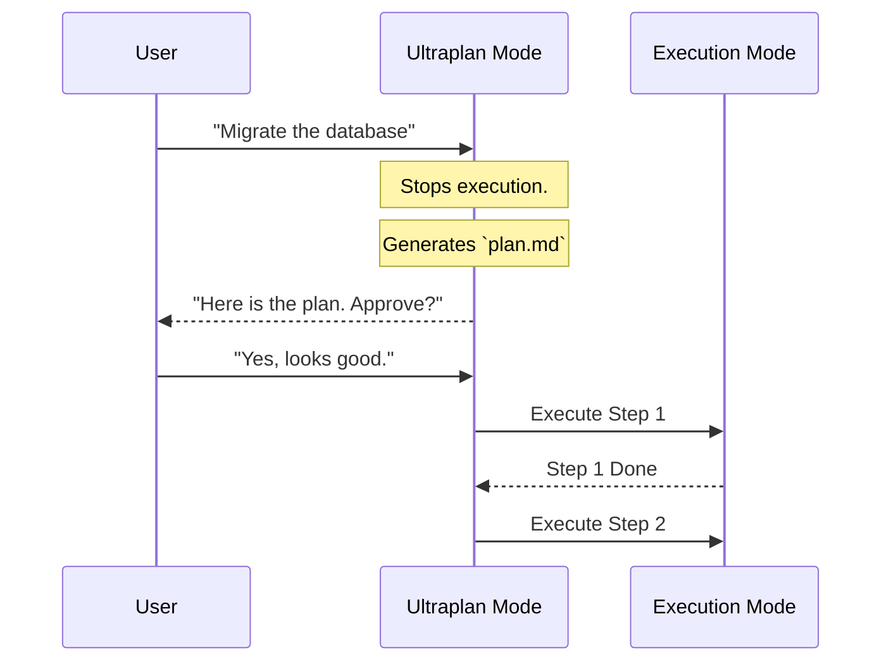

# Chapter 17: Unique Features

In the previous [Teammates](16_teammates.md) chapter, we learned how to spawn background agents to help us multitask.

We have built a powerful system: it has a brain ([Query Engine](03_query_engine.md)), hands ([BashTool](06_bashtool.md)), and helpers ([Teammates](16_teammates.md)).

But `claudeCode` isn't just a standard chatbot. It includes several "Secret Weapons"—specialized modes and behaviors designed to handle complex, real-world coding scenarios.

In this chapter, we will tour five unique features that make the application feel "smart": **The Buddy System**, **Kairos**, **Ultraplan**, **Auto-Dream**, and **Remote Bridge**.

## Feature 1: The Buddy System

### The Concept: "Pair Programming"
Programming alone can be error-prone. You might write a bug and not notice it until hours later.

The **Buddy System** is a specific configuration of a [Teammate](16_teammates.md) that acts as a silent observer. It watches every file change you make and runs a quick "sanity check" in the background.

### How it works
If you enable the Buddy System:
1.  You edit a file using [FileEditTool](04_fileedittool.md).
2.  The Buddy System detects the `save` event.
3.  It spins up a lightweight reviewer agent.
4.  The agent checks for obvious bugs or style issues.
5.  If it finds something, it gently nudges you: *"Hey, you missed a semicolon in line 40."*

## Feature 2: Kairos (Time Awareness)

### The Concept: "The Clock"
Most AI models exist in a timeless void. They don't know if a command takes 1 second or 1 hour.

**Kairos** (Greek for "opportune moment") is the system's internal clock. It allows the AI to understand **duration** and **deadlines**.

### The Use Case: "Don't Get Stuck"
If you ask the AI to "Run the test suite," and the suite hangs for 30 minutes, a standard AI would wait forever.
**Kairos** watches the clock. If a task takes unusually long, it interrupts: *"This is taking too long. Should I kill the process?"*

### Code Snippet: The Timeout Logic
Here is how Kairos might check constraints inside the [Query Engine](03_query_engine.md) loop.

```typescript
// features/kairos/timer.ts

function checkTimeBudget(startTime, budgetMinutes) {
  const now = Date.now();
  const elapsed = (now - startTime) / 1000 / 60; // in minutes

  if (elapsed > budgetMinutes) {
    // Stop the AI from thinking further
    throw new Error("Kairos Alert: Time budget exceeded.");
  }
}
```
*Explanation: This simple check prevents the AI from burning through your API credits on a stuck task.*

## Feature 3: Ultraplan

### The Concept: "Think Before You Act"
For simple tasks, the AI just acts. But for huge tasks (e.g., "Rewrite the entire database layer"), acting immediately is dangerous.

**Ultraplan** is a mode where the AI creates a structured Markdown checklist *before* it runs a single command. It forces the AI to be an Architect before it becomes a Builder.

### The Flow
1.  **Draft:** The AI writes a plan file (e.g., `plan.md`).
2.  **Review:** It shows you the plan.
3.  **Approve:** You click "Yes."
4.  **Execute:** The AI follows its own checklist step-by-step.

### Visual Flow



## Feature 4: Auto-Dream

### The Concept: "Subconscious Processing"
When you step away from your computer, `claudeCode` doesn't have to sleep.

**Auto-Dream** allows the system to run low-priority tasks when the user is idle. It uses the [Auto-Mode Classifier](10_auto_mode_classifier.md) to find safe tasks, like:
*   Updating documentation.
*   Fixing typos.
*   Organizing import statements.

It's like a Roomba for your code. It cleans up the dust while you are away.

## Feature 5: Remote Bridge

### The Concept: "Teleportation"
Sometimes, the code you want to edit isn't on your laptop. It's on a server in the cloud.

**Remote Bridge** allows `claudeCode` to connect to a remote machine via SSH and treat it as if it were local.

It uses the [Model Context Protocol (MCP)](14_model_context_protocol__mcp_.md) to tunnel commands.
*   **Local:** You type "List files" on your laptop.
*   **Bridge:** Sends the command over SSH.
*   **Remote:** Runs `ls` on the server.
*   **Local:** You see the server's files on your screen.

## Under the Hood: Implementing Ultraplan

Let's look closer at **Ultraplan**, as it is the most commonly used unique feature.

Ultraplan works by injecting a special "System Prompt" into the [Query Engine](03_query_engine.md). This prompt forbids the AI from using tools like `FileEditTool` until it has used the `PlanTool`.

### The State Logic
We track whether we are in "Planning Phase" or "Execution Phase" in [State Management](01_state_management.md).

```typescript
// features/ultraplan/state.ts

export const planStateAtom = atom({
  isPlanning: false,
  currentPlan: [], // List of steps
  currentStepIndex: 0
});
```

### The Plan Tool
The AI calls this tool to save its strategy.

```typescript
// features/ultraplan/PlanTool.ts

export const PlanTool = buildTool({
  name: "create_plan",
  description: "Create a step-by-step plan before coding.",
  
  // Input: A list of strings
  inputSchema: z.object({ steps: z.array(z.string()) }),

  async call({ steps }, context) {
    // Save the plan to state
    context.setPlan(steps);
    return "Plan saved. Ask user for approval.";
  }
});
```
*Explanation: This tool doesn't edit code. It simply saves a JavaScript array of steps into memory.*

### Enforcing the Plan
In the main loop, we check the state.

```typescript
// features/ultraplan/guard.ts

function checkPlanGuard(toolName, planState) {
  // If we have a plan, but haven't finished Step 1...
  if (planState.isPlanning && toolName === 'FileEditTool') {
    // Block the edit!
    throw new Error("You must approve the plan first.");
  }
}
```
*Explanation: This ensures the AI respects the architectural phase and doesn't "jump the gun."*

## Why are these important for later?

These unique features distinguish `claudeCode` from simple script runners:

*   **[Computer Use](18_computer_use.md):** In the next chapter, we will unlock the ultimate capability: allowing the AI to move your mouse and see your screen. Features like **Kairos** are critical there to prevent the AI from clicking endlessly if it gets stuck.

## Conclusion

You have learned about the "Secret Weapons" of `claudeCode`:
1.  **Buddy System:** Automated pair programming.
2.  **Kairos:** Time limits and awareness.
3.  **Ultraplan:** Structured architectural planning.
4.  **Auto-Dream:** Idle-time cleanup.
5.  **Remote Bridge:** Editing code on distant servers.

Now, we are ready for the most experimental and futuristic chapter of all. What if the AI could stop typing code and start *using* your computer like a human?

[Next Chapter: Computer Use](18_computer_use.md)

---

Generated by [Code IQ](https://github.com/adityasoni99/Code-IQ)