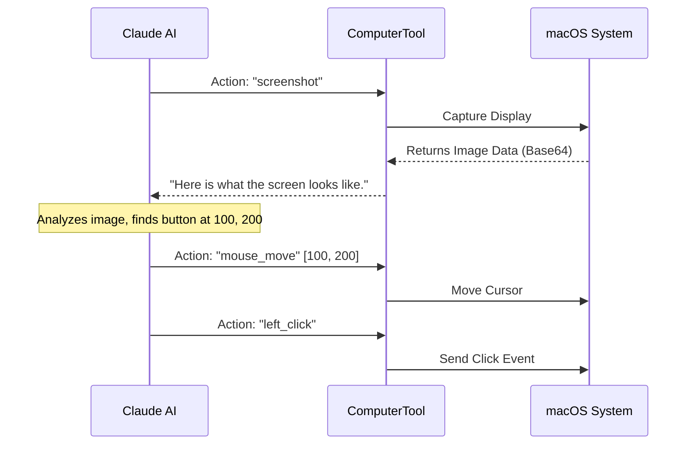

# Chapter 18: Computer Use

In the previous [Unique Features](17_unique_features.md) chapter, we explored special modes like "Auto-Dream" and "Ultraplan" that make the AI smarter.

But all those features rely on text. The AI reads text files and writes text commands.

What if the task involves something visual? What if you need to test a website's layout, or change a setting in a graphical application where there is no command-line interface?

Enter **Computer Use**. This is the ability for `claudeCode` to see your screen, move your mouse, and type on your keyboard, just like a human user.

## What is Computer Use?

**Computer Use** transforms the AI from a "Terminal Script" into a "Virtual Operator."

Instead of using APIs to talk to software, it uses the **GUI (Graphical User Interface)**. It takes screenshots to understand what is happening and sends virtual input events to interact with it.

### The Central Use Case: "The UI Test"

Imagine you are building a website. You want to verify that the "Sign Up" button actually works when clicked.

**You ask `claudeCode`: "Open Safari, go to localhost:3000, and click the Sign Up button."**

To do this, the AI must:
1.  **See:** Take a screenshot to find the Safari icon.
2.  **Move:** Calculate the X,Y coordinates of the icon and move the mouse.
3.  **Click:** Simulate a mouse click.
4.  **Type:** Type the URL into the address bar.
5.  **Verify:** Take another screenshot to ensure the page loaded.

Without Computer Use, the AI is blind to the graphical world.

## Key Concepts

### 1. The Screen (The Eyes)
The AI cannot watch a video stream (that is too much data). Instead, it takes **Screenshots**.
It works in a "Stop-Motion" animation style:
1.  Take a picture.
2.  Analyze the picture.
3.  Decide the next move.

### 2. Coordinate System (The Map)
To click a button, the AI needs to know exactly where it is. We use a pixel coordinate system.
*   **(0, 0):** The top-left corner of your screen.
*   **(1920, 1080):** The bottom-right (on a standard monitor).

### 3. Action Primitives (The Hands)
We break down complex human actions into tiny atomic steps:
*   `mouse_move`: Go to X, Y.
*   `left_click`: Press the button.
*   `type`: Press keys on the keyboard.
*   `key`: Press special keys like "Return" or "Command".

## How to Use Computer Use

This feature is currently experimental and often hidden behind [Feature Gating](13_feature_gating.md).

When enabled, the [Query Engine](03_query_engine.md) gains access to a tool usually named `computer`.

### The Input Structure
The AI sends a command that includes an `action` and sometimes `coordinates` or `text`.

**Example 1: Taking a look**
```json
{
  "action": "screenshot"
}
```

**Example 2: Clicking a button**
```json
{
  "action": "mouse_move",
  "coordinate": [500, 300]
}
```
*Explanation: This moves the cursor to pixel X=500, Y=300.*

**Example 3: Typing**
```json
{
  "action": "type",
  "text": "Hello World"
}
```

## Under the Hood: How it Works

The implementation relies on a "Loop of Vision." The AI is blind until it asks for a screenshot.

1.  **Goal:** User says "Click the Apple menu."
2.  **Vision:** AI calls `screenshot`.
3.  **Analysis:** AI receives the image. It uses its vision capabilities to find the Apple logo at `[20, 10]`.
4.  **Action:** AI calls `mouse_move` to `[20, 10]`.
5.  **Action:** AI calls `left_click`.

Here is the visual flow:



### Internal Implementation Code

Since `claudeCode` is written in JavaScript (Node.js), it doesn't have built-in access to low-level operating system functions like moving the mouse.

To solve this, we usually use a **Bridge Script**. On macOS, we might execute a Python script or a compiled Swift binary that handles the actual hardware control.

#### 1. Defining the Tool
The tool definition tells the AI what it can do.

```typescript
// tools/ComputerTool/index.ts
import { buildTool } from '../../Tool';

export const ComputerTool = buildTool({
  name: 'computer',
  description: 'Control the mouse, keyboard, and take screenshots.',
  
  // Input Schema: action (enum), coordinate (array), text (string)
  inputSchema: computerSchema, 
  
  async call(input) {
    // Pass the command to our execution engine
    return await executeComputerAction(input);
  }
});
```
*Explanation: We register the tool just like the [BashTool](06_bashtool.md), but the inputs are specific to UI control.*

#### 2. Executing Actions (The Bridge)
This function translates the AI's request into a system command.

```typescript
// tools/ComputerTool/executor.ts
import { spawn } from 'child_process';

async function executeComputerAction(action, coords) {
  if (action === 'screenshot') {
    // On macOS, use the built-in screencapture utility
    return await runCommand('screencapture', ['-x', '/tmp/screen.png']);
  }

  if (action === 'mouse_move') {
    // Run a python script to move the mouse
    return await runPython('import pyautogui; pyautogui.moveTo(...)');
  }
}
```
*Explanation: We rely on external utilities. `screencapture` is a standard Mac command. For mouse movement, we often use Python libraries like `pyautogui` or Swift commands.*

#### 3. Handling the Image
When the screenshot is taken, it's just a file. We need to convert it into a format the AI can understand (Base64).

```typescript
// tools/ComputerTool/screen.ts
import { readFile } from 'fs/promises';

async function getScreenshotData() {
  // 1. Read the file we just saved
  const buffer = await readFile('/tmp/screen.png');
  
  // 2. Convert to Base64 string
  const base64 = buffer.toString('base64');
  
  // 3. Return a special object for the AI model
  return {
    type: 'image',
    source: { type: 'base64', media_type: 'image/png', data: base64 }
  };
}
```
*Explanation: We don't send the filename to the AI; we send the actual image data encoded as text strings. This consumes a lot of bandwidth and tokens!*

## Safety and Permissions

Giving an AI control over your mouse is inherently risky. What if it tries to drag your "Documents" folder into the Trash?

We rely heavily on the **[Permission & Security System](08_permission___security_system.md)**.
1.  **High-Risk Flag:** The `ComputerTool` is marked as "High Risk."
2.  **Confirmation:** The user typically has to approve the session start.
3.  **Interrupt:** The user can shake the mouse or press a key combo to kill the process immediately (using the Abort Controller logic we learned in [Teammates](16_teammates.md)).

## Why is this important for later?

Computer Use is the most resource-intensive feature in the entire application.

*   **[Cost Tracking](19_cost_tracking.md):** Sending high-definition screenshots to an AI model costs significantly more "tokens" than sending text. In the next chapter, we will see how we track these soaring costs to prevent "Bill Shock."
*   **[Model Context Protocol (MCP)](14_model_context_protocol__mcp_.md):** Eventually, Computer Use can be exposed as an MCP server, allowing *other* AI agents to control your screen remotely.

## Conclusion

You have learned that **Computer Use** gives `claudeCode` eyes and hands. By combining **Screenshots** (to see) with **System Scripts** (to click and type), the AI can interact with any application on your computer, not just those with APIs.

However, all these screenshots and complex actions come with a price. How do we keep track of how much money we are spending on API fees?

[Next Chapter: Cost Tracking](19_cost_tracking.md)

---

Generated by [Code IQ](https://github.com/adityasoni99/Code-IQ)