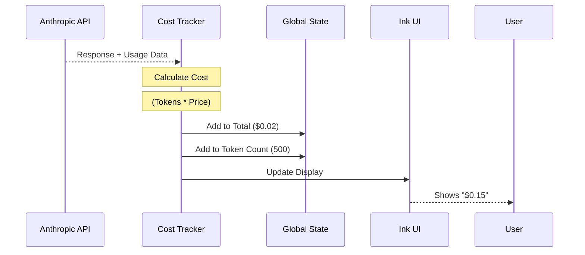

# Chapter 19: Cost Tracking

Welcome to the final chapter of our journey!

In the previous [Computer Use](18_computer_use.md) chapter, we gave the AI the power to see your screen and move your mouse. While incredible, sending high-definition screenshots to an AI model consumes a massive amount of data.

This leads to a very practical question: **"How much is this costing me?"**

Since `claudeCode` uses commercial AI APIs (like Anthropic's Claude 3.5 Sonnet), every request costs a fraction of a cent. If you run a loop for hours, those fractions add up.

**Cost Tracking** is the system's "Taxi Meter." It counts every token used, applies the correct price, and keeps a running total so you never get "Bill Shock."

## What is Cost Tracking?

Cost Tracking is a background utility that listens to every interaction with the AI. It captures the "Usage Statistics" returned by the API and converts them into dollars and cents.

### The Central Use Case: "The Budget Check"

Imagine you are using `claudeCode` to refactor a large project. You've been working for 30 minutes. You want to know:
1.  How much money have I spent so far?
2.  Which model is costing the most?
3.  How many tokens did I save using caching?

Without Cost Tracking, you would have to log into your API provider's dashboard and guess which costs came from this specific session.

## Key Concepts

To understand the code, we need to understand how AI billing works.

### 1. The Token
AI models don't read words; they read "Tokens" (chunks of characters). Usage is billed per million tokens.
*   **Input Tokens:** What you send to the AI (Code files, chat history).
*   **Output Tokens:** What the AI writes back (Code fixes, explanations).
*   **Note:** Output is usually much more expensive than Input.

### 2. Prompt Caching
`claudeCode` sends your project's file structure with every message. To save money, we use **Prompt Caching**.
*   **Cache Write:** The first time we send the files, we pay a bit more to save them on the server.
*   **Cache Read:** The next time we send the *exact same* files, we pay significantly less (often 90% cheaper).
Our tracker must distinguish between "Normal Input," "Cache Write," and "Cache Read" to calculate the price accurately.

### 3. Session Persistence
If you close `claudeCode` and open it again tomorrow, you might want to resume where you left off. The Cost Tracker saves your spending history into a config file so the "Taxi Meter" doesn't reset to zero accidentally.

## How to Use Cost Tracking

As a developer using the `claudeCode` source, you mostly interact with this module to **display** information.

### displaying the Total
The most common function is `formatTotalCost()`. This generates a pretty string summary of the current session.

```typescript
import { formatTotalCost } from './cost-tracker';

function showSummary() {
  // Returns a string like:
  // "Total cost: $0.45"
  // "Total duration: 5m 30s"
  console.log(formatTotalCost());
}
```

### Getting Raw Numbers
If you need to make decisions based on cost (e.g., "Stop if cost > $5.00"), you can get the raw number.

```typescript
import { getTotalCost } from './cost-tracker';

function checkBudget() {
  const currentSpend = getTotalCost();
  
  if (currentSpend > 5.00) {
    console.warn("Budget limit reached!");
  }
}
```

## Under the Hood: How it Works

The Cost Tracker is a passive listener. It waits for the [Query Engine](03_query_engine.md) to finish a request, grabs the receipt, and adds it to the pile.

1.  **Request:** The app sends a message to Claude.
2.  **Response:** The API returns the text *plus* a `usage` object (e.g., `{ input_tokens: 50, output_tokens: 10 }`).
3.  **Calculation:** We look up the price of the specific model used (e.g., Claude 3.5 Sonnet).
4.  **Update:** We add the cost to the global [State Management](01_state_management.md) store.
5.  **Persistence:** We save this new total to a JSON file on disk.

Here is the visual flow:



### Internal Implementation Code

Let's look at `cost-tracker.ts` to see how the math happens.

#### 1. Adding the Cost
When a request finishes, we call `addToTotalSessionCost`. This function updates our running counters.

```typescript
// cost-tracker.ts

export function addToTotalSessionCost(cost, usage, model) {
  // 1. Update the internal state for the specific model
  const modelUsage = addToTotalModelUsage(cost, usage, model);
  
  // 2. Update the grand total in the global store
  addToTotalCostState(cost, modelUsage, model);

  // 3. Log analytics for telemetry (optional)
  getTokenCounter()?.add(usage.input_tokens, { type: 'input' });
  
  return cost;
}
```
*Explanation: This acts as the central register. It takes the calculated `cost` and the raw `usage` numbers and ensures they are stored in the Global State.*

#### 2. Formatting the Report
We need to present this data clearly. This function builds the summary text you see at the end of a session.

```typescript
// cost-tracker.ts

export function formatTotalCost() {
  // Get the USD value nicely formatted (e.g., "$0.12")
  const costDisplay = formatCost(getTotalCostUSD());

  // Return a multi-line string with stats
  return `Total cost:            ${costDisplay}\n` +
         `Total duration (API):  ${formatDuration(getTotalAPIDuration())}\n` +
         `Total code changes:    ${getTotalLinesAdded()} lines added`;
}
```
*Explanation: `formatTotalCost` aggregates data from multiple sources (Cost, Duration, Git Lines Changed) into a single readable report.*

#### 3. Saving Between Sessions
This ensures your "Meter" is saved to disk.

```typescript
// cost-tracker.ts

export function saveCurrentSessionCosts(fpsMetrics) {
  // Updates the project configuration file
  saveCurrentProjectConfig(current => ({
    ...current,
    lastCost: getTotalCostUSD(),
    lastTotalInputTokens: getTotalInputTokens(),
    lastSessionId: getSessionId(), // Verify owner
  }));
}
```
*Explanation: We save the data into `projectConfig`. When you restart the app, `restoreCostStateForSession` (not shown here) reads this back into memory.*

## Why is this important?

Cost Tracking provides transparency.

*   **Trust:** Users trust the tool more when they can see exactly what it costs.
*   **Optimization:** By seeing "Cache Write" vs "Cache Read" stats, developers can optimize their prompts to save money.
*   **Safety:** It prevents runaway scripts (like an infinite loop in [Computer Use](18_computer_use.md)) from draining a bank account unnoticed.

## Conclusion

You have reached the end of the `claudeCode` tutorial series!

In this final chapter, you learned that **Cost Tracking** is the accounting department of the application. It captures token usage from every API call, calculates the USD cost (accounting for complex things like Caching), and persists this data so the user always knows the price of their productivity.

### Series Wrap-Up

We have covered an immense amount of ground:
1.  We built a brain with **[State Management](01_state_management.md)**.
2.  We gave it a face with **[Ink UI Framework](02_ink_ui_framework.md)**.
3.  We gave it agency with the **[Query Engine](03_query_engine.md)**.
4.  We gave it hands to code (**[FileEditTool](04_fileedittool.md)**) and run commands (**[BashTool](06_bashtool.md)**).
5.  We secured it with **[Shell Safety Checks](07_shell_safety_checks.md)** and **[Permissions](08_permission___security_system.md)**.
6.  We expanded its mind with **[MCP](14_model_context_protocol__mcp_.md)** and **[Teammates](16_teammates.md)**.
7.  And finally, we learned to track the bill with **Cost Tracking**.

You now understand the architecture of a modern, agentic AI developer tool. Thank you for reading!

---

Generated by [Code IQ](https://github.com/adityasoni99/Code-IQ)