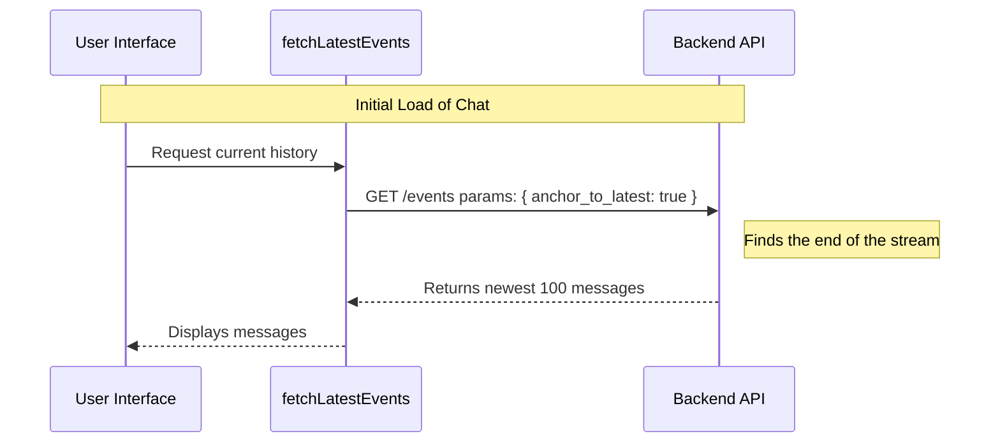

# Chapter 1: Latest Event Anchoring

Welcome to the **Assistant** project tutorial! 

In this first chapter, we are going to tackle a fundamental requirement of any chat application: **Loading the conversation.**

### Motivation: The "Live" Button

Imagine you are watching a livestream video, but you paused it to get a snack. When you come back, you are ten minutes behind. You press the **"Live"** button to jump straight to what is happening *right now*.

Chat applications work the same way. When a user opens a chat window, they don't want to see the first message they sent three months ago. They want to see the **most recent** messages immediately.

**The Problem:**
Typically, databases track data by IDs. To get data, you often need to say "Give me messages starting after ID #123." But when the app first loads, we don't know what the latest ID is!

**The Solution:**
**Latest Event Anchoring**. This is a strategy where we tell the system: "I don't know the specific message ID, just anchor me to the very end of the conversation stream."

---

### How to use it

We have abstracted this logic into a helper function called `fetchLatestEvents`. You don't need to worry about calculating IDs or cursors.

Here is how you use it in your application code:

```typescript
// 1. Prepare the authorization context (we will learn this in Ch 4)
const ctx = await createHistoryAuthCtx('session-123');

// 2. Fetch the most recent 100 events
const latestHistory = await fetchLatestEvents(ctx, 100);

console.log(latestHistory.events); // The newest messages!
```

**What happens here?**
1.  We set up the connection info (`ctx`).
2.  We ask for the latest events.
3.  The system automatically finds the "now" point and gives us the most recent slice of history.

---

### Under the Hood: How it Works

Let's look at what happens inside the `assistant` project when you call this function.

The magic relies on a specific flag sent to the API called `anchor_to_latest`. This flag acts like that "Live" button. It tells the server to ignore specific IDs and just look at the bottom of the list.

#### Visualizing the Flow



#### Code Implementation

The implementation is located in `sessionHistory.ts`. It is designed to be simple and reusable.

**1. The Specialist Function**

First, we have the specific function designed for this chapter. Its only job is to turn on the "Live" button flag.

```typescript
// File: sessionHistory.ts

/**
 * Newest page: last `limit` events, chronological, via anchor_to_latest.
 */
export async function fetchLatestEvents(
  ctx: HistoryAuthCtx,
  limit = HISTORY_PAGE_SIZE,
): Promise<HistoryPage | null> {
  // We hardcode 'anchor_to_latest: true' here
  return fetchPage(ctx, { limit, anchor_to_latest: true }, 'fetchLatestEvents')
}
```

*   **Explanation:** This function wraps a generic fetcher. Crucially, it hardcodes `{ anchor_to_latest: true }`. This is the signal that tells our API to perform **Latest Event Anchoring**.

**2. The Generic Fetcher**

The specialist function calls `fetchPage`, which handles the actual network request. This is part of our [Defensive API Wrapper](03_defensive_api_wrapper.md) strategy (which we will cover in Chapter 3), but here is the simplified core logic:

```typescript
// File: sessionHistory.ts

async function fetchPage(
  ctx: HistoryAuthCtx,
  params: Record<string, string | number | boolean>,
  label: string,
): Promise<HistoryPage | null> {
  // Use axios to make the GET request
  const resp = await axios
    .get<SessionEventsResponse>(ctx.baseUrl, {
      headers: ctx.headers, // Auth headers from Chapter 4
      params,               // This contains our anchor_to_latest flag
    })
    .catch(() => null) // Simple error handling

  // ... validation logic ...
```

*   **Explanation:** `fetchPage` doesn't care *what* logic we are using (anchoring vs. scrolling). It just takes the `params` we gave it and sends them to the API.

**3. Handling the Response**

Once the data comes back, we need to return it in a clean format. This touches on the [Data Normalization Layer](05_data_normalization_layer.md), but simply put, we ensure the data is an array.

```typescript
  // ... inside fetchPage ...

  return {
    // The list of messages
    events: Array.isArray(resp.data.data) ? resp.data.data : [],
    // Pointers for pagination (used in Chapter 2)
    firstId: resp.data.first_id, 
    hasMore: resp.data.has_more,
  }
}
```

*   **Explanation:** We return the `events` (the messages) and `hasMore`. If `hasMore` is true, it means there is older history available to scroll up to.

---

### Conclusion

You have learned the concept of **Latest Event Anchoring**. 

By using the `anchor_to_latest` flag, we avoid the complexity of managing cursors during the initial load. We simply ask the API: "Show me what is happening now," ensuring the user always lands in the most current context of the conversation.

**But wait!** What if the user wants to see what they said *yesterday*? They need to scroll up. How do we fetch older messages seamlessly?

Join us in the next chapter to learn about the **Reverse Pagination Strategy**.

[Next Chapter: Reverse Pagination Strategy](02_reverse_pagination_strategy.md)

---

Generated by [Code IQ](https://github.com/adityasoni99/Code-IQ)