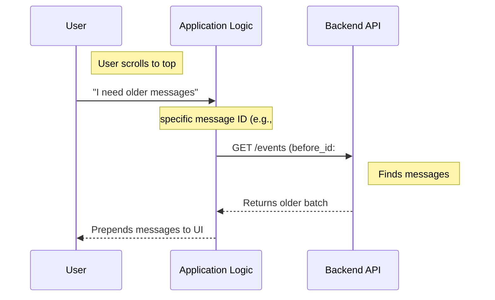

# Chapter 2: Reverse Pagination Strategy

Welcome back! In the previous chapter, [Latest Event Anchoring](01_latest_event_anchoring.md), we learned how to load the "Live" view of a chat—the most recent messages.

But a chat interface isn't just about what is happening *now*. It's a history book. Users expect to scroll up and see what was discussed yesterday or last week.

In this chapter, we will solve the **"Scroll Up"** problem using the **Reverse Pagination Strategy**.

---

### Motivation: The Infinite Scroll

Imagine you are reading a very long ancient scroll. You start reading at the very bottom (the most recent text).

When you reach the top of the section you are reading, you realize there is more text missing above it. To get the rest, you need to tell the librarian exactly where you stopped so they can unroll the previous section.

**The Problem:**
You cannot simply say "Give me Page 2." In a live chat, new messages are constantly arriving, which shifts "Page 2" around. Relying on page numbers would result in skipping messages or seeing duplicates.

**The Solution:**
We use a **Cursor System**. We take the ID of the oldest message currently on your screen (the top one) and use it as a bookmark. We ask the database: *"Give me the 100 messages that came immediately **before** this ID."*

---

### Key Concept: The `before_id`

This strategy relies on a specific piece of data called a "cursor." In our system, this cursor is the `before_id`.

*   **Chronological Order:** Time moves forward.
*   **Reverse Pagination:** We move backward.
*   **The Bookmark:** The `firstId` (the oldest ID in our current list) becomes the `before_id` for our next request.

---

### How to use it

We have simplified this logic into a function called `fetchOlderEvents`.

Here is the flow of how you would use it in your application code.

**1. Identify the Bookmark**
When you fetched the latest events (in Chapter 1), the system gave you a "bookmark" called `firstId`.

```typescript
// From Chapter 1
const latestPage = await fetchLatestEvents(ctx, 100);

// This ID represents the top-most message on the user's screen
const bookmark = latestPage.firstId; 

// This boolean tells us if there is even more history to fetch
const canScrollUp = latestPage.hasMore;
```

**2. Fetch the Previous Batch**
When the user scrolls to the top, use that bookmark to get older data.

```typescript
if (canScrollUp && bookmark) {
  // Ask for history specifically BEFORE our bookmark
  const olderPage = await fetchOlderEvents(ctx, bookmark, 100);

  console.log(olderPage.events); // Messages from the past!
  
  // Update the bookmark for the next time the user scrolls
  const newBookmark = olderPage.firstId;
}
```

**What happens here?**
1.  We check if `hasMore` is true (the librarian says there is more text).
2.  We pass our current top-most ID (`bookmark`) to the function.
3.  The system returns the previous slice of history without overlapping or skipping messages.

---

### Under the Hood: How it Works

Let's visualize the timeline. We are traversing time backwards.

#### Visualizing the Flow



1.  **User Action:** The user hits the "ceiling" of the current chat.
2.  **Cursor Lookup:** The app looks at the ID of that ceiling message (e.g., ID #850).
3.  **Request:** The app requests messages *before* #850.
4.  **Response:** The API returns the next chunk (e.g., IDs #750 to #849).

---

### Code Implementation

The code for this is located in `sessionHistory.ts`. It follows the same pattern as the function in the previous chapter but uses a different parameter.

**1. The Specialist Function**

This function's job is to ensure we are asking for `before_id` specifically.

```typescript
// File: sessionHistory.ts

/** Older page: events immediately before `beforeId` cursor. */
export async function fetchOlderEvents(
  ctx: HistoryAuthCtx,
  beforeId: string,
  limit = HISTORY_PAGE_SIZE,
): Promise<HistoryPage | null> {
  // We pass 'before_id' to the generic fetcher
  return fetchPage(ctx, { limit, before_id: beforeId }, 'fetchOlderEvents')
}
```

*   **Explanation:**
    *   It accepts `beforeId` as a required argument.
    *   It calls `fetchPage` (our [Defensive API Wrapper](03_defensive_api_wrapper.md)), passing `{ before_id: beforeId }` in the parameters object.

**2. The Shared Logic**

Just like in Chapter 1, this function relies on `fetchPage` to handle the network call. It uses the `ctx` we will define in [Session Authorization Context](04_session_authorization_context.md) to handle security.

```typescript
// File: sessionHistory.ts

async function fetchPage(
  ctx: HistoryAuthCtx,
  params: Record<string, string | number | boolean>,
  label: string,
): Promise<HistoryPage | null> {
  // The 'params' object now contains { before_id: "..." }
  const resp = await axios
    .get<SessionEventsResponse>(ctx.baseUrl, {
      headers: ctx.headers,
      params, // Axios attaches this to the URL: ?before_id=...
    })
    .catch(() => null)
// ...
```

*   **Explanation:** `fetchPage` is versatile. In Chapter 1, it received `anchor_to_latest`. In Chapter 2, it receives `before_id`. It treats them both simply as `params` to send to the server.

**3. Updating the Pointers**

When the data returns, we need to extract the *new* pointers so the user can scroll again later. This is part of the [Data Normalization Layer](05_data_normalization_layer.md).

```typescript
  // ... inside fetchPage ...
  return {
    events: Array.isArray(resp.data.data) ? resp.data.data : [],
    
    // This is crucial: The API gives us the ID of the OLDEST item 
    // in this new batch. This becomes our NEXT bookmark.
    firstId: resp.data.first_id, 
    
    hasMore: resp.data.has_more,
  }
}
```

---

### Conclusion

You now understand the **Reverse Pagination Strategy**.

By using the `before_id` cursor, we can stitch together a conversation history perfectly, regardless of how many new messages are coming in. We treat the top message as a "bookmark" to fetch the previous chapter of the story.

**However,** you might have noticed we are making network requests (`axios.get`) inside these functions. What if the network fails? What if the API sends back garbage data?

To make our assistant robust, we need to wrap these calls in a safety layer.

[Next Chapter: Defensive API Wrapper](03_defensive_api_wrapper.md)

---

Generated by [Code IQ](https://github.com/adityasoni99/Code-IQ)