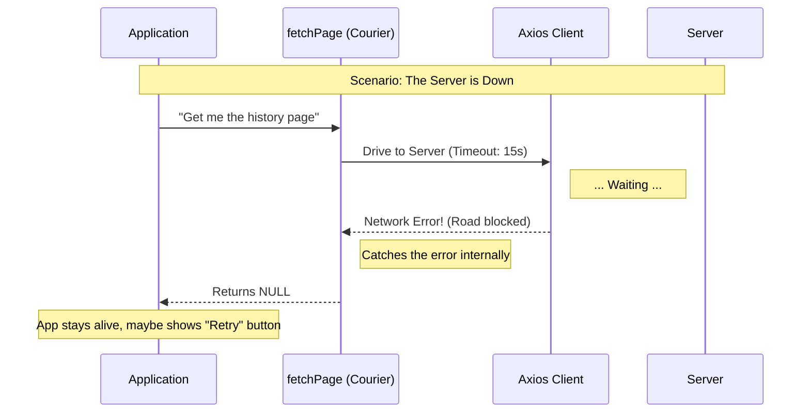

# Chapter 3: Defensive API Wrapper

Welcome back! 

In [Chapter 1](01_latest_event_anchoring.md), we learned how to get the latest messages. In [Chapter 2](02_reverse_pagination_strategy.md), we learned how to scroll back in time.

However, both of those chapters assumed everything works perfectly. But in the real world, Wi-Fi drops, servers get overloaded, and cables get unplugged.

In this chapter, we will build the **Defensive API Wrapper**. This is the safety gear that protects our application when the world goes wrong.

---

### Motivation: The Courier Service

Imagine you need to pick up a package from a warehouse.

**The "Do It Yourself" Approach (Bad):**
You get in your car and drive there.
*   If there is a traffic jam (Network Timeout), you are stuck.
*   If the bridge is out (Connection Error), you crash your car.
*   If the warehouse is closed (HTTP 500 Error), you have a panic attack in the parking lot.

In programming, "crashing your car" means your application throws an **Unhandled Exception**. The screen turns white, the app freezes, and the user quits.

**The "Defensive Wrapper" Approach (Good):**
Instead of driving yourself, you hire a **Specialized Courier** (our wrapper function).
*   You give the order to the courier.
*   If *anything* goes wrong—traffic, closed bridges, fires—the courier handles the stress.
*   The courier simply returns to your house empty-handed and says: "Sorry, I couldn't get it."

Your application (you) stays safe, comfortable, and stable.

---

### Key Concept: `fetchPage`

In our project, this courier is a function named `fetchPage`. 

It encapsulates (hides) the raw network client (`axios`). It acts as a shield between your application logic and the chaotic internet.

Its job is simple: **Return data if successful, or return `null` if anything fails.** It never complains, and it never crashes.

---

### Under the Hood: How it Works

Before looking at the code, let's look at the courier's process.

#### Visualizing the Flow



1.  **Request:** The App asks `fetchPage` for data.
2.  **Attempt:** `fetchPage` uses `axios` (the truck) to try and get it.
3.  **Failure:** Something goes wrong (timeout, 404, 500 error).
4.  **Defense:** Instead of passing that error back to the App, `fetchPage` swallows the error.
5.  **Graceful Exit:** It returns `null`.

---

### Code Implementation

Let's dissect `fetchPage` in `sessionHistory.ts`. We will break it down into three small parts to understand the defense mechanisms.

#### Part 1: The Configuration

First, we set up the request. We don't just send it blindly; we set rules.

```typescript
// File: sessionHistory.ts

const resp = await axios
  .get<SessionEventsResponse>(ctx.baseUrl, {
    headers: ctx.headers, // Authorization (covered in Ch 4)
    params,               // Pagination (covered in Ch 1 & 2)
    timeout: 15000,       // Rule 1: Don't wait forever
    validateStatus: () => true, // Rule 2: Don't throw on error codes
  })
```

*   **`timeout: 15000`**: If the server takes longer than 15 seconds, we consider it a failure. We don't want the user waiting forever.
*   **`validateStatus: () => true`**: By default, `axios` throws an error if the server says "404 Not Found" or "500 Error." We disable this. We want to receive the error response object so we can inspect it safely, rather than crashing.

#### Part 2: The Safety Net

This is the most important part of the defensive strategy.

```typescript
  // ... continued from above
  .catch(() => null) // <--- THE SAFETY NET
```

*   **The Problem:** If the user has no internet connection, `axios` will fail hard.
*   **The Solution:** The `.catch(() => null)` block catches *network level* crashes. If the internet is down, this line turns the catastrophic crash into a harmless `null`.

#### Part 3: Validation and Return

Now that we have a response (or `null`), we check if it is valid before giving it to the app.

```typescript
  // Check if we got a response AND if the status is OK (200)
  if (!resp || resp.status !== 200) {
    // Log it for the developer, but keeps the app safe
    logForDebugging(`[${label}] HTTP ${resp?.status ?? 'error'}`)
    return null
  }

  // If we made it here, we have valid data!
  return {
    events: Array.isArray(resp.data.data) ? resp.data.data : [],
    // ... maps other fields (Covered in Chapter 5) ...
  }
```

*   **`if (!resp ...)`**: If the Safety Net (Part 2) triggered, `resp` is null. We stop here.
*   **`resp.status !== 200`**: If the server sent a "500 Server Error", we stop here.
*   **`return null`**: The courier returns empty-handed.

---

### Usage in the Project

You don't usually call `fetchPage` directly. It is a helper used by the strategies we learned earlier.

Because `fetchPage` is defensive, our other functions become safe by default.

**Example from Chapter 1:**
```typescript
export async function fetchLatestEvents(ctx: HistoryAuthCtx) {
  // We delegate the risky work to fetchPage
  return fetchPage(ctx, { anchor_to_latest: true }, 'fetchLatestEvents')
}
```

If `fetchLatestEvents` returns `null`, the UI knows something went wrong, but the Javascript keeps running.

---

### Conclusion

You have learned the concept of a **Defensive API Wrapper**.

By wrapping our raw network calls in `fetchPage`, we centralized our error handling. We turned "App Crashes" into "Null Returns." This makes the application incredibly stable and resilient to poor network conditions.

**Coming Up Next:**
We have talked a lot about `ctx` (the Authorization Context) in these code snippets. How do we actually log in and tell the server who we are?

[Next Chapter: Session Authorization Context](04_session_authorization_context.md)

---

Generated by [Code IQ](https://github.com/adityasoni99/Code-IQ)