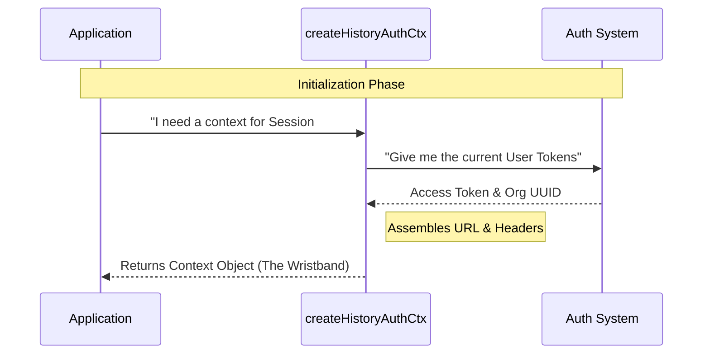

# Chapter 4: Session Authorization Context

Welcome to Chapter 4!

In the previous chapter, [Defensive API Wrapper](03_defensive_api_wrapper.md), we built a safety mechanism to handle network errors gracefully. We compared it to hiring a courier who handles traffic and road closures for you.

However, even the best courier needs two things to do their job:
1.  **The Address:** Where exactly are they going?
2.  **The Keys:** How do they get inside the secure building?

In this chapter, we will build the **Session Authorization Context**. This is how we package the "Address" and "Keys" into a single, reusable object.

---

### Motivation: The Theme Park Wristband

Imagine you are visiting a high-tech theme park.

**The "Inefficient" Way:**
Every time you want to go on a ride, you have to go back to the front gate, show your ID, pay for that specific ride, get a paper ticket, walk back to the ride, and hand it to the operator.
*   **Result:** You spend 90% of your day walking back and forth to the gate.

**The "Context" Way:**
You go to the front gate **once** when you arrive. You show your ID and pay. The staff gives you a **RFID Wristband**.
*   Now, when you want to go on a ride, you just flash your wristband. The ride operator instantly knows who you are and that you are allowed to enter.

**The Technical Problem:**
Logging in to an API is "expensive." It takes time to fetch an Access Token and find your Organization ID. If we did this inside every single `fetchLatestEvents` or `fetchOlderEvents` call, our chat would be slow and laggy.

**The Solution:**
We perform the expensive work once to create a **Context (`ctx`)**. We pass this context around like a wristband to make subsequent requests fast and simple.

---

### Key Concept: The Context Object

In our code, the "wristband" is a simple JavaScript object that looks like this:

```typescript
export type HistoryAuthCtx = {
  // The specific address for this chat session
  baseUrl: string
  
  // The keys (tokens and IDs) needed to enter
  headers: Record<string, string>
}
```

This object contains everything the [Defensive API Wrapper](03_defensive_api_wrapper.md) needs to make a successful call.

---

### How to use it

We have created a helper function called `createHistoryAuthCtx`. You call this function **once** when the user opens the chat.

#### 1. Generate the Context
This is the "standing in line at the front gate" part. It is asynchronous because it might need to talk to an authentication server.

```typescript
// Ideally, you get the session ID from the URL or app state
const currentSessionId = 'session-888';

// Generate the "wristband"
const ctx = await createHistoryAuthCtx(currentSessionId);
```

#### 2. Pass it to the Strategies
Now that you have the `ctx`, you pass it to the functions we built in [Latest Event Anchoring](01_latest_event_anchoring.md) and [Reverse Pagination Strategy](02_reverse_pagination_strategy.md).

```typescript
// Flash the wristband to get the latest messages
const latest = await fetchLatestEvents(ctx);

// Flash the wristband again to scroll up
const older = await fetchOlderEvents(ctx, latest.firstId);
```

Notice how `fetchLatestEvents` doesn't need to know your password or organization ID? It just trusts the `ctx`.

---

### Under the Hood: How it Works

Let's see what happens when you ask for this context.

#### Visualizing the Flow



1.  **Request:** The App requests a context for a specific chat session.
2.  **Fetch Secrets:** The builder asks the Auth System for the current user's credentials (this is the expensive part).
3.  **Assembly:** The builder combines the credentials and the session ID into a neat package.
4.  **Delivery:** The App receives the context and holds onto it.

#### Code Implementation

The code lives in `sessionHistory.ts`.

**1. Fetching the Secrets**

We use a helper `prepareApiRequest` (external to this module) to get the raw data we need.

```typescript
// File: sessionHistory.ts

export async function createHistoryAuthCtx(
  sessionId: string,
): Promise<HistoryAuthCtx> {
  // 1. Get the expensive data (Async operation)
  const { accessToken, orgUUID } = await prepareApiRequest()
  
  // ... continued below
```

*   **Explanation:** This line creates the bridge between our chat history logic and the user's login state.

**2. Building the Base URL**

We construct the specific "address" for this chat session.

```typescript
  // 2. Construct the specific URL for THIS session
  // Example: https://api.assistant.com/v1/sessions/session-123/events
  const url = `${getOauthConfig().BASE_API_URL}/v1/sessions/${sessionId}/events`
```

*   **Explanation:** By pre-calculating this string, we ensure we don't accidentally mistype the URL later when fetching pages.

**3. Assembling the Headers**

Finally, we put the "keys" into a header object.

```typescript
  // 3. Return the ready-to-use context object
  return {
    baseUrl: url,
    headers: {
      ...getOAuthHeaders(accessToken), // Standard Bearer Token
      'anthropic-beta': 'ccr-byoc-2025-07-29', // API Versioning
      'x-organization-uuid': orgUUID, // Org Identification
    },
  }
}
```

*   **Explanation:**
    *   We include the **OAuth Token** (Access).
    *   We include the **Organization UUID** (Routing).
    *   We return the final object.

---

### Integration with Previous Chapters

This chapter ties everything together.

1.  **Chapter 3 ([Defensive API Wrapper](03_defensive_api_wrapper.md)):** The `fetchPage` function consumes this `ctx`. It reads `ctx.baseUrl` and sends `ctx.headers` with the request.
2.  **Chapter 1 & 2:** The strategy functions act as middlemen, passing the `ctx` from your App to the Wrapper.

Without the **Session Authorization Context**, we would have to repeat these 10 lines of setup code inside every single function in our project!

---

### Conclusion

You have learned about the **Session Authorization Context**.

By doing the hard work of authentication and URL construction **once**, we created a "security badge" that makes the rest of our application faster and cleaner. We separated "Identity Management" (Who am I?) from "Data Fetching" (Get me messages).

**What's next?**
Now that we have the data, we need to make sure it looks correct. APIs sometimes send data in messy formats. We need to clean it up before showing it to the user.

Join us in the final chapter to learn about the **Data Normalization Layer**.

[Next Chapter: Data Normalization Layer](05_data_normalization_layer.md)

---

Generated by [Code IQ](https://github.com/adityasoni99/Code-IQ)