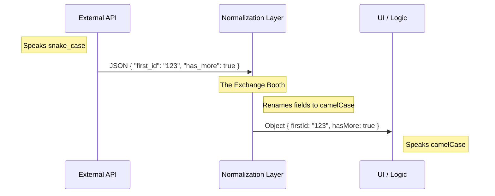

# Chapter 5: Data Normalization Layer

Welcome to the final chapter of the **Assistant** project tutorial!

In the previous chapter, [Session Authorization Context](04_session_authorization_context.md), we learned how to securely authenticate our requests using a reusable "wristband" context.

Now we have secure access, and we can fetch data. But there is one final problem: **The API speaks a different language than our Application.**

In this chapter, we will build the **Data Normalization Layer**.

---

### Motivation: The Currency Exchange

Imagine you just landed at an airport in a foreign country. You have money in your pocket, but it is in your home currency. If you try to buy a coffee, the shopkeeper won't accept it.

You need to visit the **Currency Exchange Booth**. You hand them your money, and they hand back the local currency. Now, you can buy anything in the city without worrying about exchange rates or doing math in your head at every store.

**The Technical Problem:**
*   **The API (Foreign Country):** Databases usually prefer `snake_case` (words separated by underscores, like `first_id` or `has_more`).
*   **The UI (Local Economy):** JavaScript and TypeScript applications prefer `camelCase` (capitalized words, like `firstId` or `hasMore`).

**The Solution:**
We create a **Normalization Layer** right at the "border" (immediately after the network request). It renames and reformats the data *once*, so the rest of our application can work with clean, native JavaScript objects.

---

### Key Concept: Transformation

The goal is to take the "Raw" data from the server and turn it into "Clean" data for the app.

| Raw API Data (Server) | Clean App Data (Client) |
| :--- | :--- |
| `first_id` | `firstId` |
| `has_more` | `hasMore` |
| `data` | `events` |
| `last_id` | *(Ignored/Not needed)* |

By doing this, we ensure our UI components never have to write code like `props.first_id`. That would look out of place in a TypeScript project!

---

### How to use it

As a user of our history module, you benefit from this automatically. You don't have to do anything!

When you call the functions we built in [Latest Event Anchoring](01_latest_event_anchoring.md) or [Reverse Pagination Strategy](02_reverse_pagination_strategy.md), the data you receive is already clean.

```typescript
// 1. Fetch the data
const historyPage = await fetchLatestEvents(ctx);

// 2. Use the data naturally
if (historyPage.hasMore) {
  // We use 'hasMore', NOT 'has_more'
  console.log("There is more history to load!");
}

console.log(historyPage.firstId); // NOT 'first_id'
```

**Why is this better?**
If the API changes its field name from `has_more` to `is_there_more_data` next year, we only have to change our code in **one place** (the Normalization Layer). The rest of your application won't break.

---

### Under the Hood: How it Works

Let's look at the flow of data as it crosses the border from the Internet into our Application.

#### Visualizing the Flow



1.  **Arrival:** The raw JSON arrives from `axios`.
2.  **Exchange:** The Normalization Layer extracts the values we need.
3.  **Renaming:** It assigns those values to new property names that match our coding style.
4.  **Delivery:** The clean object is returned to the function caller.

#### Code Implementation

This logic is embedded inside the `fetchPage` function in `sessionHistory.ts`. It acts as the "Exchange Booth."

**1. Defining the Raw Format**

First, we define what the API sends us. This acts as our contract with the server.

```typescript
// File: sessionHistory.ts

// This matches the JSON coming from the server EXACTLY
type SessionEventsResponse = {
  data: SDKMessage[]
  has_more: boolean       // Snake case
  first_id: string | null // Snake case
  last_id: string | null  // We might receive this, even if we don't use it
}
```

*   **Explanation:** We use TypeScript types to describe the "Foreign Currency." Note the underscores.

**2. Defining the Clean Format**

Next, we define what our application *wants* to use.

```typescript
// File: sessionHistory.ts

// This is the clean structure our UI expects
export type HistoryPage = {
  events: SDKMessage[]    // Renamed from 'data' to be more descriptive
  firstId: string | null  // Camel case
  hasMore: boolean        // Camel case
}
```

*   **Explanation:** This is the "Local Currency." It uses standard JavaScript naming conventions.

**3. Performing the Exchange**

Finally, inside `fetchPage` (our [Defensive API Wrapper](03_defensive_api_wrapper.md)), we perform the conversion right before returning.

```typescript
// File: sessionHistory.ts -> inside fetchPage function

  // ... (Network request happens above) ...

  // NORMALIZATION HAPPENS HERE:
  return {
    // 1. Rename 'data' to 'events' and ensure it is an array
    events: Array.isArray(resp.data.data) ? resp.data.data : [],
    
    // 2. Map snake_case to camelCase
    firstId: resp.data.first_id,
    
    // 3. Map snake_case to camelCase
    hasMore: resp.data.has_more,
  }
```

*   **Line 1:** The API calls the list of messages `data`. That is very generic. We rename it to `events` so the code is easier to read. We also add a safety check (`Array.isArray`) to ensure we never crash if the API sends `null`.
*   **Line 2 & 3:** We map the values directly. `first_id` becomes `firstId`.

---

### Conclusion

You have completed the **Data Normalization Layer**.

By treating the API response as "raw material" and refining it immediately, we protect our application from inconsistent naming and messy data structures.

### Series Wrap-Up

Congratulations! You have built a robust, production-grade chat history loader. Let's review what you have accomplished:

1.  **[Latest Event Anchoring](01_latest_event_anchoring.md):** You learned how to load the "Live" conversation without knowing the IDs.
2.  **[Reverse Pagination Strategy](02_reverse_pagination_strategy.md):** You implemented the logic to scroll back in time using cursors.
3.  **[Defensive API Wrapper](03_defensive_api_wrapper.md):** You protected your app from crashing when the network fails.
4.  **[Session Authorization Context](04_session_authorization_context.md):** You optimized authentication by creating a reusable "wristband."
5.  **Data Normalization Layer:** You ensured your code stays clean by translating API data into friendly JavaScript objects.

You now possess the tools to build a seamless, resilient chat experience. Happy coding!

---

Generated by [Code IQ](https://github.com/adityasoni99/Code-IQ)