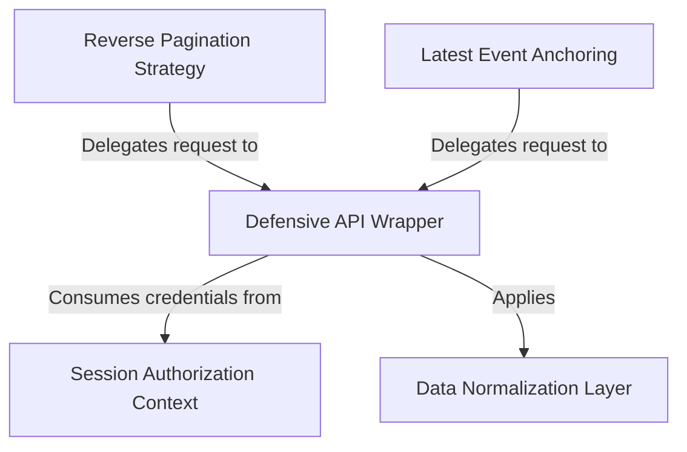

# Tutorial: assistant

This project serves as a robust backend utility for managing **chat session history**. It acts as a specialized librarian that securely organizes *authentication credentials* and retrieves conversation events from an external API. The system supports seamless scrolling by allowing the application to fetch messages in **reverse chronological order** or instantly jump to the **latest updates**, all while protecting the app from network crashes and converting raw data into a clean, usable format.

## Chapters

1. [Latest Event Anchoring](01_latest_event_anchoring.md)
2. [Reverse Pagination Strategy](02_reverse_pagination_strategy.md)
3. [Defensive API Wrapper](03_defensive_api_wrapper.md)
4. [Session Authorization Context](04_session_authorization_context.md)
5. [Data Normalization Layer](05_data_normalization_layer.md)

---

Generated by [Code IQ](https://github.com/adityasoni99/Code-IQ)