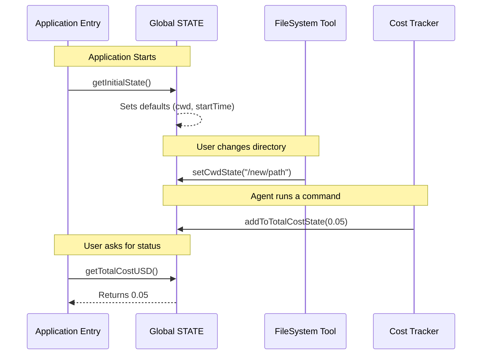

# Chapter 1: Global Application State

Welcome to the **Bootstrap** project! If you are just joining us, this is the very first chapter of our deep dive into the system's architecture.

Before we worry about complex AI agents, cost tracking, or telemetry, we need a place to store information. Imagine you are working on a team project in a conference room. To keep everyone on the same page, you write the most important details on a large **Whiteboard** at the front of the room.

In our application, **Global Application State** is that whiteboard.

### Why do we need this?

Imagine you are writing a program that needs to know the **Current Working Directory (CWD)** (the folder you are currently working in). If you didn't have a global state, you would have to pass the `cwd` variable as an argument to *every single function* in your code.

**Without Global State (Messy):**
```typescript
function startApp(cwd) {
  loadConfig(cwd);
  startAgent(cwd);
}

function startAgent(cwd) {
  // Pass it down again... and again...
  executeTool(cwd);
}
```

**With Global State (Clean):**
Any part of the system can simply look at the "whiteboard" to see where we are.

---

## Key Concept: The `STATE` Object

At its core, the Global Application State is just a massive JavaScript object called `STATE`. It acts as a **Singleton**—meaning there is only one instance of it alive while the application runs.

This object holds everything that defines the "context" of the application right now, including:
1.  **Where we are:** The current directory (`cwd`).
2.  **Who we are:** The Session ID (`sessionId`).
3.  **What we've spent:** Cost accounting (`totalCostUSD`).
4.  **Configuration:** Active flags and settings.

### The Structure

Here is a simplified look at what this object looks like in code. It's a plain dictionary of values.

```typescript
type State = {
  // Where did we start?
  originalCwd: string
  
  // Where are we now?
  cwd: string
  
  // Who is this session?
  sessionId: string
  
  // How much have we spent?
  totalCostUSD: number
  
  // Is the user there?
  isInteractive: boolean
}
```

> **Note:** The actual `State` type in `state.ts` is huge! It holds dozens of properties. But don't worry, you don't need to memorize them. You just need to know they live here.

---

## How to Use It: Getters and Setters

In `bootstrap`, we **never** touch the `STATE` variable directly from other files. It is kept private to ensure safety. Instead, we use "Accessor Functions" (Getters and Setters).

Think of the Global State as a bank vault. You don't walk in and grab money. You ask a teller (a function) to give you money or deposit it for you.

### Example: Managing the Directory

Let's look at how we handle the Current Working Directory.

**1. Reading the State (The Getter)**
When a module needs to know the current folder, it calls this function:

```typescript
// From state.ts
export function getCwdState(): string {
  return STATE.cwd
}
```

**2. Writing to State (The Setter)**
When the agent decides to change directories (like running a `cd` command), it calls this function:

```typescript
// From state.ts
export function setCwdState(cwd: string): void {
  // Normalize the path so it works across different OSs
  STATE.cwd = cwd.normalize('NFC')
}
```

### Why use functions?
Notice that `setCwdState` normalizes the string (`.normalize('NFC')`) before saving it. By forcing everyone to use this function, we guarantee that the data in our state is always clean and consistent.

---

## The "Under the Hood" Workflow

What actually happens when the application starts and runs? Let's visualize the lifecycle of the Global State using a simple diagram.

1.  **Initialization:** When the app launches, it creates the initial blank state.
2.  **Modification:** Tools (like the file system tools) update the state.
3.  **Access:** Other parts of the system (like the prompt generator) read the state.



---

## Deep Dive: Code Implementation

Let's look at how `state.ts` implements this.

### 1. Initialization
The state isn't just `null` when we start. We have a function `getInitialState()` that sets up sensible defaults. It captures the exact moment the app starts (`startTime`) and where it starts (`originalCwd`).

```typescript
// state.ts
function getInitialState(): State {
  // ... logic to find current directory ...
  const state: State = {
    originalCwd: resolvedCwd,
    startTime: Date.now(),
    totalCostUSD: 0,
    sessionId: randomUUID(), // Generate a unique ID
    // ... many other defaults
  }
  return state
}
```

### 2. The Singleton Instance
This is the most important line in the file. It creates the *one true source of truth*.

```typescript
// AND ESPECIALLY HERE
const STATE: State = getInitialState()
```

The comment "THINK THRICE BEFORE MODIFYING" is a warning. Because this variable is global, adding data here adds it to the memory footprint of the entire application forever.

### 3. Session Management
One of the most critical pieces of data stored here is the `sessionId`. This ID allows us to track conversations, logs, and history.

```typescript
export function getSessionId(): string {
  return STATE.sessionId
}

export function regenerateSessionId(): string {
  STATE.sessionId = randomUUID()
  return STATE.sessionId
}
```

This simple ID is the foundation for the next major concept: **Sessions**.

---

## Connections to Other Systems

The Global State acts as the glue between several complex systems. We will explore these in detail in upcoming chapters:

*   **Sessions:** The `sessionId` stored here controls the lifecycle of a user's interaction. We cover this in [Session Lifecycle Management](02_session_lifecycle_management.md).
*   **Modes:** The state tracks `isInteractive` and various "Modes" (like Plan Mode vs. Act Mode). This is detailed in [Agent Context & Mode Tracking](03_agent_context___mode_tracking.md).
*   **Money:** The `totalCostUSD` and `modelUsage` are vital for making sure the agent doesn't spend too much API credit. Learn more in [Resource & Cost Accounting](04_resource___cost_accounting.md).
*   **Observability:** The state holds references to `meter` and `loggerProvider`, which are the eyes and ears of the system. We discuss this in [Telemetry Infrastructure](05_telemetry_infrastructure.md).

---

## Summary

In this chapter, we learned:
1.  **Global Application State** is the "whiteboard" or "short-term memory" of the application.
2.  It is a **Singleton** object called `STATE` defined in `state.ts`.
3.  We access it strictly through **exported functions** (getters and setters) to keep data clean.
4.  It holds critical context like the current directory, session ID, and accumulated costs.

Now that we have a place to store our data, we need to understand how to manage the *time* and *lifetime* of that data.

[Next Chapter: Session Lifecycle Management](02_session_lifecycle_management.md)

---

Generated by [Code IQ](https://github.com/adityasoni99/Code-IQ)