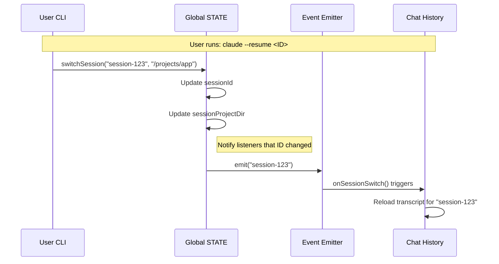

# Chapter 2: Session Lifecycle Management

In the previous chapter, [Global Application State](01_global_application_state.md), we built our "Whiteboard"—a central place to store data. But data isn't static. Users come and go, conversations start and stop, and sometimes we need to switch between different tasks.

This is where **Session Lifecycle Management** comes in.

If Global State is the whiteboard, **Session Management** is the concept of a "Meeting." A meeting has a specific start time, a specific topic, and a specific ID. When the meeting ends, we wipe the whiteboard. If we resume the meeting later, we need to put everything back exactly how it was.

## The Motivation: Why do we need Sessions?

Imagine you are using a web browser.
1.  **Tab A:** You are writing an email.
2.  **Tab B:** You are watching a video.

If the browser didn't distinguish between Tab A and Tab B, your email text might accidentally appear in the video search bar!

In our agent, a **Session** groups together:
*   The conversation history (what you and the agent said).
*   The costs incurred during this specific task.
*   The files created or modified.

We need a system to track **"Who is talking right now?"** and **"Where are they?"**

---

## Key Concepts

There are three main pillars to managing a session in `bootstrap`.

### 1. The Session ID (`sessionId`)
Every time you start the agent, it generates a unique "Passport Number" called a UUID (Universally Unique Identifier). This string (e.g., `a1b2-c3d4...`) tags every log line, cost entry, and error message.

### 2. The Stable Home (`projectRoot`)
This is a subtle but critical concept.
*   **CWD (Current Working Directory):** Where you are *right now*. If you run `cd src`, your CWD changes.
*   **Project Root:** Where the project *started*.

**Why the difference?**
If the agent is working in `/my-app`, and it runs `cd /my-app/src/utils`, it shouldn't forget that it is still working on `/my-app`. The `projectRoot` acts as the anchor for the session's history and skills.

### 3. Teleportation (`switchSession`)
Sometimes, a user wants to "resume" an old conversation. To do this, we perform a "context switch." We load the old ID and the old directory, effectively teleporting the agent back to the past state.

---

## Usage: Managing the Session

Let's look at how we interact with the session logic using the functions exported from `state.ts`.

### Getting the Current ID
Any tool that needs to log data needs to know the current Session ID.

```typescript
import { getSessionId } from './state.js'

function logError(message: string) {
  const currentId = getSessionId()
  console.log(`[Session: ${currentId}] Error: ${message}`)
}
```

### Starting Over (Regeneration)
Sometimes, things go wrong, or the user wants a fresh start without restarting the entire program. We can regenerate the ID.

```typescript
import { regenerateSessionId } from './state.js'

// Wipe the slate clean
const newId = regenerateSessionId()
console.log("New session started:", newId)
```

### Switching Contexts
If we need to jump to a specific session (for example, when the user provides a `--resume` flag), we use `switchSession`.

```typescript
import { switchSession } from './state.js'

// Teleport to an existing session
switchSession('existing-session-id', '/path/to/project')
```

---

## Under the Hood: The Lifecycle Flow

What happens when we switch sessions? It's not just changing a variable; we have to notify the rest of the system so it can reload history.



---

## Deep Dive: Code Implementation

Let's look at the implementation in `state.ts`.

### 1. The `projectRoot` Anchor
In the `State` object (discussed in [Global Application State](01_global_application_state.md)), we hold two path variables. Notice how `projectRoot` is designed to be stable.

```typescript
type State = {
  // Changes frequently (whenever agent runs `cd`)
  cwd: string

  // Set ONCE at startup. Never changes mid-session.
  // Used for history, skills, and session identity.
  projectRoot: string
  
  // ... other fields
}
```

### 2. The `switchSession` Logic
This is the mechanic that allows "teleportation."

```typescript
// state.ts

// 1. We define a signal (an event emitter)
const sessionSwitched = createSignal<[id: SessionId]>()

export function switchSession(
  sessionId: SessionId,
  projectDir: string | null = null,
): void {
  // 2. Clean up old data (caches)
  STATE.planSlugCache.delete(STATE.sessionId)

  // 3. Atomically update the ID and the directory
  STATE.sessionId = sessionId
  STATE.sessionProjectDir = projectDir

  // 4. Shout to the world: "We moved!"
  sessionSwitched.emit(sessionId)
}
```

**Why is this atomic?**
We update `sessionId` and `sessionProjectDir` in the same function. This ensures we never have a "Zombie State" where we have the *new* ID but are looking in the *old* folder for files.

### 3. Listening for Changes
Other parts of the application (like the transcript logger) need to know when the session changes so they can stop writing to the old file and start writing to the new one.

```typescript
// state.ts exports this subscriber
export const onSessionSwitch = sessionSwitched.subscribe
```

A listener in another file might look like this:

```typescript
// concurrentSessions.ts
onSessionSwitch((newSessionId) => {
  // Update the lock file to say: "This process now owns newSessionId"
  updatePidFile(newSessionId)
})
```

---

## Connections to Other Chapters

Session management is the heartbeat of the application. It pumps the "Identity" to all other organs:

*   **Context:** The session determines *what* the agent remembers. We explore how the agent knows what it's doing in [Agent Context & Mode Tracking](03_agent_context___mode_tracking.md).
*   **Cost:** If you switch sessions, you don't want the cost of Session B to be billed to Session A. The cost accountant uses `sessionId` to separate these bills. See [Resource & Cost Accounting](04_resource___cost_accounting.md).
*   **Telemetry:** When we send logs to the cloud for debugging, the `sessionId` is the primary key used to trace what happened. See [Telemetry Infrastructure](05_telemetry_infrastructure.md).

---

## Summary

In this chapter, we learned:
1.  **Sessions** provide identity and continuity to the user's interaction.
2.  The **Session ID** is the unique key for this identity.
3.  **Project Root** is the stable home base, distinct from the wandering `cwd`.
4.  **`switchSession`** allows the agent to "teleport" context, ensuring history and file paths stay in sync.

Now that we know *who* we are (Session ID) and *where* we are (Global State), we need to figure out *what we are doing*. Are we planning? Are we coding? Are we waiting for user input?

[Next Chapter: Agent Context & Mode Tracking](03_agent_context___mode_tracking.md)

---

Generated by [Code IQ](https://github.com/adityasoni99/Code-IQ)