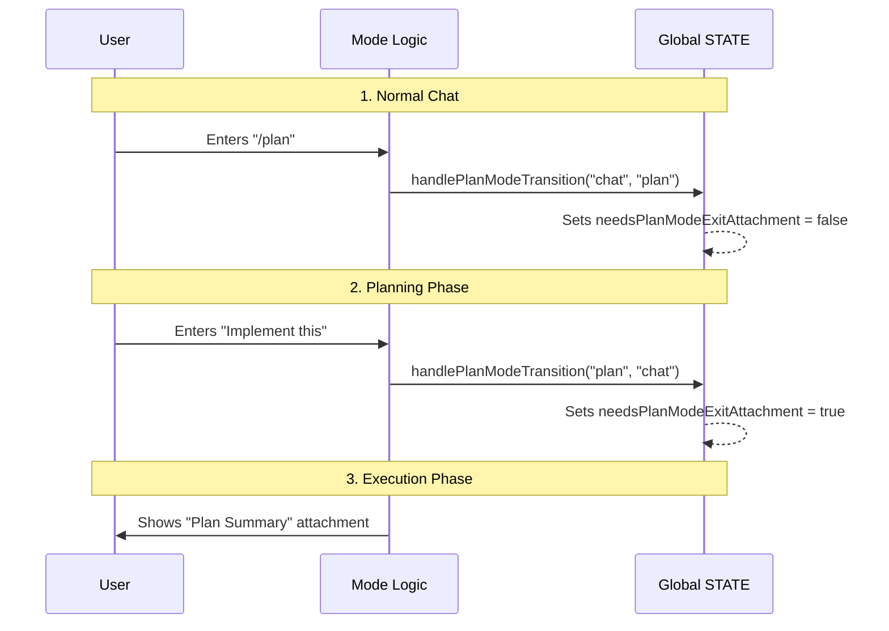

# Chapter 3: Agent Context & Mode Tracking

Welcome back! In the previous chapter, [Session Lifecycle Management](02_session_lifecycle_management.md), we learned how to manage the "Meeting" (Session) and the "Room" (Project Root).

Now that we know *who* is in the meeting and *where* they are, we need to establish the **Rules of Engagement**.

Is the agent allowed to act on its own? Is it currently brainstorming a plan? Has it been left alone for a long time? This is **Agent Context & Mode Tracking**.

## The Motivation: Why do we need Modes?

Imagine you hired a contractor to renovate your kitchen. You interact with them in different "modes":

1.  **Planning Mode:** You sit down and discuss blueprints. No hammers are swinging. You are just thinking.
2.  **Auto Mode:** You say, "I'm going to work, please install the cabinets." You want them to work autonomously without asking you every 5 minutes.
3.  **Interactive Mode:** You stand next to them saying, "Move that slightly to the left."

Without **Mode Tracking**, the agent wouldn't know how to behave. It might try to install a cabinet while you are still drawing the blueprint, or it might stop to ask for permission when you explicitly told it to run automatically.

In `bootstrap`, we use **Context Flags** in the Global State to track these behaviors.

---

## Key Concepts

### 1. Interactivity (`isInteractive`)
This is the master switch.
*   **Interactive:** The user is sitting at the keyboard waiting for a response.
*   **Non-Interactive:** The agent is running via a script, a cron job, or in a "headless" environment.

### 2. Operational Modes (Plan vs. Act)
*   **Plan Mode:** The agent acts as an architect. It gathers information and proposes a solution but rarely modifies code directly.
*   **Act (Normal) Mode:** The agent acts as a builder. It executes tools, runs commands, and edits files.

### 3. Latches (The "Sticky" Flags)
This is a specific optimization for AI. When we send data to the AI model (Anthropic's API), we want to use **Prompt Caching** to save money and time.

If we constantly toggle settings on and off, we "break" the cache. A **Latch** is a flag that, once turned on, *stays* on for the rest of the session to keep the cache stable.

---

## Usage: Checking the Context

We interact with these modes using simple functions exported from `state.ts`.

### Checking for a Human
Before asking for user input (like a confirmation prompt), we must check if a human is actually there.

```typescript
import { getIsInteractive } from './state.js'

function askForPermission() {
  if (!getIsInteractive()) {
    // Don't block! Default to a safe action or fail.
    console.log("No user present, skipping permission...")
    return
  }
  // ... show dialog ...
}
```

### Handling Mode Transitions
When the user types `/plan`, we switch modes. The system needs to know about this transition to handle UI updates (like showing a "Exiting Plan Mode" notification later).

```typescript
import { handlePlanModeTransition } from './state.js'

// User types: /plan
handlePlanModeTransition('auto', 'plan')

// Later, user says: "Go ahead"
handlePlanModeTransition('plan', 'auto')
```

### The "Latch" for AFK Mode
If the user steps away (AFK - Away From Keyboard), we enable a special header to tell the API to cache differently. Once enabled, we keep it enabled.

```typescript
import { getAfkModeHeaderLatched, setAfkModeHeaderLatched } from './state.js'

function updateHeaders() {
  // If it was EVER on, keep it on
  if (getAfkModeHeaderLatched()) {
    return { 'anthropic-beta': 'prompt-caching-2024-07-31' }
  }
}
```

---

## Under the Hood: The State Machine

How does the system decide what to show the user? It acts like a state machine. Let's visualize a user entering "Plan Mode" and then exiting it.

1.  **Normal State:** Agent answers questions.
2.  **Transition:** User types `/plan`. State updates.
3.  **Exit:** User says "Do it." State updates.
4.  **Notification:** Because we tracked the transition, we know to show a summary of what was planned.



---

## Deep Dive: Code Implementation

Let's look at how `state.ts` implements this tracking.

### 1. Mode Transitions
We don't just flip a boolean. We look at *where we came from* and *where we are going*. This allows us to trigger specific UI elements, like the "Plan Mode Exit Summary."

```typescript
// state.ts
export function handlePlanModeTransition(fromMode: string, toMode: string): void {
  // If we are leaving plan mode...
  if (fromMode === 'plan' && toMode !== 'plan') {
    // ...flag that we need to show the summary attachment
    STATE.needsPlanModeExitAttachment = true
  }
  
  // If entering plan mode, clear old flags
  if (toMode === 'plan' && fromMode !== 'plan') {
    STATE.needsPlanModeExitAttachment = false
  }
}
```

### 2. The Latch Logic
Here is the implementation of the "Sticky" flag. Notice there is no "Turn Off" function for the latch during a session. This is intentional to preserve the API cache.

```typescript
// state.ts

// This variable stores the state. null = not set yet.
// afkModeHeaderLatched: boolean | null

export function getAfkModeHeaderLatched(): boolean | null {
  return STATE.afkModeHeaderLatched
}

export function setAfkModeHeaderLatched(v: boolean): void {
  // Once true, it stays true (conceptually)
  STATE.afkModeHeaderLatched = v
}
```

### 3. Tracking Invoked Skills
Context isn't just about modes; it's also about what the agent *has done*. We track `invokedSkills` to ensure that if we compress the conversation history (to save space), we don't forget which important tools (skills) were used.

```typescript
// state.ts
export function addInvokedSkill(
  skillName: string, 
  content: string
): void {
  // Store what we did so we don't forget it later
  STATE.invokedSkills.set(skillName, {
    skillName,
    content,
    invokedAt: Date.now()
  })
}
```

---

## Connections to Other Systems

Context tracking is the decision-making brain that guides the other systems:

*   **Global State:** All these flags (`isInteractive`, `needsPlanModeExitAttachment`) live in the `STATE` object we built in [Global Application State](01_global_application_state.md).
*   **Cost:** The "Latches" (like `afkModeHeaderLatched`) exist specifically to optimize the Prompt Cache, which directly lowers the bill. We discuss costs in [Resource & Cost Accounting](04_resource___cost_accounting.md).
*   **Telemetry:** When we analyze logs, knowing if the user was in "Plan Mode" vs "Auto Mode" helps us understand why the agent behaved a certain way. This is covered in [Telemetry Infrastructure](05_telemetry_infrastructure.md).

---

## Summary

In this chapter, we learned:
1.  **Context Tracking** tells the agent *how* to behave (Planning vs. Doing).
2.  **`isInteractive`** determines if the agent can ask the user for help.
3.  **Mode Transitions** allow us to trigger helpful UI summaries when switching tasks.
4.  **Latches** are sticky flags that keep API caches stable to save money.

Now that the agent knows *who* it is (Session) and *what mode* it is in (Context), we need to track the most painful part of any project: **The Budget**.

[Next Chapter: Resource & Cost Accounting](04_resource___cost_accounting.md)

---

Generated by [Code IQ](https://github.com/adityasoni99/Code-IQ)