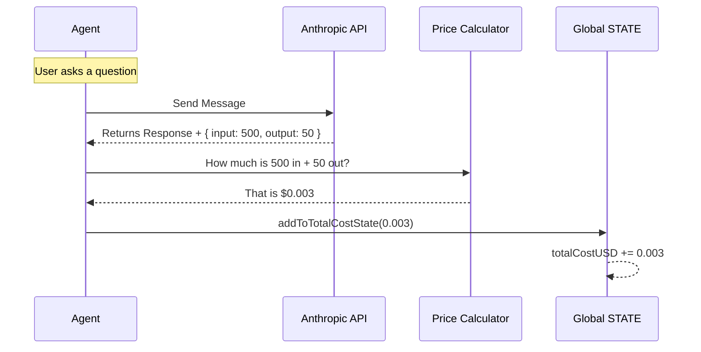

# Chapter 4: Resource & Cost Accounting

Welcome back! In the previous chapter, [Agent Context & Mode Tracking](03_agent_context___mode_tracking.md), we gave our agent a "brain" to understand if it should be planning, acting, or waiting for a human.

Now that the agent knows *what* to do, we need to track **how much it costs** to do it.

This is **Resource & Cost Accounting**.

## The Motivation: The Taxi Meter

Imagine you are taking a taxi across the city.
*   You don't just pay a flat fee at the end of the year.
*   You watch a **meter** running in real-time.
*   It tracks **distance** (miles) and **time** (minutes).

In the world of AI agents, "Distance" is the number of **Tokens** (words) we send and receive, and "Time" is the **Duration** of the API calls.

If we didn't track this, a user might ask the agent to "Read every file in my computer" and accidentally spend $500 in API credits in ten minutes! We need a system to tally the bill continuously so the user stays in control.

---

## Key Concepts

The cost system in `bootstrap` tracks three main resources inside the [Global Application State](01_global_application_state.md).

### 1. The Ledger (`totalCostUSD`)
This is the most important number. It acts like a cash register. Every time the agent successfully talks to an LLM (Large Language Model), we calculate the price based on the model used (e.g., Claude 3.5 Sonnet vs. Haiku) and add it to this running total.

### 2. Token Usage (`modelUsage`)
Not all miles are equal.
*   **Input Tokens:** Things you type or files the agent reads. (Cheaper)
*   **Output Tokens:** The text the AI generates. (More expensive)
*   **Cache Reads:** Re-using context we sent previously. (Very cheap!)

We store a breakdown of these tokens for every model type in an object called `modelUsage`.

### 3. Time (`duration`)
We track how long the AI takes to "think." This helps us identify if a specific model is running slowly or if the network is lagging.

---

## Usage: Managing the Bill

We interact with the accounting system using helper functions exported from `state.ts`.

### Reading the Bill
When we want to show the user how much they have spent (for example, in the bottom corner of their screen), we call this getter:

```typescript
import { getTotalCostUSD } from './state.js'

function displayStatus() {
  const cost = getTotalCostUSD()
  // Formats to currency, e.g., "$0.15"
  console.log(`Current Session Cost: $${cost.toFixed(2)}`)
}
```

### Recording a Transaction
When an API call finishes, the networking layer calculates the cost and "deposits" the usage into the global state.

```typescript
import { addToTotalCostState } from './state.js'

// Example: API call cost $0.002
// We also pass the detailed token breakdown
addToTotalCostState(0.002, usageStats, 'claude-3-5-sonnet')
```

### Checking Time
We can also see how much "wall-clock" time we have spent waiting for the AI.

```typescript
import { getTotalAPIDuration } from './state.js'

const durationMs = getTotalAPIDuration()
console.log(`Total time waiting for AI: ${durationMs / 1000}s`)
```

---

## Under the Hood: The Accounting Flow

How does a request turn into a cost entry? Let's visualize the lifecycle of a single message sent to the AI.

1.  **Action:** The Agent sends a prompt.
2.  **Receipt:** The API responds with the answer *and* a `usage` object (e.g., "Input: 500 tokens, Output: 20 tokens").
3.  **Calculation:** We multiply tokens by the price-per-token of that specific model.
4.  **Update:** We update the global `STATE`.



---

## Deep Dive: Code Implementation

Let's look at how `state.ts` implements the ledger.

### 1. The State Structure
Inside the massive `State` object, we have dedicated fields for money, time, and model breakdowns.

```typescript
// state.ts
type State = {
  // The big number: Cumulative cost in dollars
  totalCostUSD: number
  
  // Time spent waiting for APIs (in milliseconds)
  totalAPIDuration: number
  
  // Detailed breakdown: Maps 'claude-3-5-sonnet' to specific token counts
  modelUsage: { [modelName: string]: ModelUsage }
  
  // ... other fields
}
```

### 2. Adding to the Ledger
The `addToTotalCostState` function is the only way to increase the bill. It updates both the total money spent and the detailed usage stats for the specific model used.

```typescript
// state.ts
export function addToTotalCostState(
  cost: number,
  modelUsage: ModelUsage,
  model: string,
): void {
  // 1. Update the detailed token counts for this model
  STATE.modelUsage[model] = modelUsage
  
  // 2. Add the dollar amount to the grand total
  STATE.totalCostUSD += cost
}
```

### 3. Resetting the Meter
Sometimes, for testing or when fully restarting a context, we need to zero out the meter.

```typescript
// state.ts
export function resetCostState(): void {
  STATE.totalCostUSD = 0
  STATE.totalAPIDuration = 0
  STATE.modelUsage = {}
  // Reset other counters...
}
```
*Note: We usually don't reset costs during a [Session](02_session_lifecycle_management.md) unless the user explicitly requests a "fresh start."*

---

## Connections to Other Systems

The Cost Accounting system is a passive tracker, but it feeds critical data to other parts of the application:

*   **Global State:** The `totalCostUSD` variable lives inside the `STATE` singleton we defined in [Global Application State](01_global_application_state.md).
*   **Context:** In [Agent Context & Mode Tracking](03_agent_context___mode_tracking.md), we learned about "Latches" (like `afkModeHeaderLatched`). These exist specifically to help **lower the cost** tracked here by enabling prompt caching.
*   **Telemetry:** The raw numbers collected here are sent to the cloud for analysis. For example, we might want to know "What is the average cost of a Pull Request?" We will cover this in [Telemetry Infrastructure](05_telemetry_infrastructure.md).

---

## Summary

In this chapter, we learned:
1.  **Resource Accounting** acts like a taxi meter, tracking cost and time in real-time.
2.  **`totalCostUSD`** is the main ledger for the user's bill.
3.  **`modelUsage`** tracks the specific "fuel" (tokens) used by different AI models.
4.  We use **helper functions** to safely add costs and read totals from the global state.

Now that we have gathered all this data—Identity (Session), Behavior (Context), and Cost (Accounting)—we need a way to **record and analyze** it to improve the system.

[Next Chapter: Telemetry Infrastructure](05_telemetry_infrastructure.md)

---

Generated by [Code IQ](https://github.com/adityasoni99/Code-IQ)