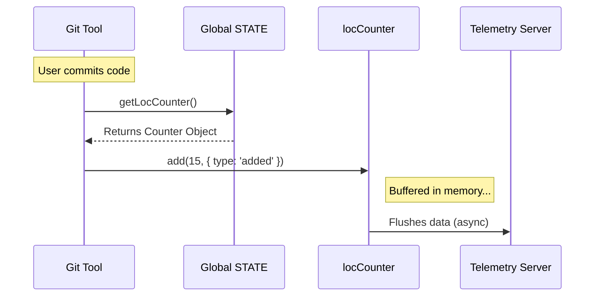

# Chapter 5: Telemetry Infrastructure

Welcome to the final chapter of our architecture deep dive!

In the previous chapter, [Resource & Cost Accounting](04_resource___cost_accounting.md), we learned how to track the immediate "bill" for the user. We know how much money was spent *during* the session.

But what if we want to answer bigger questions later?
*   "How often do users get stuck?"
*   "Is the 'Write Code' tool getting slower over time?"
*   "How many lines of code does the average agent write per day?"

The user doesn't need to see this on their screen, but the developers (us!) need this data to improve the software. This is **Telemetry Infrastructure**.

## The Motivation: The "Black Box" Flight Recorder

Imagine you are building an airplane.
1.  **The Dashboard (Accounting):** Shows the pilot fuel levels and speed *right now*.
2.  **The Black Box (Telemetry):** Records thousands of data points every second. If something goes wrong—or if the flight goes perfectly—engineers can analyze the recording later to build better planes.

In `bootstrap`, the Telemetry layer serves as this "Black Box." It provides standardized slots in the [Global Application State](01_global_application_state.md) where different tools can plug in and report statistics without knowing *where* that data goes.

---

## Key Concepts

We rely on a standard industry framework called **OpenTelemetry**. You don't need to know how it works internally, just that it gives us three tools:

### 1. The Meter (Metrics)
This measures numeric values. It answers questions like "How many?" or "How fast?"
*   **Counters:** Numbers that only go up (e.g., `total_errors`).
*   **Histograms:** Distributions of data (e.g., "Request duration took 200ms").

### 2. Attributed Counters
A raw number often isn't enough. We don't just want to know "5 lines of code were changed." We want to know:
*   **Value:** 5
*   **Attribute:** `type: "added"` (vs. removed)

In `bootstrap`, we use specific `AttributedCounter` objects stored in the state, such as `locCounter` (Lines of Code) and `costCounter`.

### 3. The Logger and Tracer
*   **Logger:** Records text messages for debugging.
*   **Tracer:** Follows a request as it travels through different functions, helping us spot bottlenecks.

---

## Usage: Reporting Data

Let's say you are writing a new tool that deletes files. You want to track how many files are deleted across all users.

You don't need to set up a database connection. You just grab the counter from the global state and add to it.

### Example: Tracking Lines of Code (LOC)

When the agent writes code, it calculates the difference (diff) and reports it.

```typescript
import { getLocCounter } from './state.js'

function reportChanges(added: number, removed: number) {
  const counter = getLocCounter()
  
  // Safety check: Telemetry might be disabled
  if (counter) {
    // Record lines added
    counter.add(added, { type: 'added' })
    
    // Record lines removed
    counter.add(removed, { type: 'removed' })
  }
}
```

### Example: Tracking Costs

While [Resource & Cost Accounting](04_resource___cost_accounting.md) shows the cost to the *user*, we also report it to our telemetry system so we can analyze global trends.

```typescript
import { getCostCounter } from './state.js'

function trackApiCost(cost: number, model: string) {
  const counter = getCostCounter()
  
  if (counter) {
    // We tag the cost with the model name
    counter.add(cost, { model: model })
  }
}
```

---

## Under the Hood: The Data Flow

How does a number get from a function call to a graph on a dashboard?

1.  **Setup:** When the app starts, we initialize the `MeterProvider` (the engine).
2.  **Creation:** We create specific counters (like `sessionCounter`) and store them in `STATE`.
3.  **Recording:** A tool (like the Git tool) calls `.add()`.
4.  **Export:** In the background, OpenTelemetry batches these numbers and sends them to a server (like Honeycomb, Splunk, or a log file).



---

## Deep Dive: Code Implementation

Let's look at how `state.ts` manages these recorders.

### 1. Storing the Recorders
In the `State` object, we hold references to the generic OpenTelemetry interfaces (`Meter`, `LoggerProvider`) and our specific custom counters.

```typescript
// state.ts
type State = {
  // The main engine
  meter: Meter | null
  
  // Specific counters ready for use
  sessionCounter: AttributedCounter | null
  locCounter: AttributedCounter | null
  costCounter: AttributedCounter | null
  // ... others like prCounter, tokenCounter
  
  // ... other state fields
}
```

### 2. Initializing the Counters
We have a setup function `setMeter`. This is called during application startup (bootstrapping). It creates the counters once and saves them into the global state so they can be reused everywhere.

```typescript
// state.ts
export function setMeter(
  meter: Meter,
  createCounter: (name: string, opts: any) => AttributedCounter
): void {
  STATE.meter = meter

  // Define the 'Lines of Code' counter
  STATE.locCounter = createCounter('claude_code.lines_of_code.count', {
    description: 'Count of lines modified',
  })

  // Define the 'Cost' counter
  STATE.costCounter = createCounter('claude_code.cost.usage', {
    unit: 'USD',
  })
}
```

### 3. Safe Access
We provide simple getters. Note that they return `null` if telemetry hasn't been initialized yet (or if it's disabled). This prevents the app from crashing just because the monitoring system isn't ready.

```typescript
// state.ts
export function getLocCounter(): AttributedCounter | null {
  return STATE.locCounter
}

export function getCostCounter(): AttributedCounter | null {
  return STATE.costCounter
}
```

---

## Connections to Other Systems

Telemetry is the observer that watches all other systems:

*   **Global State:** All counters live inside the `STATE` singleton from [Global Application State](01_global_application_state.md).
*   **Session:** Every telemetry event is automatically tagged with the `sessionId` from [Session Lifecycle Management](02_session_lifecycle_management.md) so we can trace a specific user's journey.
*   **Cost:** The data collected in [Resource & Cost Accounting](04_resource___cost_accounting.md) is fed into `costCounter` for long-term analysis.

---

## Conclusion & Series Summary

In this chapter, we learned:
1.  **Telemetry** acts as the application's "Black Box," recording data for future analysis.
2.  We use **OpenTelemetry** standards like `Meter` and `AttributedCounter`.
3.  Counters like `locCounter` and `costCounter` are stored in the Global State.
4.  This allows any part of the app to report statistics without worrying about backend connections.

### Tutorial Complete! 

Congratulations! You have navigated the core architecture of the **Bootstrap** project.

1.  You started with the **Whiteboard** ([Global Application State](01_global_application_state.md)).
2.  You learned how to manage **Time and Identity** ([Session Lifecycle Management](02_session_lifecycle_management.md)).
3.  You gave the agent a **Brain** ([Agent Context & Mode Tracking](03_agent_context___mode_tracking.md)).
4.  You gave the agent a **Budget** ([Resource & Cost Accounting](04_resource___cost_accounting.md)).
5.  And finally, you gave the system **Eyes** ([Telemetry Infrastructure](05_telemetry_infrastructure.md)).

With these five pillars, you understand how the application maintains stability, tracks history, and manages resources. You are now ready to dive into the codebase and build your own tools!

---

Generated by [Code IQ](https://github.com/adityasoni99/Code-IQ)