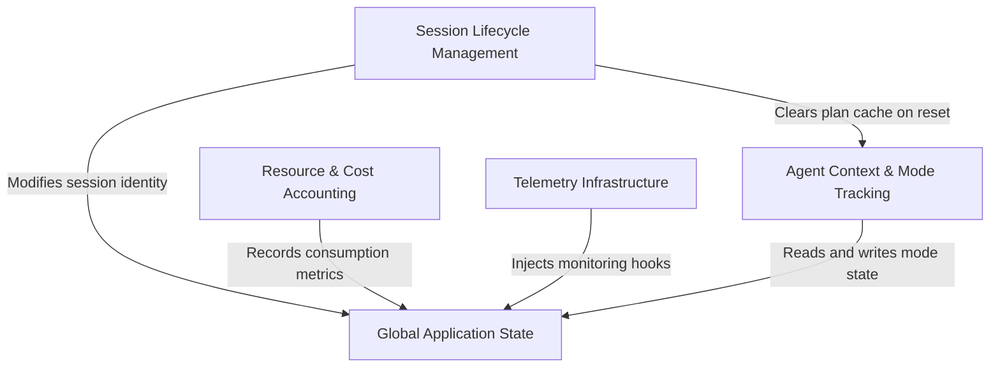

# Tutorial: bootstrap

This project serves as the **central nervous system** for an AI agent, maintaining a monolithic **Global Application State** as the single source of truth. It coordinates the agent's runtime environment by managing **session lifecycles**, tracking **resource and cost accounting** in real-time, and maintaining **contextual modes** (like "Plan Mode" or "Auto Mode"). Additionally, it provides the necessary hooks for **telemetry infrastructure** to report health and usage statistics to external observers.

## Chapters

1. [Global Application State](01_global_application_state.md)
2. [Session Lifecycle Management](02_session_lifecycle_management.md)
3. [Agent Context & Mode Tracking](03_agent_context___mode_tracking.md)
4. [Resource & Cost Accounting](04_resource___cost_accounting.md)
5. [Telemetry Infrastructure](05_telemetry_infrastructure.md)

---

Generated by [Code IQ](https://github.com/adityasoni99/Code-IQ)