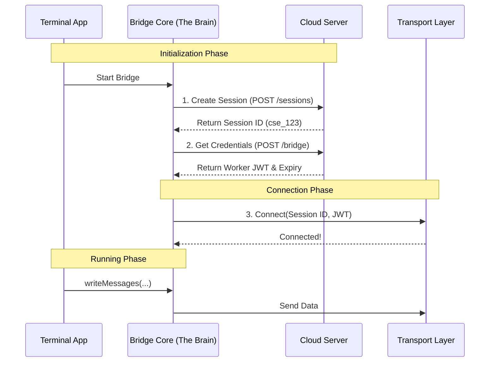

# Chapter 1: Remote Bridge Core (The "Brain")

Welcome to the **Bridge** project! If you've ever wondered how a terminal application (like Claude Code) can talk to a web interface in real-time, you are in the right place.

We begin our journey with the **Remote Bridge Core**, often called "The Brain."

### What is the "Brain"?

Imagine you want to control your computer from your phone. You need a central system that:
1.  **Dials the connection** to the server.
2.  **Keeps the line open** so commands can flow instantly.
3.  **Renews the security keys** so the connection doesn't drop.
4.  **Hangs up** cleanly when you are done.

In the Bridge project, this is the **Remote Bridge Core**. It is the central controller for the "Env-less" (v2) connection.

> **Old vs. New:** In older versions (v1), the system acted like a mailman, checking a mailbox every few seconds ("polling") to see if there was work. The new **Env-less Core** acts like a telephone operator, establishing a direct, streaming line that stays open.

### The Central Use Case

Let's say a user starts a session in their terminal. They want this session to appear on a web dashboard so they can monitor it remotely.

**The Goal:** Initialize a session, get a secure ID, and connect the wires.

### Key Concepts

Before we look at code, let's understand the three pillars of the Core:

1.  **The Session ID:** This is the unique ticket number for the conversation. The Core asks the server, "Can I start a new session?" and gets this ID back.
2.  **The Worker JWT:** Think of this as a temporary ID badge. It allows the Core to talk to the session. The Core is responsible for refreshing this badge before it expires.
3.  **The Transport:** This is the actual "pipe" that sends data. The Core sets it up but delegates the heavy lifting of moving bytes to [Unified Transport Layer (The "Pipe")](03_unified_transport_layer__the__pipe__.md).

### How to Use the "Brain"

The main entry point is a function called `initEnvLessBridgeCore`. It takes configuration (like your API URL and OAuth token) and returns a set of controls.

#### Input
You provide the basics: "Who am I?" (Auth Token) and "Where is the server?" (Base URL).

#### Output
You get a **Handle**. This is like a remote control with buttons like `writeMessages` or `teardown`.

#### Simplified Usage Example

```typescript
// Ideally, this is how you start the brain
const bridgeHandle = await initEnvLessBridgeCore({
  baseUrl: "https://api.anthropic.com",
  getAccessToken: () => "my-secret-oauth-token",
  title: "My Terminal Session",
  // What to do when the server sends a message
  onInboundMessage: (msg) => console.log("Received:", msg)
});

// Now we can use the handle!
bridgeHandle.writeMessages([{ role: "user", content: "Hello!" }]);
```

### The Setup Workflow

What happens internally when we call that function? It follows a strict "Handshake" protocol.



### Internal Implementation: Step-by-Step

Let's look at how `remoteBridgeCore.ts` implements this logic. We will break it down into the 4 main steps handled by the function `initEnvLessBridgeCore`.

#### Step 1: Create the Session
First, we need to register the session with the server. We don't need a complex environment setup (hence "Env-less"), just a valid OAuth token.

```typescript
// remoteBridgeCore.ts
// 1. Create session (POST /v1/code/sessions)
const createdSessionId = await withRetry(
  () => createCodeSession(baseUrl, accessToken, title, timeout, tags),
  'createCodeSession',
  cfg,
);

if (!createdSessionId) return null; // Failed to start
```

**Explanation:** We ask the server to create a "Code Session". If successful, we get an ID (e.g., `cse_xyz`). If this fails, the bridge cannot start.

#### Step 2: Get the "Keys" (Credentials)
Now that we have a Session ID, we need the specific credentials to join it as a "worker" (the entity that executes code).

```typescript
// remoteBridgeCore.ts
// 2. Fetch bridge credentials (POST /bridge)
const credentials = await withRetry(
  () => fetchRemoteCredentials(sessionId, baseUrl, token, timeout),
  'fetchRemoteCredentials',
  cfg,
);

// Returns: { worker_jwt, expires_in, api_base_url, worker_epoch }
```

**Explanation:** The `fetchRemoteCredentials` function exchanges our high-level OAuth token for a specific **Worker JWT**. This JWT is short-lived and safer to use for the continuous connection.

#### Step 3: Build the Transport
The Brain doesn't move the data itself; it hires a specialist. It initializes the Transport layer using the credentials it just fetched.

```typescript
// remoteBridgeCore.ts
// 3. Build v2 transport
transport = await createV2ReplTransport({
  sessionUrl: buildCCRv2SdkUrl(credentials.api_base_url, sessionId),
  ingressToken: credentials.worker_jwt,
  sessionId,
  // ... other config
});

transport.connect(); // Turn it on!
```

**Explanation:** Here, the Core hands off the Session ID and JWT to the Transport layer. You'll learn exactly how this `createV2ReplTransport` works in [Unified Transport Layer (The "Pipe")](03_unified_transport_layer__the__pipe__.md).

#### Step 4: The Refresh Scheduler
Security tokens expire. The Brain is smart—it sets an alarm to wake up before the token dies to get a new one.

```typescript
// remoteBridgeCore.ts
// 5. JWT refresh scheduler
const refresh = createTokenRefreshScheduler({
  refreshBufferMs: cfg.token_refresh_buffer_ms, // e.g., 5 minutes before expiry
  onRefresh: async (sid, oauthToken) => {
    // 1. Get new credentials from server
    // 2. Rebuild transport with new keys
    await rebuildTransport(freshCreds, 'proactive_refresh');
  }
});

refresh.scheduleFromExpiresIn(sessionId, credentials.expires_in);
```

**Explanation:** This acts like a heartbeat. If the session lasts hours, the Brain ensures the connection never drops due to expired security badges. It coordinates with [Authentication & Security (The "Keycard")](05_authentication___security__the__keycard__.md) to handle 401 errors if things go wrong.

### Teardown: Cleaning Up

When the user types `exit`, the Brain performs a "Graceful Shutdown." It doesn't just cut the cord; it archives the session so history is preserved.

```typescript
// remoteBridgeCore.ts
async function teardown() {
  transport.reportState('idle'); // Tell server we are done
  
  // Save the history to the server
  await archiveSession(sessionId, baseUrl, token, orgUUID, timeout);
  
  transport.close(); // Close the websocket/connection
}
```

### Summary

The **Remote Bridge Core** is the orchestrator. It:
1.  **Negotiates** the creation of the session.
2.  **Acquires** the necessary keys (JWTs).
3.  **Wires up** the transport layer.
4.  **Maintains** the session via token refreshes.

It acts as the container for everything else. Now that we have a running "Brain," we need to understand exactly *what* creates the context for this session and how different versions of the app work together.

[Next Chapter: Session Lifecycle & Compatibility (The "Container")](02_session_lifecycle___compatibility__the__container__.md)

---

Generated by [Code IQ](https://github.com/adityasoni99/Code-IQ)