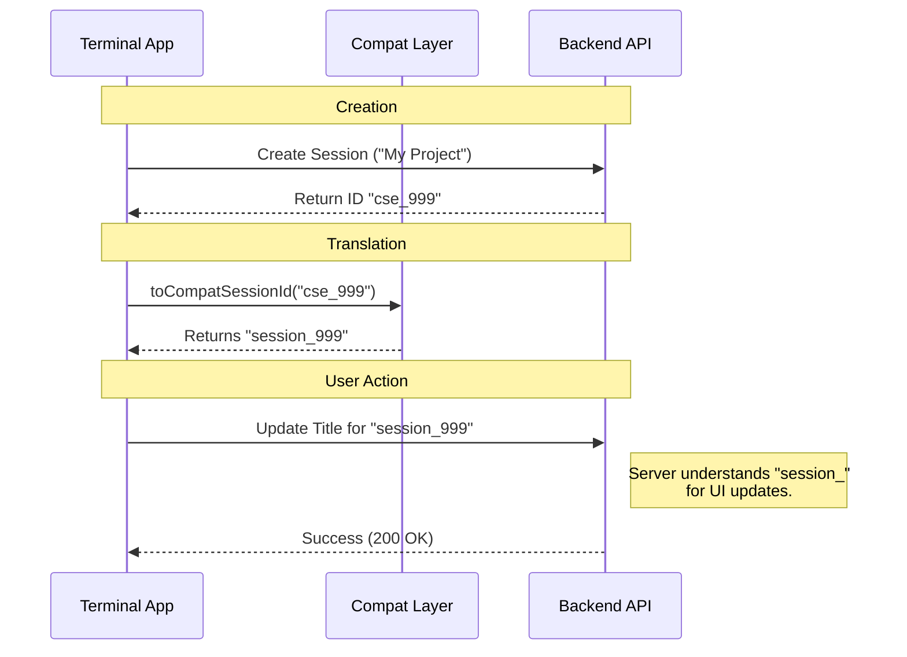

# Chapter 2: Session Lifecycle & Compatibility (The "Container")

In the previous chapter, [Remote Bridge Core (The "Brain")](01_remote_bridge_core__the__brain__.md), we learned how the system establishes a connection and keeps it alive. But a connection needs a destination.

Think of the "Brain" as a telephone operator. The operator is ready to connect you, but they need to know **which file folder** (Session) you want to open and work on.

This chapter covers the **Session Lifecycle**: how sessions are born, how they are named, how they connect different parts of the system, and how they are archived when finished.

### The Problem: The "Identity Crisis"

Here is the central challenge this module solves.

Imagine you are working in a terminal. The backend infrastructure knows your session by a specific technical ID (like `cse_abc123`). However, the web interface where you view your history expects a different ID format (like `session_abc123`).

If we send the wrong ID to the wrong place, the system says "404 Not Found."

**The Goal:** We need a "Container" that:
1.  Creates the session.
2.  Translates the ID so both the backend and frontend are happy.
3.  Updates the title (e.g., renaming "Untitled" to "Fixing Bug").
4.  Archives the session when you type `exit`.

### Key Concepts

#### 1. The Lifecycle
A session follows a strict path:
*   **Creation:** We ask the server for a new workspace.
*   **Active:** We update details like the Title.
*   **Archival:** We explicitly tell the server "We are done," so it can be saved to history.

#### 2. The Compatibility Layer (The Translator)
This is the most unique part of the Bridge.
*   **Infrastructure ID (`cse_`)**: "Code Session Entity." This is the raw ID used by the heavy-lifting servers executing code.
*   **Compat ID (`session_`)**: This is the legacy ID format used by the user-facing API and web dashboard.

The **Compatibility Layer** is a small set of functions that swaps these labels on the fly.

### Use Case: Starting a Named Session

Let's say a user starts the bridge with a specific project name. We want to create the session and ensure the web UI can see it.

#### Simplified Usage

```typescript
// 1. Create the raw session
const rawId = await createBridgeSession({ title: "My Project" });
// Output: "cse_59283..."

// 2. Convert ID for the User Interface
const uiId = toCompatSessionId(rawId); 
// Output: "session_59283..."

// 3. Rename it later
await updateBridgeSessionTitle(uiId, "New Name");

// 4. Clean up
await archiveBridgeSession(uiId);
```

### Internal Implementation: The "Shim" Workflow

How does the system handle this translation internally? It acts like a passport control officer, checking the ID format before letting requests pass.



### Code Deep Dive

Let's look at the actual code that makes this work.

#### 1. The Translator (`sessionIdCompat.ts`)
This file is the dictionary. It swaps the prefix of the ID.

```typescript
// sessionIdCompat.ts

// Converts raw infra ID to UI-friendly ID
export function toCompatSessionId(id: string): string {
  if (!id.startsWith('cse_')) return id; // Already correct?
  // Cut off "cse_" and add "session_"
  return 'session_' + id.slice('cse_'.length);
}

// Converts UI ID back to infra ID (if needed)
export function toInfraSessionId(id: string): string {
  if (!id.startsWith('session_')) return id;
  return 'cse_' + id.slice('session_'.length);
}
```

**Explanation:** This creates a "Shim." If the backend gives us `cse_123`, this function creates a virtual ID `session_123`. We use this virtual ID whenever we talk to the web dashboard endpoints.

#### 2. Creating the Session (`createSession.ts`)
This function talks to the API to initialize the container.

```typescript
// createSession.ts
export async function createBridgeSession({ title, environmentId }) {
  // Setup headers and body
  const url = `${baseUrl}/v1/sessions`;
  const body = { 
    title, 
    environment_id: environmentId,
    source: 'remote-control' // Tells server who we are
  };

  // Send POST request
  const response = await axios.post(url, body, { headers });
  
  // Return the ID (e.g., "cse_123")
  return response.data.id;
}
```

**Explanation:** We send a POST request. Notice we include `source: 'remote-control'`. This helps the server understand that this isn't a browser session, but a terminal bridge session.

#### 3. Updating the Title (`createSession.ts`)
Users often change their minds. The session needs to be renamed without breaking the connection.

```typescript
// createSession.ts
export async function updateBridgeSessionTitle(sessionId, title) {
  // IMPORTANT: The UI API expects "session_*", not "cse_*"
  const compatId = toCompatSessionId(sessionId);
  
  const url = `${baseUrl}/v1/sessions/${compatId}`;
  
  // Send PATCH request to update just the title
  await axios.patch(url, { title }, { headers });
}
```

**Explanation:** Notice the call to `toCompatSessionId`? If we tried to send `cse_123` to this specific endpoint, it might fail. We convert it to `session_123` first to ensure compatibility with the web platform.

#### 4. Archiving (The Cleanup)
When the user quits, we don't just walk away. We file the paperwork.

```typescript
// createSession.ts
export async function archiveBridgeSession(sessionId) {
  const url = `${baseUrl}/v1/sessions/${sessionId}/archive`;
  
  // Send POST to archive endpoint
  // This tells the server: "Move this to history"
  await axios.post(url, {}, { headers });
  
  console.log(`Session ${sessionId} archived.`);
}
```

**Explanation:** This is called during the teardown process mentioned in Chapter 1. It ensures that when you log into the web dashboard later, this session appears in "Past Chats" rather than staying stuck as "Active."

### Summary

The **Session Lifecycle & Compatibility** layer is the file cabinet manager.
1.  It **Create**s the folder.
2.  It **Translates** the folder name (`cse_` vs `session_`) so different departments (backend vs frontend) can find it.
3.  It **Archives** the folder when work is done.

Without this layer, the [Remote Bridge Core (The "Brain")](01_remote_bridge_core__the__brain__.md) would have a connection, but it wouldn't know *what* it is connected to or how to save the work.

Now that we have a Brain and a Container, we need to actually move data back and forth. It's time to build the pipes.

[Next Chapter: Unified Transport Layer (The "Pipe")](03_unified_transport_layer__the__pipe__.md)

---

Generated by [Code IQ](https://github.com/adityasoni99/Code-IQ)