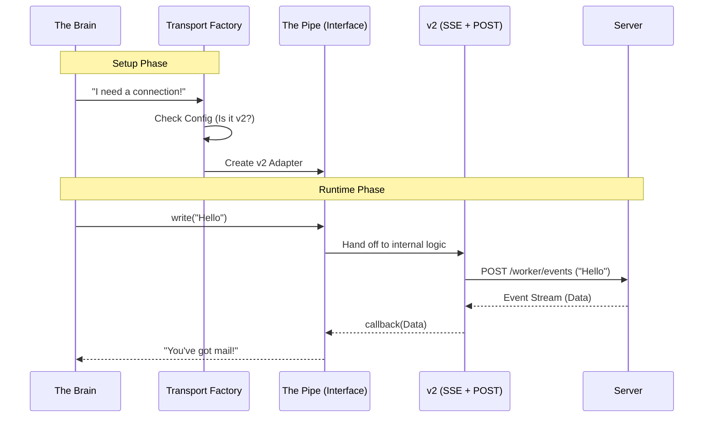

# Chapter 3: Unified Transport Layer (The "Pipe")

In the previous chapter, [Session Lifecycle & Compatibility (The "Container")](02_session_lifecycle___compatibility__the__container__.md), we learned how to create a session "folder" to hold our work.

But a folder is useless if we can't put anything inside it. We need a way to send commands and receive output. We need a connection.

However, connecting is complicated. Sometimes we use old protocols (WebSockets), and sometimes we use new ones (Server-Sent Events). We don't want our main application to worry about *how* the data moves; we just want it to move.

This is the job of the **Unified Transport Layer**, or **"The Pipe."**

### The Problem: The "Universal Power Adapter"

Imagine you travel to different countries. In one country, the wall socket has two round holes. In another, it has three flat pins.

You don't want to buy a new phone for every country. You want a **Universal Adapter**. You plug your phone into the adapter, and the adapter handles the messy reality of the wall socket.

In the Bridge project:
1.  **The Phone** is your application (The Brain).
2.  **The Wall Socket** is the Server (which might use "v1" or "v2" technology).
3.  **The Adapter** is the Unified Transport Layer.

### Key Concepts

#### 1. The Interface (The Contract)
This layer defines a strict set of rules. No matter what technology we use underneath, the Transport **must** provide simple buttons like:
*   `connect()`: Turn it on.
*   `write(message)`: Send data.
*   `setOnData(callback)`: Listen for data.

#### 2. v1 Transport (Legacy)
This acts like a walkie-talkie. It uses a **WebSocket** to listen for messages and uses standard HTTP **POST** requests to talk back. It's reliable but older technology.

#### 3. v2 Transport (Modern)
This is the modern "streaming" approach. It uses **Server-Sent Events (SSE)**.
*   **Reading:** It opens a continuous stream where the server pushes data (like a ticker tape).
*   **Writing:** It uses a specialized "Control Plane" (CCR) to send batched commands.

The **Unified Transport Layer** looks at the configuration and automatically picks the right one.

### How to Use "The Pipe"

If you are writing high-level code, you don't need to know about v1 or v2. You just use the generic object.

#### Simplified Usage Example

```typescript
// 1. Create the transport (The factory does the hard work)
const pipe = await createV2ReplTransport({ ...config });

// 2. Setup: What do we do when data arrives?
pipe.setOnData((incomingData) => {
  console.log("Server said:", incomingData);
});

// 3. Connect the wires
pipe.connect();

// 4. Send a message
// We don't care if this uses POST, WebSockets, or Carrier Pigeons.
await pipe.write({ role: "user", content: "Hello World" });
```

### Internal Implementation: The Workflow

How does the system decide which pipe to build and how to route the traffic?



### Code Deep Dive

Let's look at `replBridgeTransport.ts` to see how this adapter is built.

#### 1. Defining the "Universal Plug"
First, we define what a Transport *is*. This is a TypeScript type definition. It guarantees that any transport we build will look exactly the same to the rest of the app.

```typescript
// replBridgeTransport.ts

export type ReplBridgeTransport = {
  // Send a single message
  write(message: StdoutMessage): Promise<void>
  
  // Listen for incoming data strings
  setOnData(callback: (data: string) => void): void
  
  // Start the connection
  connect(): void
  
  // Clean up and hang up
  close(): void
}
```
**Explanation:** This is the contract. If you build a v3 transport in the future, it just needs to follow these four rules, and the rest of the app won't need to change.

#### 2. The v2 Adapter Implementation
This function creates the modern version of the pipe. It combines **SSE** (for reading) and **CCR** (for writing).

```typescript
// replBridgeTransport.ts
export async function createV2ReplTransport(opts): Promise<ReplBridgeTransport> {
  const { sessionUrl, ingressToken, sessionId } = opts;

  // 1. Setup the Reader (Server-Sent Events)
  const sse = new SSETransport(sseUrl, headers, sessionId);

  // 2. Setup the Writer (Command Control Region)
  const ccr = new CCRClient(sse, sessionUrl, { ... });

  // 3. Return the Unified Interface
  return {
    write: (msg) => ccr.writeEvent(msg), // Delegate write to CCR
    setOnData: (cb) => sse.setOnData(cb), // Delegate read to SSE
    connect: () => {
      sse.connect(); // Start listening
      ccr.initialize(); // Start writing
    },
    close: () => { ccr.close(); sse.close(); }
  };
}
```
**Explanation:**
1.  We create an `sse` object to handle incoming data.
2.  We create a `ccr` object to handle outgoing data.
3.  We return an object that matches our "Universal Plug" interface, wiring the internal `write` to `ccr` and `onData` to `sse`.

#### 3. Handling Heartbeats & State
The "Pipe" isn't just dumb wires; it also tells the server if we are alive.

```typescript
// inside createV2ReplTransport...

// If the server sends an event, acknowledge we got it
sse.setOnEvent(event => {
  // Tell server: "I received message ID 123"
  ccr.reportDelivery(event.event_id, 'received');
  
  // Tell server: "I processed message ID 123"
  ccr.reportDelivery(event.event_id, 'processed');
});
```
**Explanation:** This is invisible to the user. The transport layer automatically whispers to the server, "I got the message," ensuring the server doesn't try to resend it. This prevents duplicate messages and keeps the connection healthy.

### Summary

The **Unified Transport Layer** is the great simplifier.
1.  It defines a **standard interface** (`write`, `connect`, `onData`).
2.  It wraps complex protocols (like SSE and HTTP POST) inside this interface.
3.  It handles maintenance tasks like heartbeats and delivery reports automatically.

Now that we have a **Brain** (Core), a **Container** (Session), and a **Pipe** (Transport), raw text is flowing into our application. But raw text isn't enough—we need to know if that text is a chat message, a code execution result, or an error.

We need a traffic controller.

[Next Chapter: Message Routing & Data Flow (The "Dispatcher")](04_message_routing___data_flow__the__dispatcher__.md)

---

Generated by [Code IQ](https://github.com/adityasoni99/Code-IQ)