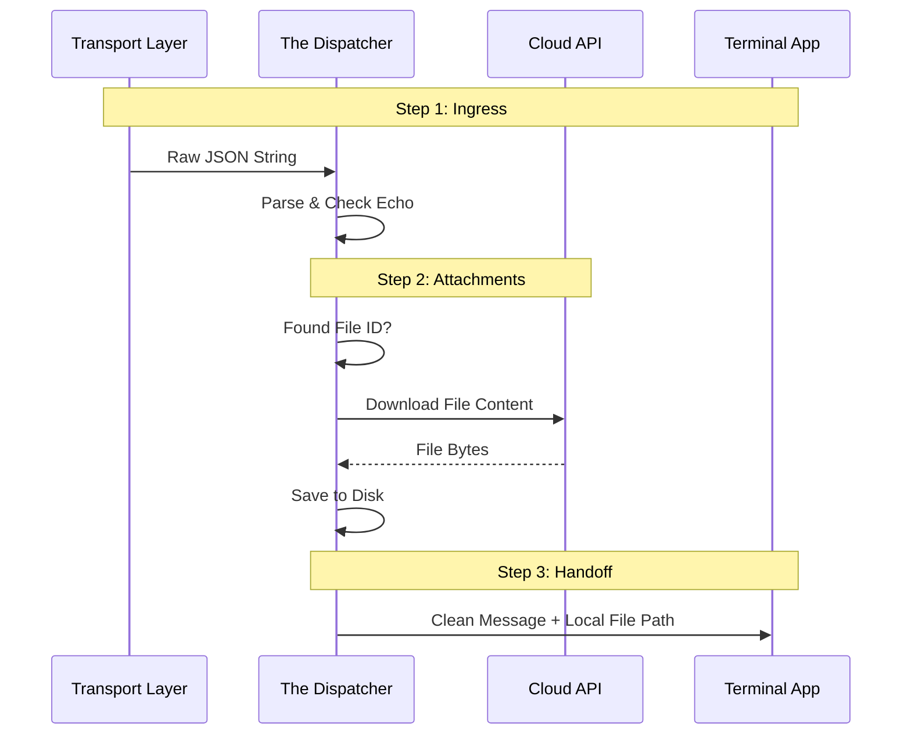

# Chapter 4: Message Routing & Data Flow (The "Dispatcher")

In the previous chapter, [Unified Transport Layer (The "Pipe")](03_unified_transport_layer__the__pipe__.md), we built a pipeline that moves raw data between the server and our application.

However, a raw pipe is dumb. It delivers everything: random server pings, echoes of messages we sent ourselves, and complex commands mixed with chat text. If we just printed everything coming out of the pipe directly to the screen, it would look like gibberish.

We need a **Dispatcher**. Think of this as the Mail Room of a large office. It opens every envelope, throws away junk mail, downloads heavy packages, and decides exactly which department should handle the request.

### The Problem: Raw Data is Messy

Imagine the server sends this raw string down the pipe:

```json
{"type": "user", "uuid": "abc-123", "content": "Hello", "file_attachments": [{"file_uuid": "xyz"}]}
```

We have three problems here:
1.  **It's a string:** Our code needs an Object, not text.
2.  **It might be an echo:** If *we* sent this message 5 seconds ago, the server might send it back to confirm. We don't want to process it twice.
3.  **It has a "ghost" file:** The `file_attachments` is just an ID (`xyz`). The AI cannot read an ID. It needs the actual file content on the hard drive.

**The Goal:** We need a layer that converts raw noise into clean, ready-to-use instructions for the AI.

### Key Concepts

#### 1. Ingress Routing (The Sorter)
The Dispatcher looks at the `type` of the message.
*   **User Message:** A chat from the web interface? Send it to the AI.
*   **Control Request:** A command to stop generating or change settings? Handle it immediately.
*   **Echo:** Did we write this? Ignore it.

#### 2. Data Normalization (The Fixer)
Different clients (iPhone app, Web Dashboard) sometimes format data differently. For example, one might say `mediaType` (camelCase) and another `media_type` (snake_case). The Dispatcher fixes these typos so the rest of the app doesn't crash.

#### 3. Attachment Resolution (The Fetcher)
When a user uploads a file on the web, the message only contains a "Claim Check" (a UUID). The Dispatcher pauses, runs to the server to download the actual file, saves it to a temp folder, and *then* hands the message to the AI saying, "Here is the message, and I put the file at `/tmp/file.txt`."

### Use Case: Handling a Web Upload

Let's say a user on the web dashboard uploads a CSV file and asks "Analyze this."

**The Dispatcher's Job:**
1.  Receive the raw JSON.
2.  See the file ID.
3.  Download the CSV to the local disk.
4.  Rewrite the message to say: `Analyze this @"/local/path/to/data.csv"`.
5.  Send *that* to the AI.

### Internal Implementation: The Workflow

This process happens automatically whenever data arrives from the Transport layer.



### Code Deep Dive

Let's look at the three files that make up the Dispatcher.

#### 1. The Router (`bridgeMessaging.ts`)
This is the main entry point. It filters noise and routes traffic.

```typescript
// bridgeMessaging.ts
export function handleIngressMessage(data, recentPostedUUIDs, onInboundMessage) {
  // 1. Parse Raw String to JSON
  const parsed = JSON.parse(data);

  // 2. Echo Detection
  // If we have seen this UUID in our "Sent" box, ignore it.
  if (parsed.uuid && recentPostedUUIDs.has(parsed.uuid)) {
    return; // Drop it!
  }

  // 3. Route based on type
  if (parsed.type === 'user') {
    // Send to the app (which will handle attachments next)
    onInboundMessage(parsed);
  }
}
```

**Explanation:** This function is the gatekeeper. It ensures that we don't get into an infinite loop of replying to our own messages (`recentPostedUUIDs`).

#### 2. The Fixer (`inboundMessages.ts`)
Sometimes, image data comes in with slightly wrong formatting. We fix it here.

```typescript
// inboundMessages.ts
export function normalizeImageBlocks(blocks) {
  return blocks.map(block => {
    // Check if it's a base64 image
    if (block.type === 'image' && block.source.type === 'base64') {
      
      // Fix "mediaType" (wrong) to "media_type" (standard)
      const fixedMediaType = block.source.mediaType || block.source.media_type;
      
      return { ...block, source: { ...block.source, media_type: fixedMediaType }};
    }
    return block;
  });
}
```

**Explanation:** This is a "sanitizer." By fixing the data here, the complex logic inside the AI "Brain" doesn't need to worry about inconsistent data formats.

#### 3. The Fetcher (`inboundAttachments.ts`)
This is the heavy lifter. It converts "Claim Checks" (IDs) into actual files.

```typescript
// inboundAttachments.ts
export async function resolveInboundAttachments(attachments) {
  // Loop through all file IDs attached to the message
  const paths = await Promise.all(attachments.map(async (att) => {
    
    // 1. Download from API
    const data = await downloadFile(att.file_uuid);
    
    // 2. Save to local disk
    const localPath = `/tmp/${att.file_name}`;
    await writeFile(localPath, data);
    
    return localPath;
  }));

  // Return a string of references: @"/tmp/file1.txt"
  return paths.map(p => `@"${p}"`).join(' ');
}
```

**Explanation:** This function makes the bridge feel magical. You upload a file on a website, and milliseconds later, that file exists on your terminal's hard drive, ready for the AI to read.

### Handling Control Signals

Not all messages are chat. Sometimes the server sends a **Control Request**.

For example, if you click "Stop" on the web dashboard, the server sends an `interrupt` signal. The Dispatcher handles this separately in `bridgeMessaging.ts`.

```typescript
// bridgeMessaging.ts
export function handleServerControlRequest(request, handlers) {
  switch (request.subtype) {
    case 'interrupt':
      // Stop the local process
      handlers.onInterrupt();
      break;
      
    case 'set_model':
      // Change the AI model
      handlers.onSetModel(request.model);
      break;
  }
}
```

**Explanation:** The Dispatcher recognizes that this isn't a message for the user—it's a command for the application itself. It routes these directly to the system handlers.

### Summary

The **Dispatcher** is the intelligent layer that sits on top of the dumb pipe.
1.  It **Parses** raw data.
2.  It **Filters** echoes (things we said).
3.  It **Normalizes** messy data (typos in image formats).
4.  It **Downloads** attachments so they are locally available.
5.  It **Routes** commands (like "Stop") to the right handler.

At this point, we have a fully functional system! We can connect, create sessions, send data, and handle complex messages.

But there is one major question left: **Is this safe?** How do we prevent unauthorized people from connecting to our session and running commands on our computer?

[Next Chapter: Authentication & Security (The "Keycard")](05_authentication___security__the__keycard__.md)

---

Generated by [Code IQ](https://github.com/adityasoni99/Code-IQ)