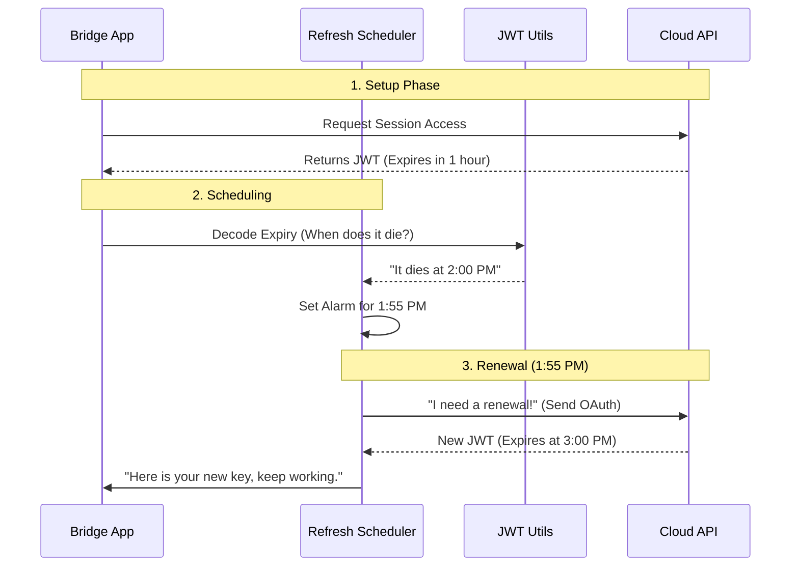

# Chapter 5: Authentication & Security (The "Keycard")

In the previous chapter, [Message Routing & Data Flow (The "Dispatcher")](04_message_routing___data_flow__the__dispatcher__.md), we built a smart system to sort and route messages. But there is a catch: you can't just walk up to a cloud server and start sending commands. You need permission.

Welcome to **Authentication & Security**, or **"The Keycard."**

### The Problem: The Exploding Badge

Imagine you work in a high-security building.
1.  **The Front Desk:** You show your ID (OAuth Token) to get into the building.
2.  **The Secure Room:** To enter a specific project room, you are given a temporary **Visitor Badge** (Worker JWT).

Here is the twist: **The Visitor Badge self-destructs every hour.**

If you are in the middle of a 3-hour meeting (a long coding session) and your badge expires, the security guards (the server) will throw you out. Your connection drops, and your work is lost.

**The Goal:** We need a robot assistant that watches your badge. Five minutes before it expires, the robot runs to the front desk, gets a fresh badge, and swaps it on your shirt—without you ever noticing.

### Key Concepts

#### 1. The OAuth Token (The Master Key)
This is your long-term identity. It proves you are *you* (e.g., "User: Alice"). You get this when you log in.

#### 2. The Worker JWT (The Room Key)
This is a short-lived token (JSON Web Token). It grants access to *one specific session* for a short time. We use this for the actual connection because it is safer; if stolen, it expires quickly.

#### 3. The Trusted Device (The Biometrics)
For extra security, the system checks if the request is coming from a "known laptop." This acts like Two-Factor Authentication behind the scenes.

#### 4. The Refresh Scheduler (The Robot)
This is a timer that calculates exactly when the JWT will expire and triggers a renewal sequence beforehand.

### Use Case: The "Forever" Session

Let's say a user starts a session that stays open for 24 hours.

1.  **Start:** The Keycard gets a JWT valid for 60 minutes.
2.  **Wait:** The Scheduler waits for 55 minutes.
3.  **Action:** The Scheduler wakes up, uses the OAuth token to ask for a *new* JWT.
4.  **Update:** The new JWT is sent to the [Unified Transport Layer (The "Pipe")](03_unified_transport_layer__the__pipe__.md) to keep the connection alive.

### Internal Implementation: The Workflow

How does the system know when to wake up?



### Code Deep Dive

Let's look at the code that manages these keys.

#### 1. Knowing Who You Are (`bridgeConfig.ts`)
Before we can get any keys, we need to find the user's primary OAuth token.

```typescript
// bridgeConfig.ts
import { getClaudeAIOAuthTokens } from '../utils/auth.js'

export function getBridgeAccessToken(): string | undefined {
  // 1. Check if we are in a special Dev mode override
  const devToken = getBridgeTokenOverride();
  
  // 2. If not, get the real token from the system keychain
  return devToken ?? getClaudeAIOAuthTokens()?.accessToken;
}
```
**Explanation:** This function acts as the wallet. It checks if you have a developer override (useful for testing); otherwise, it grabs the real production credentials stored securely on your computer.

#### 2. Trusted Device Enrollment (`trustedDevice.ts`)
This ensures your specific computer is authorized.

```typescript
// trustedDevice.ts
export async function enrollTrustedDevice(): Promise<void> {
  // 1. Send computer details to the server
  const response = await axios.post(`${baseUrl}/api/auth/trusted_devices`, { 
    display_name: `Claude Code on ${hostname()}` 
  });

  // 2. Get the specific device token
  const token = response.data?.device_token;

  // 3. Save it to the secure keychain
  getSecureStorage().update({ trustedDeviceToken: token });
}
```
**Explanation:** When you first log in, this runs once. It registers "My Macbook Pro" with the server. Future requests will include this token in the header, proving the request comes from *this* specific physical machine.

#### 3. Reading the Badge (`jwtUtils.ts`)
We need to know when the badge expires. The expiration date is hidden inside the "payload" of the JWT string.

```typescript
// jwtUtils.ts
export function decodeJwtExpiry(token: string): number | null {
  // 1. Decode the middle part of the token (base64)
  const payload = decodeJwtPayload(token);
  
  // 2. Look for the "exp" (expiry) field
  if (payload && typeof payload.exp === 'number') {
    return payload.exp; // Unix timestamp
  }
  
  return null; // Could not read it
}
```
**Explanation:** JWTs are just strings separated by dots. This function cracks open the string to read the `exp` number, which tells us the exact second the token becomes invalid.

#### 4. The Refresh Scheduler (`jwtUtils.ts`)
This is the logic that prevents the session from dying.

```typescript
// jwtUtils.ts
export function createTokenRefreshScheduler({ onRefresh }) {
  
  function schedule(sessionId, token) {
    // 1. Find out when the token dies
    const expiry = decodeJwtExpiry(token);
    
    // 2. Calculate delay: Expiry - Now - Buffer (e.g., 5 mins)
    const delayMs = expiry * 1000 - Date.now() - 300_000;

    // 3. Set the alarm
    setTimeout(() => {
       // Time's up! Call the refresh function.
       onRefresh(sessionId); 
    }, delayMs);
  }

  return { schedule };
}
```
**Explanation:**
*   We calculate `delayMs`. If the token expires in 60 minutes, and our buffer is 5 minutes, we set the timer for 55 minutes.
*   When the timer fires, it executes `onRefresh`. This callback (defined in the Core) fetches a new token and restarts the cycle.

### Summary

The **Authentication & Security** layer acts as the invisible guardian of the connection.
1.  It uses **OAuth** to prove identity.
2.  It uses **Trusted Device** tokens to prove hardware security.
3.  It uses a **Refresh Scheduler** to proactively renew access before it cuts out.

Without this layer, long-running tasks would fail, and users would constantly have to re-login.

Now that we have a secure, robust, and intelligent connection, there is only one piece left. How does the user actually *see* what is happening? It's time to build the interface.

[Next Chapter: Bridge UI & Feedback (The "Dashboard")](06_bridge_ui___feedback__the__dashboard__.md)

---

Generated by [Code IQ](https://github.com/adityasoni99/Code-IQ)