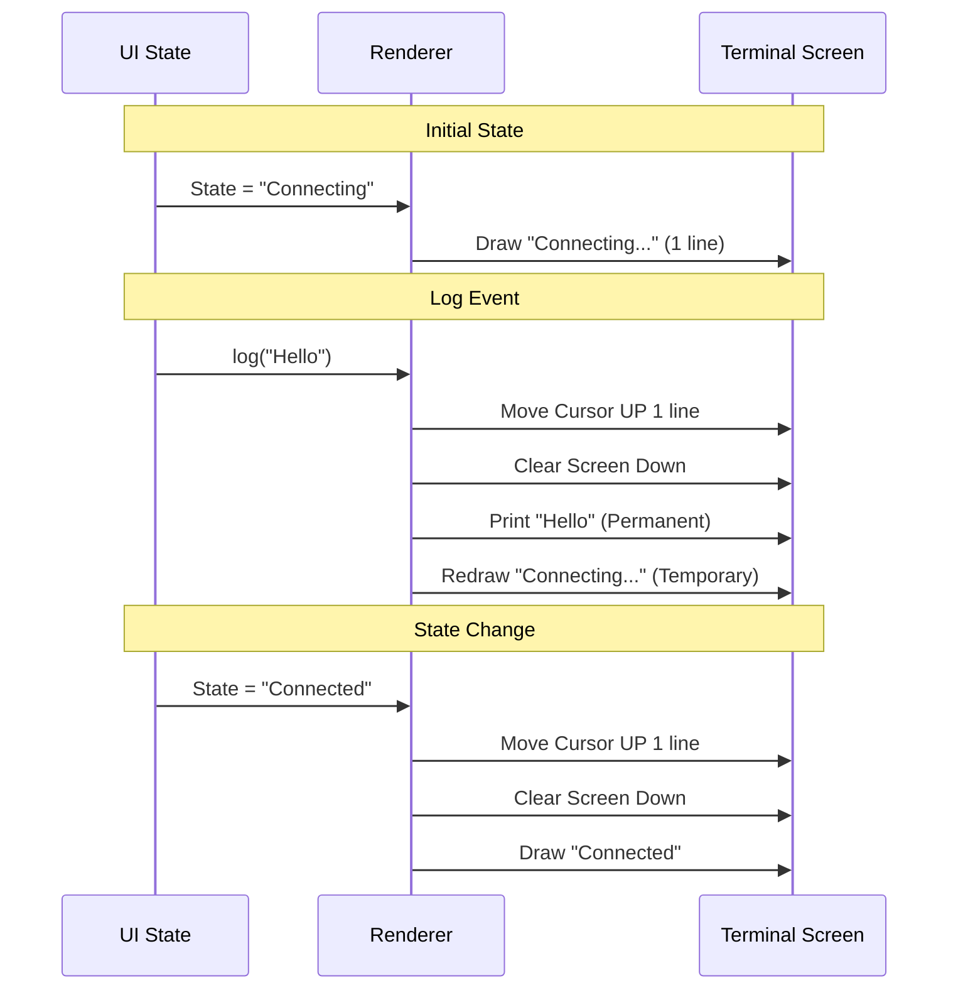

# Chapter 6: Bridge UI & Feedback (The "Dashboard")

In the previous chapter, [Authentication & Security (The "Keycard")](05_authentication___security__the__keycard__.md), we secured our connection using OAuth tokens and trusted device checks.

At this point, our "Bridge" is fully functional. It has a **Brain** (Core), a **Container** (Session), a **Pipe** (Transport), a **Dispatcher** (Routing), and a **Keycard** (Security).

But there is one problem: **The user is blind.**

Imagine driving a car with a powerful engine but no dashboard. You don't know your speed, you don't know if you have gas, and you don't know if the engine check light is on.

This chapter covers the **Bridge UI**, or **"The Dashboard."** It is the layer that translates complex internal states into simple text, spinners, and QR codes that humans can understand.

### The Problem: Information Overload vs. Status

Terminal applications have a unique challenge.
1.  **Logs:** We need a permanent history of what happened (e.g., "Executed script.py").
2.  **Status:** We need a temporary display of what is happening *now* (e.g., a spinning loader saying "Connecting...").

If we print "Connecting..." as a log, our screen will be filled with thousands of "Connecting..." lines. We need a way to draw a status line at the bottom of the screen that **updates in place**, while keeping the history above it safe.

**The Goal:** A "Head-Up Display" that shows the connection status, a login QR code, and current activity, without cluttering the terminal history.

### Key Concepts

#### 1. The Logger Factory
Instead of just using `console.log`, we create a specialized **Bridge Logger**. This object holds the "State" of the UI. It knows if we are idle, working, or failing.

#### 2. The Status Line (The "Ticker")
This is the bottom-most part of the terminal output. It is "ephemeral." When the status changes (from "Connecting" to "Connected"), the UI erases the old line and writes the new one.

#### 3. The QR Generator
To make logging in easy, the Dashboard generates a QR code directly in the terminal using ASCII block characters. This allows a user to scan their computer screen with their phone to instantly connect.

#### 4. Fault Injection (The Crash Test)
To ensure the Dashboard displays errors correctly (like "Reconnecting in 5s..."), we have a hidden debug module that lets developers simulate crashes.

### Use Case: The Connection Flow

Let's walk through what the user sees when they start the app.

1.  **Start:** The user runs `claude bridge`.
2.  **Banner:** The UI prints a welcome message and a large QR code.
3.  **Spinner:** A yellow spinner appears: `⠋ Connecting...`
4.  **Success:** The spinner turns into a green dot: `● Connected`.
5.  **Action:** When the AI reads a file, a log appears *above* the status line: `[12:00] Reading file...`

### Internal Implementation: The Render Loop

How do we update the bottom of the screen without erasing the top? We use special terminal codes (ANSI escape codes) to move the cursor up and clear lines.



### Code Deep Dive

Let's look at `bridgeUI.ts` to see how this magic trick is performed.

#### 1. The Rendering Logic
The heart of the dashboard is `renderStatusLine`. It handles the "erase and redraw" logic.

```typescript
// bridgeUI.ts

// 1. We track how many lines the status currently takes up
let statusLineCount = 0;

function renderStatusLine() {
  // 2. Erase the old status
  clearStatusLines(); 

  // 3. Draw the QR code (if visible)
  if (qrVisible) {
    qrLines.forEach(line => write(`${line}\n`));
  }

  // 4. Draw the status text (e.g., "Ready" or "Connecting")
  const color = currentState === 'idle' ? chalk.green : chalk.yellow;
  write(`${color(indicator)} ${currentStateText}\n`);
}
```

**Explanation:**
*   `clearStatusLines()` uses ANSI codes to move the cursor up by `statusLineCount` rows and delete everything.
*   We then write the new content.
*   We calculate the new height so we know how much to delete next time.

#### 2. Generating the QR Code
We want users to log in with their phones. We transform a URL into a block of text.

```typescript
// bridgeUI.ts
import { toString as qrToString } from 'qrcode'

async function regenerateQr(url: string) {
  // 1. Generate ASCII block string from URL
  const qrString = await qrToString(url, { type: 'utf8', small: true });
  
  // 2. Split into lines for rendering
  qrLines = qrString.split('\n');
  
  // 3. Update the screen
  renderStatusLine();
}
```

**Explanation:** We use a library to convert the long session URL (which contains the encryption keys) into a visual pattern. This runs asynchronously, so the UI can stay responsive.

#### 3. Handling Logs (Permanent History)
When we want to save a message to history, we must be careful not to overwrite the status line.

```typescript
// bridgeUI.ts
function printLog(line: string) {
  // 1. Remove the temporary status line
  clearStatusLines();
  
  // 2. Print the permanent log
  write(line);
  
  // 3. The status line will be redrawn later by the render loop
  //    or we can force a redraw immediately if needed.
}
```

**Explanation:** This is the key to the "Dashboard" effect. The status line is temporary; it gets out of the way whenever a real log needs to be printed, then reappears at the bottom.

### The "Crash Test" (Debugging)

How do we know the UI will correctly show "Reconnecting in 5s..." if the network fails? We can't easily unplug our internet at the exact right millisecond during testing.

We use **Fault Injection**. This is found in `bridgeDebug.ts`.

```typescript
// bridgeDebug.ts

// Queue a fake error to happen next time we poll
export function injectBridgeFault(fault) {
  faultQueue.push(fault);
}

// Wrap the real API with a saboteur
export function wrapApiForFaultInjection(api) {
  return {
    ...api, // Copy real methods
    
    // Hijack the poll method
    async pollForWork(...) {
      // Check if we should crash
      if (shouldCrash()) throw new Error("Fake Network Error");
      
      // Otherwise, work normally
      return api.pollForWork(...);
    }
  };
}
```

**Explanation:**
1.  This code wraps the real network calls.
2.  If a developer queues a "fault," the wrapper throws a fake error.
3.  The Core catches this error and triggers the "Reconnecting" state.
4.  The **UI** sees the state change and renders the red/yellow warning status.

This allows developers to polish the error-handling UI without needing to cause real network outages.

### Multi-Session Display

The Dashboard is smart enough to handle multiple sessions at once (e.g., if you have three terminal tabs open).

```typescript
// bridgeUI.ts
if (sessionMax > 1) {
  // Loop through all active sessions
  for (const [id, info] of sessionDisplayInfo) {
    
    // Format the title (e.g., "Fixing Bug #123")
    const title = truncatePrompt(info.title, 35);
    
    // Print a bullet point for this session
    writeStatus(`    ${title} - ${info.activity}\n`);
  }
}
```

**Explanation:** The `renderStatusLine` function checks if we are in "Multi-Session Mode." If so, instead of just printing one status, it loops through a Map of all active sessions and prints a list.

### Conclusion

The **Bridge UI** is the face of the operation. It manages the delicate balance between showing permanent history (Logs) and current state (Status).

It uses:
1.  **ANSI Codes** to rewrite the bottom of the screen.
2.  **QR Libraries** to bridge the gap between terminal and mobile.
3.  **State Management** to reflect the complex logic of the Core in simple colors (Green/Yellow/Red).

### Project Summary

Congratulations! You have completed the **Bridge** tutorial series.

You now understand the full architecture of a modern remote terminal bridge:
1.  **[Remote Bridge Core (The "Brain")](01_remote_bridge_core__the__brain__.md):** Orchestrates the connection.
2.  **[Session Lifecycle & Compatibility (The "Container")](02_session_lifecycle___compatibility__the__container__.md):** Manages the workspace.
3.  **[Unified Transport Layer (The "Pipe")](03_unified_transport_layer__the__pipe__.md):** Moves the bytes (SSE/WebSockets).
4.  **[Message Routing & Data Flow (The "Dispatcher")](04_message_routing___data_flow__the__dispatcher__.md):** Sorts and downloads data.
5.  **[Authentication & Security (The "Keycard")](05_authentication___security__the__keycard__.md):** Protects the connection.
6.  **Bridge UI & Feedback (The "Dashboard"):** Visualizes the state.

You are now ready to explore the codebase, fix bugs, or add new features to the Bridge!

---

Generated by [Code IQ](https://github.com/adityasoni99/Code-IQ)