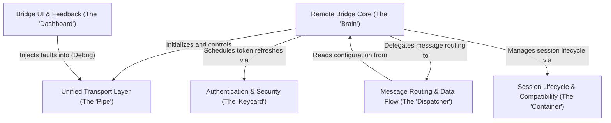

# Tutorial: bridge

The **Bridge** project implements a remote control capability that allows the CLI to function as a "headless" agent managed by a web interface. It replaces traditional polling with a streaming architecture orchestrated by the **Remote Bridge Core**, which wires together the **Unified Transport Layer** for communication, the **Keycard** for security, and the **Dispatcher** for message routing. The system ensures robust session management, compatibility with legacy IDs, and provides real-time feedback via the **Dashboard**.

## Chapters

1. [Remote Bridge Core (The "Brain")](01_remote_bridge_core__the__brain__.md)
2. [Session Lifecycle & Compatibility (The "Container")](02_session_lifecycle___compatibility__the__container__.md)
3. [Unified Transport Layer (The "Pipe")](03_unified_transport_layer__the__pipe__.md)
4. [Message Routing & Data Flow (The "Dispatcher")](04_message_routing___data_flow__the__dispatcher__.md)
5. [Authentication & Security (The "Keycard")](05_authentication___security__the__keycard__.md)
6. [Bridge UI & Feedback (The "Dashboard")](06_bridge_ui___feedback__the__dashboard__.md)

---

Generated by [Code IQ](https://github.com/adityasoni99/Code-IQ)