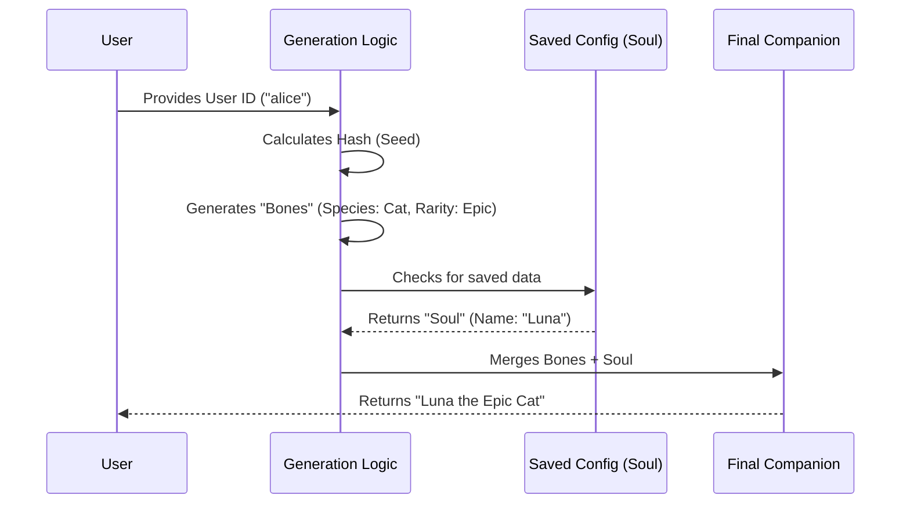

# Chapter 1: Deterministic Generation (Soul & Bones)

Welcome to the world of **buddy**! In this project, we are building a CLI companion that lives in your terminal.

The first question we face is: **Where does the companion come from?**

We could generate a random pet every time you log in, but then you wouldn't bond with it. We could store every detail in a database, but that requires complex storage.

Instead, we use **Deterministic Generation**. We split your companion into two parts:
1.  **Bones:** Traits determined by math (Species, Stats, Rarity). These never change.
2.  **Soul:** Traits stored in a config file (Name, Personality). These can change.

It is like **Digital DNA**. Your User ID is the seed. No matter how many times we run the code, your unique ID will always grow the exact same creature.

## Key Concepts

### 1. The Seed (User ID)
Everything starts with a unique string, usually your User ID (e.g., `user_123` or an email). This is the source of truth. If you have the ID, you can recreate the creature.

### 2. Bones (Immutable)
"Bones" are the structural parts of the companion. Since they are generated mathematically from your ID, we don't need to save them in a database! We just recalculate them when the program starts.

### 3. Soul (Mutable)
The "Soul" consists of the things that make your buddy unique to *you*, like the name you give it ("Sir Quacks-a-Lot"). This small amount of data is the only thing we actually need to save to a file.

---

## How to Use It

Let's look at how the application uses this logic to "find" your companion.

### Step 1: Hashing the ID
Computers are bad at predicting "random" things from text. They prefer numbers. We turn your User ID into a large number called a **Hash**.

```typescript
// types.ts & companion.ts context
const userId = "alice_doe"
const SALT = "friend-2026-401" // A secret ingredient

// We combine them to ensure unique results for this app
const uniqueKey = userId + SALT 
// Result: "alice_doefriend-2026-401"
```
*We add a "Salt" (a secret string) so users can't simply guess which ID will result in a "Legendary" rarity.*

### Step 2: The Dice Roll
We use that hash to create a **Seeded Random Number Generator (RNG)**. Normal random numbers change every time. **Seeded** random numbers are always the same sequence if the seed is the same.

```typescript
// From companion.ts
// Create a generator that creates the SAME numbers for this user
const rng = mulberry32(hashString(uniqueKey))

// If we ask for a number, it might give 0.42
// If we restart the app and ask again, it gives 0.42 again!
const roll = rng() 
```

### Step 3: Determining Species
Now we just use that predictable number to pick from our list of species.

```typescript
// From types.ts
export const SPECIES = ['duck', 'cat', 'robot', /*...*/] as const

// From companion.ts
function pick<T>(rng: () => number, arr: readonly T[]): T {
  // Uses the predictable random number to pick an index
  return arr[Math.floor(rng() * arr.length)]!
}
```
*If your ID results in the number `0`, you get a Duck. Always.*

---

## Under the Hood: Implementation

How does the data flow when the application starts?



### The `roll` Function
The core of this system is in `companion.ts`. This function coordinates the creation of the Bones.

```typescript
// companion.ts simplified
function rollFrom(rng: () => number): Roll {
  const rarity = rollRarity(rng) // e.g., 'rare'
  
  const bones = {
    rarity,
    species: pick(rng, SPECIES), // e.g., 'robot'
    eye: pick(rng, EYES),        // e.g., '◉'
    stats: rollStats(rng, rarity) // e.g., { WISDOM: 80 }
  }
  return { bones, inspirationSeed: rng() }
}
```
*Notice how we pass `rng` into everything? That ensures every trait is tied to that original seed.*

### Generating Stats
We even generate RPG-like stats (Wisdom, Chaos, Patience) deterministically. We make sure every companion has at least one "Peak" stat (really good) and one "Dump" stat (really bad).

```typescript
// companion.ts simplified
function rollStats(rng, rarity) {
  const peak = pick(rng, STAT_NAMES) // Pick one stat to be high
  let dump = pick(rng, STAT_NAMES)   // Pick one stat to be low
  
  // Logic ensures 'dump' isn't the same as 'peak'
  // Then assigns numbers based on Rarity tier
  // ...
}
```

### Merging Soul and Bones
Finally, when the app asks `getCompanion()`, we combine the calculated reality with the saved data.

```typescript
// companion.ts
export function getCompanion(): Companion | undefined {
  const stored = getGlobalConfig().companion // Get Name (Soul)
  if (!stored) return undefined

  // Re-calculate the immutable traits (Bones)
  const { bones } = roll(companionUserId())
  
  // Combine them!
  return { ...stored, ...bones }
}
```

## Why this is cool
1.  **Cheating Prevention:** A user can edit their config file to change their pet's name, but they can't change `"species": "duck"` to `"species": "dragon"`. The app ignores the config for "Bones" and recalculates them from the ID every time.
2.  **Lightweight:** We don't need a massive database of user pets.

## Conclusion
You have now learned how `buddy` creates a unique friend for you using nothing but your User ID and some math. We have our **Bones** (the data).

But data is boring to look at. We need to visualize our new friend!

In the next chapter, we will take these "Bones" and draw them to the screen using ASCII art.

[Next: ASCII Sprite Renderer](02_ascii_sprite_renderer.md)

---

Generated by [Code IQ](https://github.com/adityasoni99/Code-IQ)