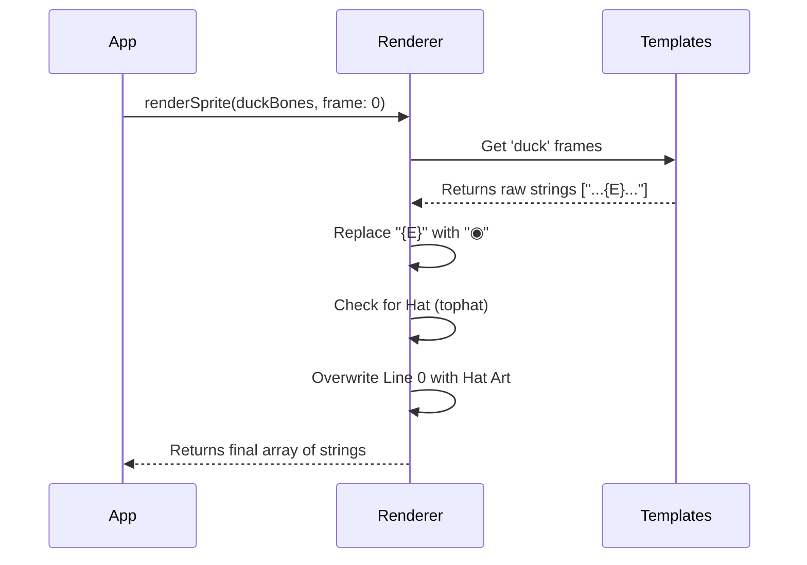

# Chapter 2: ASCII Sprite Renderer

In the previous chapter, [Deterministic Generation (Soul & Bones)](01_deterministic_generation__soul___bones_.md), we learned how to conjure a unique digital soul from nothing but a User ID.

We have the **Bones**:
```json
{ "species": "duck", "eye": "◉", "hat": "tophat" }
```

But currently, our friend is invisible. It's just data sitting in memory. To bring it to life in the terminal, we need a graphics engine. Since we are in a text-based environment, our "pixels" are characters.

Welcome to the **ASCII Sprite Renderer**.

## The Concept: The Costume Department

Drawing every possible combination of species, eyes, and hats by hand would take forever.
*   18 Species
*   6 Eye types
*   8 Hat types
*   **Total:** 864 unique drawings!

Instead of drawing 864 images, we use a **Paper Doll** system (or a Puppet).

1.  **The Template:** We draw the "body" of the Duck once.
2.  **The Placeholder:** We leave a special mark `{E}` where the eyes should go.
3.  **The Assembly:** When the program runs, we swap `{E}` with the actual eye trait (like `◉` or `^`).

## Key Concepts

### 1. The Raw Template
A "Sprite" in `buddy` isn't a single string; it is an **Array of Strings**. Each string is one horizontal line on your terminal screen.

Here is the raw template for the `duck` species found in `sprites.ts`:

```typescript
const duckFrames = [
  '            ',      // Line 0: Reserved for Hats
  '    __      ',
  '  <({E} )___  ',    // Look at the {E}!
  '   (  ._>   ',
  '    `--´    ',
]
```

### 2. The Substitution
The magic happens with a simple string replacement. If your **Bones** say your eyes are `◉`, the renderer looks at line 2:

*   **Before:** `' <({E} )___ '`
*   **After:** `' <(◉ )___ '`

### 3. Frames (Animation)
To make the creature feel alive, we don't just store one image. We store 2 or 3 "Frames."
*   **Frame 0:** Standing still.
*   **Frame 1:** Wiggling a wing or closing the beak.

The renderer decides which frame to return based on the current time (we will cover the timing logic in [Live Component & Animation](03_live_component___animation.md)).

---

## How to Use It

The renderer is a pure function. It takes data in, and spits text out.

### The Input
You provide the **Bones** (which tell us the Species and Eye type) and a **Frame Number** (0, 1, or 2).

```typescript
import { renderSprite } from './sprites'

const myBones = {
  species: 'duck',
  eye: '◉',
  hat: 'none'
  // ... other stats
}

// Get the visual for the first frame
const lines = renderSprite(myBones, 0)
```

### The Output
The variable `lines` is now an array of strings, ready to be printed to the console:

```text
    __      
  <(◉ )___  
   (  ._>   
    `--´    
```

---

## Under the Hood: Implementation

How does the code actually assemble the puppet?



### 1. The Sprite Library
In `sprites.ts`, we store all our templates in a big object called `BODIES`.

```typescript
// sprites.ts
const BODIES: Record<Species, string[][]> = {
  duck: [ /* frame 1 */, /* frame 2 */ ],
  cat:  [ /* frame 1 */, /* frame 2 */ ],
  robot: [ /* frame 1 */, /* frame 2 */ ],
  // ...
}
```

### 2. The `renderSprite` Function
This is the core logic. We've simplified it here to show the logic clearly.

```typescript
export function renderSprite(bones: CompanionBones, frame = 0): string[] {
  // 1. Find the raw templates for this species
  const frames = BODIES[bones.species]
  
  // 2. Select the specific frame (using modulo to loop safely)
  const rawLines = frames[frame % frames.length]

  // 3. Inject the soul (Replace eyes)
  return rawLines.map(line => line.replaceAll('{E}', bones.eye))
}
```

### 3. Handling Hats
Hats are a special layer. Every sprite is designed with a specific height (5 lines). **Line 0** is usually empty space, specifically reserved for a hat.

If the user has a hat, we overwrite that empty first line.

```typescript
// sprites.ts (continued)
const HAT_LINES = {
  crown: '   \\^^^/    ',
  tophat: '   [___]    ',
  // ...
}

// Inside renderSprite...
if (bones.hat !== 'none') {
  // Overwrite the top empty line with the hat art
  lines[0] = HAT_LINES[bones.hat]
}
```

*This is why consistency matters in the templates! If the Duck was 4 lines tall and the Robot was 6 lines tall, the hat would float in the air or crush the Robot's head.*

## Why this approach?

1.  **Memory Efficient:** We don't store "Duck with Star Eyes" and "Duck with Circle Eyes" as separate images. We combine them on the fly.
2.  **Extensible:** Adding a new eye type immediately works for all 18 species.
3.  **Simple Animation:** By treating animation as a list of strings (`string[][]`), switching frames is just an array index lookup.

## Conclusion

We now have a **Generator** (Chapter 1) that creates the math, and a **Renderer** (Chapter 2) that creates the art.

However, `renderSprite` is just a function. If we run it once, we get a static image. To make our buddy blink, wiggle, and react to us, we need to run this function repeatedly in a loop.

In the next chapter, we will build the engine that drives this loop.

[Next: Live Component & Animation](03_live_component___animation.md)

---

Generated by [Code IQ](https://github.com/adityasoni99/Code-IQ)