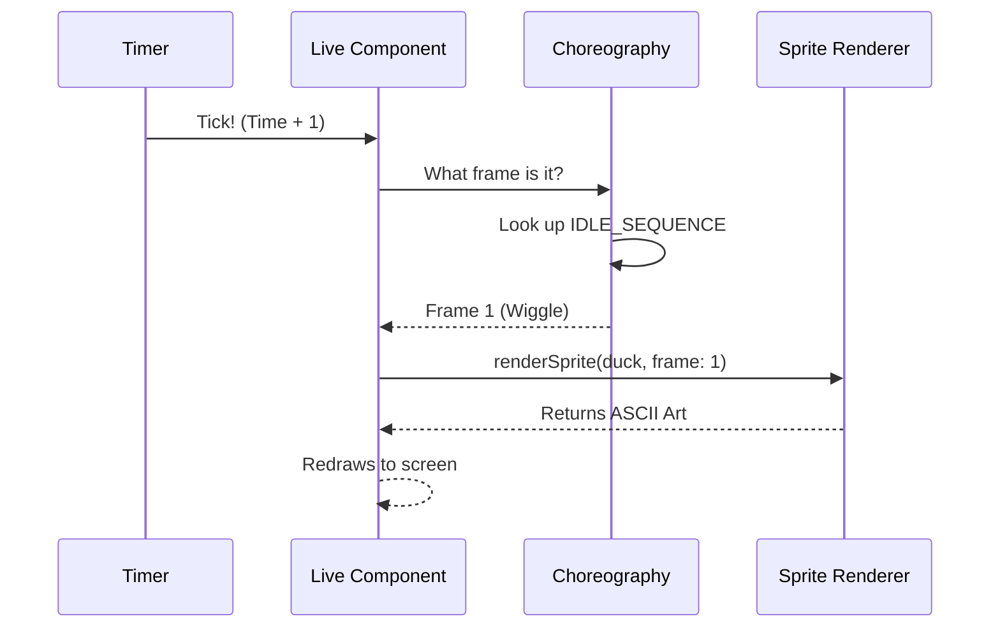

# Chapter 3: Live Component & Animation

In the previous chapter, [ASCII Sprite Renderer](02_ascii_sprite_renderer.md), we built a "Paper Doll" system. We can generate a Duck, put a hat on it, and render it to text strings.

But right now, our friend is frozen in time. It is a statue.

To turn a statue into a companion, it needs a **Heartbeat**. It needs to breathe, blink, and look around, even when you aren't typing commands.

In this chapter, we will build the stage where our actor performs: the **Live Component**.

## The Concept: The Infinite Loop

Standard command-line tools run once and exit (like `ls` or `git status`). They print text and die.

`buddy` is different. It uses a library called **Ink** (React for the terminal) to stay alive. It redraws the screen many times per second.

To animate our companion, we need three things:
1.  **The Tick:** A metronome that counts time.
2.  **The Choreography:** A script telling the pet when to move.
3.  **The Stage:** A layout system to hold the pet and its speech bubbles.

## Key Concepts

### 1. The Tick (State)
We use a React state variable to count time. Every 500 milliseconds (half a second), we increase this number by 1.

*   Tick 0: Start
*   Tick 1: 0.5s passed
*   Tick 2: 1.0s passed...

### 2. The Choreography (Sequence)
We don't want our pet to move constantly; that would be distracting. We want it to sit still mostly, and occasionally blink or wiggle.

Instead of complex AI, we use a simple array of numbers called the `IDLE_SEQUENCE`.

```typescript
// 0 = Stand Still, 1 = Wiggle, -1 = Blink
const IDLE_SEQUENCE = [0, 0, 0, 0, 1, 0, 0, 0, -1, 0, 0];
```

As the **Tick** counts up, we step through this list.

### 3. The Layout (Flexbox)
Terminals are usually just lines of text. But **Ink** allows us to use **Flexbox** (like in web design). This lets us put a Speech Bubble *next to* the Companion, or float hearts *above* it.

---

## How to Use It

From the perspective of the main application, using the companion is as simple as dropping a generic HTML tag into the code.

```tsx
import { CompanionSprite } from './CompanionSprite'

// Inside our main App layout
export function App() {
  return (
    <Box>
      <Header />
      <CompanionSprite /> 
      <Footer />
    </Box>
  )
}
```

The `CompanionSprite` handles its own internal time. The main app doesn't need to tell it to blink; it just does.

---

## Under the Hood: Implementation

Let's visualize the "Heartbeat" loop.



### Step 1: Setting the Heartbeat
We use `useEffect` to start a timer when the component loads. This timer updates the `tick` state variable every 500ms (`TICK_MS`).

```typescript
// CompanionSprite.tsx
const TICK_MS = 500;

export function CompanionSprite() {
  const [tick, setTick] = useState(0);

  useEffect(() => {
    // Start the metronome
    const timer = setInterval(() => setTick(t => t + 1), TICK_MS);
    
    // Cleanup when component closes
    return () => clearInterval(timer);
  }, []);
  
  // ... rest of code
}
```
*Result: Every 0.5 seconds, the component re-runs its code with a new `tick` number.*

### Step 2: Deciding the Frame
Now that we have a changing number (`tick`), we use it to pick a frame from our sequence.

We use the **Modulo Operator (`%`)**. This effectively loops the array forever. If the array has 10 items, tick 11 becomes index 1.

```typescript
// CompanionSprite.tsx
// 0=Rest, 1=Move, -1=Blink
const IDLE_SEQUENCE = [0, 0, 0, 0, 1, 0, 0, 0, -1, 0];

// Inside the component...
const stepIndex = tick % IDLE_SEQUENCE.length; // Loops 0 to 9
const action = IDLE_SEQUENCE[stepIndex];       // Get the action

let frame = 0;
let blink = false;

if (action === -1) blink = true; // Special blink flag
else frame = action;             // Standard frame (0 or 1)
```

### Step 3: Drawing the Frame
Now we connect back to [Chapter 2: ASCII Sprite Renderer](02_ascii_sprite_renderer.md). We pass our calculated frame to the renderer.

```typescript
// CompanionSprite.tsx
const companion = getCompanion(); // From Chapter 1

// Get the raw lines for this specific frame
const lines = renderSprite(companion, frame);

// If we need to blink, we replace eyes with dashes '-'
const finalLines = blink 
  ? lines.map(l => l.replaceAll(companion.eye, '-'))
  : lines;
```

### Step 4: Layout and Speech Bubbles
Finally, we render the result using **Ink** components (`Box` and `Text`). We check if there is a `reaction` (text to say).

If there is a reaction, we render a `SpeechBubble` component next to the sprite.

```tsx
// CompanionSprite.tsx (Simplified Return)
return (
  <Box flexDirection="row" alignItems="flex-end">
    
    {/* 1. The Speech Bubble (Optional) */}
    {reaction && (
      <SpeechBubble text={reaction} color="green" />
    )}

    {/* 2. The Sprite Body */}
    <Box flexDirection="column">
      {finalLines.map((line, i) => (
        <Text key={i}>{line}</Text>
      ))}
    </Box>

  </Box>
);
```

## Why this is cool
1.  **Low CPU Usage:** We aren't calculating 60 frames per second like a video game. We update twice a second. It's very lightweight.
2.  **Personality:** By changing `IDLE_SEQUENCE`, we can make the pet look hyperactive (lots of `1`s) or sleepy (mostly `0`s).
3.  **Responsive:** Because it's a React component, if the window resizes, the `Box` layout automatically adjusts the speech bubble position.

## Conclusion
We have breathed life into our companion!
1.  **Chapter 1** gave it a Soul (Name/Stats).
2.  **Chapter 2** gave it a Body (ASCII Art).
3.  **Chapter 3** gave it a Heartbeat (Animation Loop).

Currently, our buddy is alive, but it is living in a bubble. It doesn't know what you are doing in the terminal. It creates animations, but it doesn't *react* to your work.

In the next chapter, we will learn how to inject "Context" so the companion can see what command you just ran and comment on it.

[Next: Context Injection](04_context_injection.md)

---

Generated by [Code IQ](https://github.com/adityasoni99/Code-IQ)