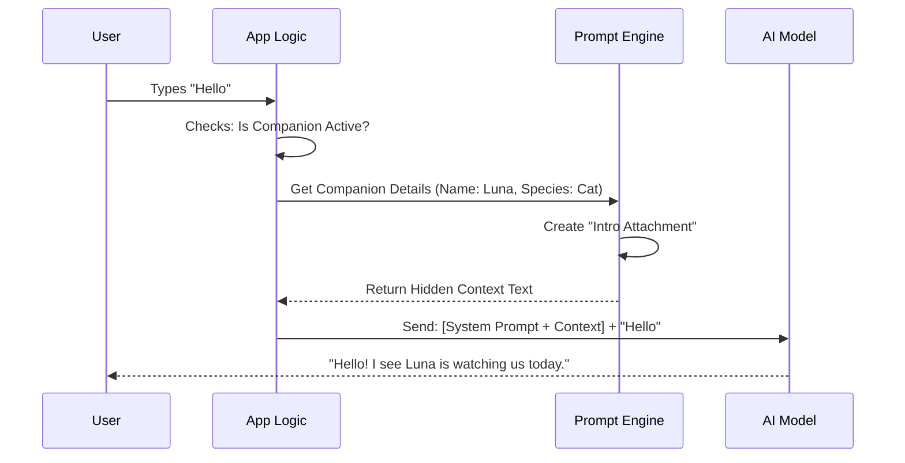

# Chapter 4: Context Injection

In the previous chapter, [Live Component & Animation](03_live_component___animation.md), we gave our companion a heartbeat. It can blink, wiggle, and stand next to your command prompt using ASCII art.

However, we have a major disconnect.

Your terminal shows a "Duck" standing there, but the **AI Brain** (the Large Language Model) has no idea it exists. The AI lives on a server in the cloud; it cannot "see" your screen. If you ask the AI, "Who is standing next to me?", it will likely say, "I don't know what you are talking about."

To fix this, we need **Context Injection**.

## The Problem: The Uninformed Dungeon Master

Imagine playing a tabletop RPG (like D&D). The AI is the **Dungeon Master** (DM). You are the player.

You have a pet Goblin named "Snarfl" sitting on your shoulder. But if you never hand the DM a character sheet for Snarfl, the DM will never describe Snarfl doing anything. The DM simply doesn't know Snarfl exists.

**Context Injection** is the act of handing that character sheet to the AI right before the adventure starts.

## Key Concepts

### 1. The System Prompt
Every time you send a message to the AI, we send a hidden instruction first called the **System Prompt**. This sets the rules of the universe (e.g., "You are a helpful coding assistant").

### 2. The Injection
We take the data from **Chapter 1** (The Name "Snarfl", The Species "Goblin") and *inject* a sentence into that System Prompt.

### 3. The Instruction
We don't just say "There is a goblin." We give the AI behavioral rules:
*   Acknowledge the companion.
*   Do **not** pretend to be the companion (the companion has its own speech bubble system).
*   Treat it as a sidekick.

---

## How to Use It

In `buddy`, we handle this by creating a text generator function. This function takes the "Soul" (Name) and "Bones" (Species) and turns them into a paragraph of text for the AI.

### Input
Let's say our user ID generated a **Robot** named **"BeepBoop"**.

```typescript
import { companionIntroText } from './prompt'

const name = "BeepBoop"
const species = "robot"

// We generate the rulebook entry
const rule = companionIntroText(name, species)
```

### Output
The `rule` variable now contains a string like this:

> "A small **robot** named **BeepBoop** sits beside the user's input box... You're not BeepBoop — it's a separate watcher."

Now, when you talk to the AI, it knows the context!

**User:** "High five!"
**AI:** "*I can't high five you, but BeepBoop raises a mechanical claw in solidarity!*"

---

## Under the Hood: Implementation

How does this text get from our config file to the AI Model?



### 1. Generating the Description
In `prompt.ts`, we have a template function. Notice how specific the instructions are. We strictly tell the AI *not* to speak *as* the companion, because the companion has its own visual speech bubble (which we built in Chapter 3).

```typescript
// prompt.ts
export function companionIntroText(name: string, species: string): string {
  return `# Companion
  A small ${species} named ${name} sits beside the user...
  You're not ${name} — it's a separate watcher.
  
  When the user addresses ${name}, stay out of the way...`
}
```

### 2. Creating the Attachment
We wrap this text in an "Attachment" object. This is how `buddy` organizes hidden context.

We also perform a check: **Has the AI already been told?**
If we tell the AI "There is a duck here" in *every single message*, the AI might get annoyed or repetitive. We only inject this context if it's new.

```typescript
// prompt.ts
export function getCompanionIntroAttachment(messages: Message[]) {
  const companion = getCompanion() // Load "Soul" and "Bones"
  
  // 1. Safety Check: Is it muted?
  if (!companion || getGlobalConfig().companionMuted) return []

  // 2. History Check: Did we already tell the AI?
  for (const msg of messages) {
    if (msg.attachment?.name === companion.name) return [] // Already knows!
  }

  // 3. Return the new Context
  return [{
    type: 'companion_intro',
    name: companion.name,
    species: companion.species,
  }]
}
```

### 3. The Flow Breakdown
1.  **Load:** `getCompanion()` retrieves the saved name ("Soul") and calculated species ("Bones").
2.  **Filter:** We loop through previous messages. If we find an attachment with `type: 'companion_intro'` and the same name, we return an empty array `[]`. We don't need to repeat ourselves.
3.  **Inject:** If it's new, we return the attachment. The main application loop will see this attachment, call `companionIntroText`, and send that hidden text to the AI.

## Why this is cool

1.  **Immersion:** The AI feels aware of your environment. If you say "feed the pet," the AI knows *what* pet you have without you saying "feed my robot."
2.  **Separation of Powers:**
    *   The **CLI** handles the visuals (Drawing the ASCII).
    *   The **AI** handles the narrative (Talking about the companion).
    *   This prevents the AI from trying to "draw" the pet with text, which LLMs are usually bad at.
3.  **Token Efficiency:** By checking history (`messages`), we ensure we aren't wasting money sending the same "There is a duck" description 1,000 times.

## Conclusion

We have now successfully connected the "Brain" (AI) to the "Body" (Companion).
*   **Chapter 1:** Created the data.
*   **Chapter 2:** Drew the body.
*   **Chapter 3:** Animated the body.
*   **Chapter 4:** Told the AI about the body.

The system is fully functional. But `buddy` isn't just about watching a pet; it's about helping you code. What if the companion could help you discover hidden features or commands?

In the final chapter, we will discuss how to guide the user through the application.

[Next: Feature Discovery & Teaser](05_feature_discovery___teaser.md)

---

Generated by [Code IQ](https://github.com/adityasoni99/Code-IQ)