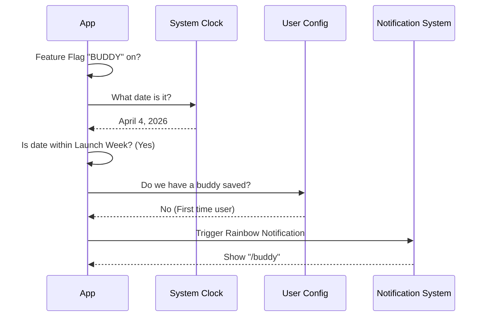

# Chapter 5: Feature Discovery & Teaser

In the previous chapter, [Context Injection](04_context_injection.md), we connected our companion to the AI's brain, allowing it to "see" and "hear" what is happening in the chat.

We now have a complete feature:
1.  **Soul:** Deterministic stats.
2.  **Body:** ASCII renderer.
3.  **Life:** Animation loop.
4.  **Brain:** Context awareness.

But there is one final problem: **Invisibility**.

If a user installs `buddy` but doesn't know the command `/buddy` exists, they will never see their new friend. We need a way to announce the feature without being annoying.

Welcome to **Feature Discovery**.

## The Concept: The Movie Poster

Imagine walking past a cinema. You know a new movie is coming out because there is a poster with the release date.

We want to do the same thing in the terminal. We want to show a "Coming Soon" or "Now Available" sign.

However, we need strict rules:
1.  **Time-Gated:** Don't show the teaser in 2030 for a feature released in 2026.
2.  **Smart:** Don't show the teaser if the user *already* has a buddy.
3.  **Flashy:** Use colors (Rainbows) so the user notices it among boring white text.

## Key Concepts

### 1. The Time Window
We define a specific date range (e.g., April 1st to April 7th, 2026). The code checks the user's system clock. If we are outside this window, the teaser remains hidden.

### 2. The Feature Flag
A "Feature Flag" is a master switch in the code. If `feature('BUDDY')` is `false`, the code acts like the feature doesn't exist. This lets us ship code before it is ready to turn on.

### 3. Rainbow Text
Terminals usually support 16 basic colors. To grab attention, we render text where every letter has a different color from a calculated spectrum.

---

## How to Use It

The discovery logic is packaged into a React Hook called `useBuddyNotification`. You simply call this hook in your main application component.

### Input
You don't pass arguments. The hook checks the environment automatically.

```typescript
import { useBuddyNotification } from './useBuddyNotification'

export function App() {
  // Run the logic silently in the background
  useBuddyNotification()

  return <Layout>...</Layout>
}
```

### Output
If the date is correct and the user has no buddy, a notification appears at the bottom of the screen:

> **New Feature:** Try typing <span style="color:red">/</span><span style="color:orange">b</span><span style="color:yellow">u</span><span style="color:green">d</span><span style="color:blue">d</span><span style="color:purple">y</span> to meet your companion!

---

## Under the Hood: Implementation

How does the app decide whether to annoy the user with a popup?



### Step 1: Checking the Calendar
We write a helper function to check the current date. Note that in JavaScript, `month` starts at 0 (January is 0, April is 3).

```typescript
// useBuddyNotification.tsx
export function isBuddyTeaserWindow(): boolean {
  const d = new Date()
  
  // Only active in April (3) of 2026, from the 1st to the 7th
  return d.getFullYear() === 2026 
      && d.getMonth() === 3 
      && d.getDate() <= 7
}
```

### Step 2: The Rainbow Renderer
To make the text `/buddy` pop, we split the string into individual characters and map a color to each index.

```typescript
// useBuddyNotification.tsx
function RainbowText({ text }) {
  return (
    <>
      {[...text].map((char, i) => (
        // getRainbowColor(i) returns a different hex code based on position
        <Text key={i} color={getRainbowColor(i)}>
          {char}
        </Text>
      ))}
    </>
  )
}
```

### Step 3: The Notification Logic
This is where we combine everything inside a `useEffect`. We check the **Flag**, the **Config**, and the **Date**.

```typescript
// useBuddyNotification.tsx
export function useBuddyNotification() {
  const { addNotification } = useNotifications()

  useEffect(() => {
    // 1. Safety Check: Is feature enabled?
    if (!feature('BUDDY')) return

    // 2. Logic Check: Do they have a pet? Is it the right date?
    const config = getGlobalConfig()
    if (config.companion || !isBuddyTeaserWindow()) return

    // 3. Action: Show the rainbow text
    addNotification({
      key: 'buddy-teaser',
      jsx: <RainbowText text="/buddy" />,
      timeoutMs: 15000 // Disappears after 15 seconds
    })
  }, [])
}
```

## Why this is cool

1.  **Non-Intrusive:** By checking `config.companion`, we ensure that once the user engages with the feature, we stop pestering them.
2.  **FOMO (Fear Of Missing Out):** Time-gating the teaser makes the event feel special for users who are using the app during launch week.
3.  **Discoverability:** It bridges the gap between "Writing code" and "Using code."

## Tutorial Conclusion

Congratulations! You have completed the **buddy** architecture tutorial.

Let's look back at what we built:
1.  **[Chapter 1](01_deterministic_generation__soul___bones_.md)** taught us how to create a unique **Soul** from a User ID using math.
2.  **[Chapter 2](02_ascii_sprite_renderer.md)** taught us how to draw a **Body** using ASCII sprite substitution.
3.  **[Chapter 3](03_live_component___animation.md)** gave the creature **Life** with a heartbeat loop.
4.  **[Chapter 4](04_context_injection.md)** gave it a **Brain** by introducing it to the AI.
5.  **Chapter 5** (This chapter) showed us how to introduce the feature to the **User**.

You now understand the full lifecycle of a modern CLI agent feature—from the random number generator to the pixels on the screen. Happy coding!

---

Generated by [Code IQ](https://github.com/adityasoni99/Code-IQ)