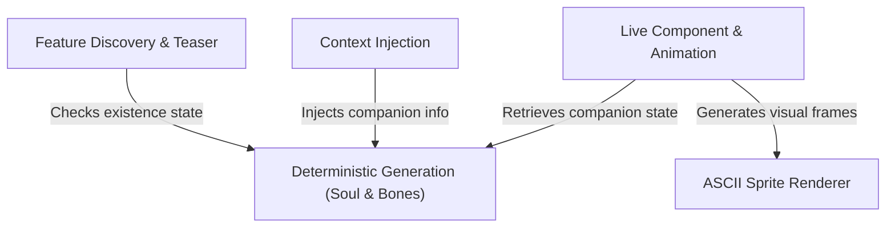

# Tutorial: buddy

The project implements a persistent **digital companion** that lives in the terminal alongside the user. It uses *deterministic generation* to create a unique creature (like a duck or robot) based on the user's ID, renders it using dynamic **ASCII art**, and manages its lifecycle with idle animations, reactions, and AI context awareness.

## Chapters

1. [Deterministic Generation (Soul & Bones)](01_deterministic_generation__soul___bones_.md)
2. [ASCII Sprite Renderer](02_ascii_sprite_renderer.md)
3. [Live Component & Animation](03_live_component___animation.md)
4. [Context Injection](04_context_injection.md)
5. [Feature Discovery & Teaser](05_feature_discovery___teaser.md)

---

Generated by [Code IQ](https://github.com/adityasoni99/Code-IQ)