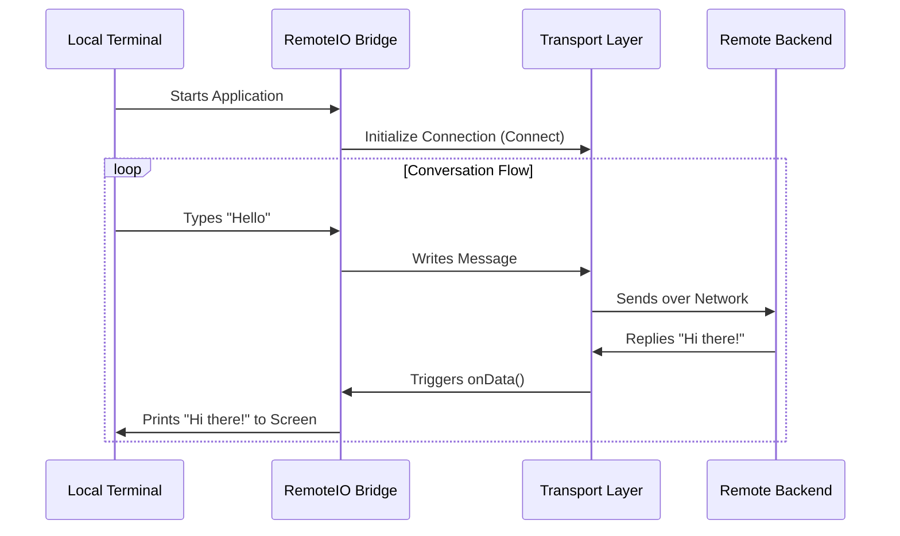

# Chapter 1: Remote I/O Bridge

Welcome to the **CLI** project tutorial! This is where your journey begins.

Before we dive into authentication or complex protocols, we need to understand the physical foundation of this application. This CLI tool is unique: it acts like a "dumb terminal" locally, while the actual brain (the AI processing) lives on a remote server.

## Motivation: The Relay Station

Imagine you are using a walkie-talkie. You press a button to speak, your voice travels through the air, and a friend miles away hears you and responds.

In this project, the **Remote I/O Bridge** is that walkie-talkie system.

1.  **Local User:** You type a command in your terminal.
2.  **The Bridge:** Captures your input, packages it, and shoots it over the internet.
3.  **Remote Brain:** Processes the thought.
4.  **The Bridge:** Catches the response and displays it on your screen.

Without this bridge, the local application is silent and disconnected. It solves the problem of **connecting a local user interface to a distant backend brain.**

## Key Concept: The `RemoteIO` Class

The core of this logic lives in `remoteIO.ts`. It extends the concept of standard Input/Output (I/O) but adds a network layer in the middle.

Think of it as having three main jobs:
1.  **Listen:** It creates a local stream to listen to the server.
2.  **Connect:** It establishes a "Transport" (the actual internet connection).
3.  **Relay:** It moves data back and forth.

### How to Use It (High Level)

To start the bridge, you simply tell it *where* the remote brain is located (the URL).

```typescript
// A simplified example of usage
import { RemoteIO } from './remoteIO';

// 1. Create the bridge to the remote server
const bridge = new RemoteIO('https://api.claude.ai/session');

// 2. The bridge is now ready to send and receive messages!
```

Once initialized, the bridge handles the complexity of keeping the connection alive and formatting messages securely.

## Under the Hood: The Internal Implementation

Let's visualize what happens when you start the application. The `RemoteIO` system acts as the coordinator between your terminal and the transport layer.



Now, let's look at the actual code in `remoteIO.ts` broken down into small, digestible pieces.

### 1. Setting up the Stream

When `RemoteIO` starts, it first creates a local "pipe" (`PassThrough`) to handle incoming data. This is where data from the server will eventually flow.

```typescript
import { PassThrough } from 'stream';
import { StructuredIO } from './structuredIO';

export class RemoteIO extends StructuredIO {
  constructor(streamUrl: string) {
    // Create a simple stream to hold incoming data
    const inputStream = new PassThrough({ encoding: 'utf8' });
    
    // Initialize the parent class with this stream
    super(inputStream);
    // ...
  }
}
```
*Explanation:* We create a `PassThrough` stream. Think of this as an empty pipe waiting for water (data) to be poured into it later.

### 2. preparing Authentication

Before we can connect, we need permission. The bridge grabs a session token. We will cover the details of how this token is generated in [Authentication Flow](02_authentication_flow.md).

```typescript
// Inside constructor...
const headers: Record<string, string> = {};

// Get the security token (auth)
const sessionToken = getSessionIngressAuthToken();

if (sessionToken) {
  // Attach the token to the headers
  headers['Authorization'] = `Bearer ${sessionToken}`;
}
```
*Explanation:* Just like showing an ID card before entering a building, we attach an `Authorization` header to our request so the remote server accepts us.

### 3. Selecting the Transport

The bridge doesn't know *how* to send data (WebSocket? SSE? HTTP?), it just knows *what* to send. It delegates the "how" to a **Transport**. We will explore this in [Transport Strategies](04_transport_strategies.md).

```typescript
// Inside constructor...
import { getTransportForUrl } from './transports/transportUtils';

// Ask a utility function to give us the right vehicle (Transport)
this.transport = getTransportForUrl(
  this.url,
  headers,
  getSessionId(),
  refreshHeaders, // Callback to get fresh tokens
);
```
*Explanation:* `RemoteIO` asks for a driver (`transport`). It hands over the destination (`url`) and the ID card (`headers`).

### 4. Wiring the Connection (The Relay)

This is the most critical part. When the remote server sends data, the Transport catches it. We need to tell the Transport to pass that data into our local stream.

```typescript
// Inside constructor...

// When the internet connection receives data...
this.transport.setOnData((data: string) => {
  // ... write it immediately to our local input stream.
  this.inputStream.write(data);
  
  // (Optional) Echo to stdout if debugging
});
```
*Explanation:* This connects the "Walkie-Talkie" speaker. When a signal comes in (`setOnData`), we pipe it directly to the application (`inputStream.write`), allowing the rest of the CLI to read it.

### 5. Sending Data Out

When the user types something, we need to send it away. The `write` method handles this.

```typescript
async write(message: StdoutMessage): Promise<void> {
  // If we are using the advanced Client (CCR), use that
  if (this.ccrClient) {
    await this.ccrClient.writeEvent(message);
  } else {
    // Otherwise, just write directly to the transport
    await this.transport.write(message);
  }
}
```
*Explanation:* This is the microphone button. It takes a message object and pushes it down the wire. It also checks if we are using "CCR" (Command Control Response), a topic for [CCR State Synchronization](05_ccr_state_synchronization.md).

### 6. Keeping it Alive

Internet connections often close if they are silent for too long. The bridge ensures the line stays open by sending a heartbeat.

```typescript
// Inside constructor...
const keepAliveIntervalMs = getPollIntervalConfig().session_keepalive_interval_v2_ms;

if (this.isBridge && keepAliveIntervalMs > 0) {
  this.keepAliveTimer = setInterval(() => {
    // Send a silent 'keep_alive' message periodically
    void this.write({ type: 'keep_alive' }); 
  }, keepAliveIntervalMs);
}
```
*Explanation:* Every few minutes, the bridge whispers "I'm still here" (`keep_alive`) to the server so the server doesn't hang up the phone.

## Conclusion

The **Remote I/O Bridge** is the lifeline of this application. It creates a seamless experience where a local terminal feels intelligent, even though the intelligence resides in the cloud. It manages the connection, secures the headers, and routes the data.

Now that we have a connection established, how do we ensure that the person connecting is actually allowed to be there?

[Next Chapter: Authentication Flow](02_authentication_flow.md)

---

Generated by [Code IQ](https://github.com/adityasoni99/Code-IQ)