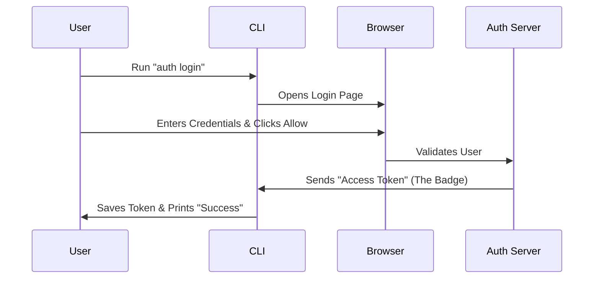

# Chapter 2: Authentication Flow

In the previous chapter, [Remote I/O Bridge](01_remote_i_o_bridge.md), we built the communication line (the "Walkie-Talkie") that connects your local terminal to the remote AI brain.

However, having a connection isn't enough. The remote server won't talk to just anyone. It needs to know **who** is calling and **if** they have permission to use the system.

## Motivation: The Digital ID Card

Imagine you work in a high-security office building. You can't just walk in; you need a security badge.

1.  **Authentication:** You show your ID to the guard (proving who you are).
2.  **Authorization:** The guard checks if your ID allows you to enter this specific floor.
3.  **Session:** The guard gives you a visitor badge so you don't have to show your ID at every single door you walk through.

The **Authentication Flow** in this CLI handles this exact process. It manages logging you in, getting a secure "badge" (token), and saving it safely on your computer so you don't have to log in every time you type a command.

## Key Concept: The OAuth Dance

The most common way this CLI authenticates is via a **Browser OAuth Flow**. This is a secure dance between your terminal, your web browser, and the authentication server.

### How it looks to the User

To the user, the process is simple magic:

1.  User types `claude auth login`.
2.  A browser window pops up asking for permission.
3.  User clicks "Allow".
4.  The terminal says "Login successful."

### What happens in the background

The CLI acts like a temporary web server waiting for a secret code from the browser.



## Internal Implementation

The core logic resides in `handlers/auth.ts`. Let's break down the code into the steps the CLI takes to get that badge.

### 1. Choosing the Login Method

When the `authLogin` function starts, it checks: "Did the user give me a refresh token via an environment variable, or should I open a browser?"

For automation (like robots running scripts), we use environment variables. For humans, we use the browser.

```typescript
// handlers/auth.ts (Simplified)

// Check if a token is already provided in the environment
const envRefreshToken = process.env.CLAUDE_CODE_OAUTH_REFRESH_TOKEN;

if (envRefreshToken) {
   // Skip browser, use the provided token directly
   const tokens = await refreshOAuthToken(envRefreshToken, { scopes });
   await installOAuthTokens(tokens);
   process.exit(0); 
}
// If no env token, we proceed to browser login...
```
*Explanation:* If you already have a ticket (env var), you skip the line. If not, you go to the ticket counter (browser).

### 2. Starting the Browser Flow

If we need to open the browser, we use the `OAuthService`. This service handles the complex work of generating a unique URL and listening for the callback.

```typescript
// handlers/auth.ts (Simplified)

const oauthService = new OAuthService();

// Start the flow
const result = await oauthService.startOAuthFlow(
  async (url) => {
    process.stdout.write('Opening browser to sign in…\n');
    process.stdout.write(`If it fails, visit: ${url}\n`);
  },
  { loginWithClaudeAi: true } // Config options
);
```
*Explanation:* We ask the `OAuthService` to start the process. We provide a small callback function that tells the user "Hey, I'm opening your browser now."

### 3. Installing the Tokens

Once the browser says "Yes, this is a valid user," the `startOAuthFlow` returns a set of **Tokens**. These are your digital keys. We must save them securely immediately.

```typescript
// handlers/auth.ts (Simplified)

// We got the tokens! Now let's save them and set up the user.
await installOAuthTokens(result);

process.stdout.write('Login successful.\n');
process.exit(0);
```
*Explanation:* We pass the fresh tokens to a helper called `installOAuthTokens`. This function is the "Save Game" feature of authentication.

### 4. The Setup Phase (`installOAuthTokens`)

Getting the token is only step one. We also need to know *who* the user is (their profile) and what *organization* they belong to.

```typescript
// handlers/auth.ts (Simplified)

export async function installOAuthTokens(tokens: OAuthTokens): Promise<void> {
  // 1. Clear old data to avoid conflicts
  await performLogout({ clearOnboarding: false });

  // 2. Fetch user profile (Who is this?)
  const profile = await getOauthProfileFromOauthToken(tokens.accessToken);
  
  // 3. Save account info locally
  storeOAuthAccountInfo({
    emailAddress: profile.account.email,
    organizationUuid: profile.organization.uuid,
    // ... other details
  });

  // 4. Save the actual secret tokens to disk
  saveOAuthTokensIfNeeded(tokens);
}
```
*Explanation:*
1.  **Logout first:** Clean the slate.
2.  **Get Profile:** Ask the server for the user's name and email.
3.  **Store Info:** Save the non-secret info (email, org ID) for display.
4.  **Save Tokens:** Save the secret keys securely so we can use them later.

## Checking Status

How do we know if we are currently logged in? The CLI provides an `auth status` command. It simply checks if those saved files exist on your computer.

```typescript
// handlers/auth.ts (Simplified)

const { hasToken } = getAuthTokenSource();
const apiKey = process.env.ANTHROPIC_API_KEY;

// You are logged in if you have a Token OR an API Key
const loggedIn = hasToken || !!apiKey;

if (loggedIn) {
  process.stdout.write(`Logged in as: ${email}\n`);
} else {
  process.stdout.write('Not logged in.\n');
}
```

## Summary

The **Authentication Flow** is the gatekeeper.
1.  It uses **OAuth** to securely identify you via the browser.
2.  It acquires **Tokens** (your digital ID badge).
3.  It **Stores** these tokens and your user profile locally.

Now that we have established a connection (Chapter 1) and proved who we are (Chapter 2), we need a standardized language to communicate complex instructions to the AI.

[Next Chapter: Structured Message Protocol](03_structured_message_protocol.md)

---

Generated by [Code IQ](https://github.com/adityasoni99/Code-IQ)