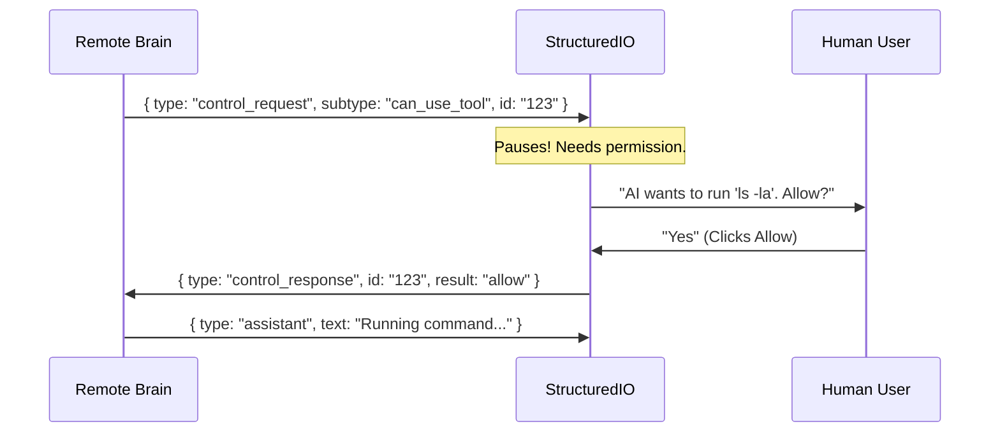

# Chapter 3: Structured Message Protocol

In the previous chapters, we established a connection to the internet in [Remote I/O Bridge](01_remote_i_o_bridge.md) and proved our identity in [Authentication Flow](02_authentication_flow.md).

Now we have a secure, open line of communication. But **how** do we talk?

If the server sends a complex instruction and the connection hiccups, or if a message contains a "newline" character inside it, how does the CLI know where one message ends and the next begins?

## Motivation: The "Broken Sentence" Problem

Imagine you are receiving a letter, but the mail carrier tears it in half and delivers the pieces separately. You might read the first half and think the sentence is finished, leading to a complete misunderstanding.

In the world of CLI tools and AI, this is a critical risk. The AI might send a piece of code like this:

```javascript
console.log("Hello
World");
```

If we aren't careful, our system might read `console.log("Hello` as one message (which is invalid code) and `World");` as the next.

The **Structured Message Protocol** solves this using **NDJSON (Newline Delimited JSON)**. It enforces a strict rule: **One complete thought per line.**

## Key Concept: The Safety Sanitizer

The first line of defense is ensuring that no message *ever* accidentally looks like two messages.

Standard JSON allows certain "invisible" characters that JavaScript treats as newlines (specifically `U+2028` and `U+2029`). If these sneak into a message, our reader might accidentally split the message in half.

We use a helper called `ndjsonSafeStringify`.

### How to Use It

Instead of using the standard `JSON.stringify`, we use our safe version for any data sent over the network.

```typescript
import { ndjsonSafeStringify } from './ndjsonSafeStringify';

const dangerousMessage = { text: "Hello\u2028World" };

// Standard stringify might output a raw newline character here.
// Safe stringify escapes it:
const safeString = ndjsonSafeStringify(dangerousMessage);

console.log(safeString); 
// Output: {"text":"Hello\u2028World"} 
// (It remains on exactly one line)
```

### Under the Hood

The implementation is a lightweight wrapper around standard JSON stringification. It uses a Regular Expression (Regex) to hunt down those specific line-breaking characters and replace them with their safe, escaped versions (`\u...`).

```typescript
// ndjsonSafeStringify.ts

const JS_LINE_TERMINATORS = /\u2028|\u2029/g;

function escapeJsLineTerminators(json: string): string {
  // Replace the physical line break char with the text "\u2028"
  return json.replace(JS_LINE_TERMINATORS, c =>
    c === '\u2028' ? '\\u2028' : '\\u2029',
  );
}

export function ndjsonSafeStringify(value: unknown): string {
  // 1. Convert to JSON
  // 2. Scrub the output for hidden line breaks
  return escapeJsLineTerminators(JSON.stringify(value));
}
```
*Explanation:* This ensures that no matter what text the user or AI types, the resulting message will occupy exactly **one physical line** in the stream.

## Key Concept: `StructuredIO`

Now that we can write safe messages, we need a system to read them and act on them. The `StructuredIO` class is the "Traffic Cop" of the application.

It has two main jobs:
1.  **Read:** Ingest raw text, split it by newlines, and parse the JSON.
2.  **Route:** Decide if a message is just text (`assistant` message) or a command that needs approval (`control_request`).

### The Reading Loop

Inside `structuredIO.ts`, there is a generator function that constantly listens for data.

```typescript
// structuredIO.ts (Simplified Logic)

private async *read() {
  let content = '';
  // Loop through every chunk of data arriving
  for await (const block of this.input) {
    content += block;
    
    // While we find a newline character...
    while (content.indexOf('\n') !== -1) {
      const splitIndex = content.indexOf('\n');
      const line = content.slice(0, splitIndex); // Grab the line
      content = content.slice(splitIndex + 1);   // Save the rest
      
      // Parse and return the valid message object
      yield this.processLine(line); 
    }
  }
}
```
*Explanation:* This buffers data. If a message arrives in two pieces, it waits until it sees the `\n` (newline) before trying to process it. This guarantees we never process a broken JSON fragment.

## Complex Use Case: Permission Negotiation

The most powerful feature of the Structured Message Protocol is the **Control Loop**.

Sometimes, the remote AI wants to do something sensitive, like running a terminal command. It cannot just *do* it; it must ask `StructuredIO` for permission.

1.  **AI:** Sends `control_request` (subtype: `can_use_tool`).
2.  **StructuredIO:** Pauses processing.
3.  **User/Host:** Sees a prompt ("Allow this command?").
4.  **StructuredIO:** Sends `control_response` (subtype: `allow` or `deny`).

### Visualizing the Negotiation



### Implementing the Permission Check

In the code, this is handled by `createCanUseTool`. This function is passed to the AI agent. When the agent tries to use a tool, this function intercepts it.

```typescript
// structuredIO.ts (Simplified)

createCanUseTool(): CanUseToolFn {
  return async (tool, input, context, message, toolUseID) => {
    
    // 1. Send a request to the SDK consumer (User Interface)
    // We create a unique ID for this specific question
    const requestId = randomUUID();

    // 2. Wait for the answer (Promise)
    const result = await this.sendRequest(
      {
        subtype: 'can_use_tool',
        tool_name: tool.name,
        input: input,
        tool_use_id: toolUseID
      },
      schema, // Expected response format
      undefined, 
      requestId
    );

    // 3. Return the decision (Allow/Deny) back to the internal system
    return result; 
  };
}
```
*Explanation:* This turns an asynchronous human interaction (waiting for a user to click a button) into a standard Promise that the code can await.

### Handling the Response

When the user finally replies (via the incoming stream), `StructuredIO` matches the response ID to the question ID.

```typescript
// structuredIO.ts inside processLine()

if (message.type === 'control_response') {
  // Find the question we asked earlier using the ID
  const pending = this.pendingRequests.get(message.response.request_id);
  
  if (pending) {
    // Complete the promise!
    pending.resolve(message.response.result);
    this.pendingRequests.delete(message.response.request_id);
  }
  return undefined; // This message was internal, don't print it
}
```

## Summary

The **Structured Message Protocol** is the strict grammar that keeps the conversation sane.
1.  It uses **NDJSON** to ensure messages are distinct.
2.  It uses **Safety Sanitizers** to prevent accidental message breaking.
3.  It uses **Control Requests** to handle permissions and interactive flows.

Now that we can safely package our messages, how do we physically move them across the network? Do we use standard HTTP? WebSockets? Something else?

[Next Chapter: Transport Strategies](04_transport_strategies.md)

---

Generated by [Code IQ](https://github.com/adityasoni99/Code-IQ)