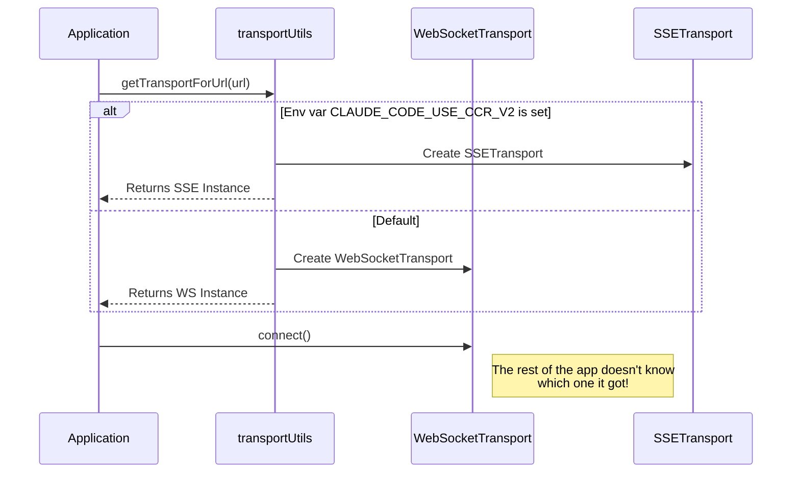

# Chapter 4: Transport Strategies

In the previous chapter, [Structured Message Protocol](03_structured_message_protocol.md), we defined the "language" (NDJSON) that our CLI and the remote AI use to understand each other.

Now, we need to figure out the **shipping method**. How do we actually move those JSON messages across the internet?

While you might think "just use the internet," corporate networks, firewalls, and proxies often have strict rules. Some block standard persistent connections (WebSockets), while others might timeout idle connections.

## Motivation: The Logistics Problem

Imagine you are a logistics manager trying to ship packages (messages) between your house (CLI) and a warehouse (Server).

1.  **The Highway (WebSocket):** The fastest method. A direct, open road where trucks can drive back and forth instantly.
2.  **The Side Roads (Hybrid/SSE):** Sometimes the highway is closed due to construction (firewalls). You might need to receive packages via a delivery drone (SSE) and send your returns via the post office (HTTP POST).

The **Transport Strategy** pattern allows our application to switch between "The Highway" and "The Side Roads" automatically, without changing the messages inside the packages.

## Key Concept: The `Transport` Interface

To make the rest of the application not care *how* data is sent, we create a standard interface. Every shipping method must follow these rules:

1.  **Connect:** Start the journey.
2.  **Write:** Send a message out.
3.  **OnData:** What to do when a message arrives.
4.  **Close:** Stop shipping.

This allows the core logic (from Chapter 1) to simply say `transport.write(message)` without worrying if it's using a WebSocket or an HTTP POST.

## Strategy 1: WebSocket Transport ("The Highway")

This is the default and preferred method. It opens a **bidirectional** pipe. Both the CLI and the Server can shout down the pipe at any time.

### How it works
It uses the standard `ws` protocol. It creates a persistent connection that stays open as long as the session is active.

### Resilience: The Heartbeat
One specific problem with "Highways" is that if no cars drive on them for a while, security guards (proxies) might close the road.

To prevent this, `WebSocketTransport.ts` implements a "Ping/Pong" or "Keep Alive" system.

```typescript
// transports/WebSocketTransport.ts (Simplified)

// Every few seconds...
this.pingInterval = setInterval(() => {
  if (this.state === 'connected') {
    // 1. Check if the server replied to our last ping
    if (!this.pongReceived) {
       // If not, the connection is dead. Reconnect!
       this.handleConnectionError(); 
       return;
    }
    
    // 2. Send a new ping
    this.pongReceived = false;
    this.ws.ping(); 
  }
}, 10000); // 10 seconds
```
*Explanation:* The CLI pokes the server every 10 seconds ("Are you there?"). If the server doesn't poke back, the CLI hangs up and tries to call again.

## Strategy 2: Hybrid & SSE ("The Side Roads")

Some environments (like strict corporate VPNs) dislike WebSockets. For these cases, we use a **Hybrid approach**.

1.  **Reading (Incoming):** We use **Server-Sent Events (SSE)**. This is like listening to a radio station. The server broadcasts a stream of events to us.
2.  **Writing (Outgoing):** We use **HTTP POST**. This is like mailing a letter. Every time we want to say something, we make a new, distinct HTTP request.

### The SSE Reader
The `SSETransport` listens to a stream of text data. It has to be smart enough to assemble pieces of data into a full message.

```typescript
// transports/SSETransport.ts (Simplified)

// Read the incoming stream chunk by chunk
while (true) {
  const { done, value } = await reader.read();
  if (done) break;

  // Decode bytes to text
  buffer += decoder.decode(value);
  
  // Parse specific "data:" lines used by SSE
  const { frames, remaining } = parseSSEFrames(buffer);
  
  // Process each complete frame
  frames.forEach(frame => this.handleSSEFrame(frame));
}
```
*Explanation:* The transport buffers incoming text. Once it sees a complete message (marked by newlines), it processes it.

### The POST Writer
Sending data via HTTP POST is slower than a WebSocket. To avoid clogging the network, we use a **Batch Uploader**. If the user sends 5 messages quickly, the `HybridTransport` might bundle them into a single HTTP POST.

## Internal Implementation: Selecting the Strategy

The file `transports/transportUtils.ts` acts as the traffic controller. It looks at your configuration and decides which vehicle to use.



### The Code: The Selector Logic

Here is how the system decides what to use. It relies heavily on environment variables ("Env Vars") or protocol checks.

```typescript
// transports/transportUtils.ts (Simplified)

export function getTransportForUrl(url: URL): Transport {
  // 1. Check if we are forced to use SSE (The Side Road)
  if (process.env.CLAUDE_CODE_USE_CCR_V2) {
    // Transform the URL to an SSE endpoint
    const sseUrl = convertToSSEUrl(url);
    return new SSETransport(sseUrl);
  }

  // 2. Otherwise, check if the URL supports WebSockets
  if (url.protocol === 'ws:' || url.protocol === 'wss:') {
    // Return the standard "Highway" transport
    return new WebSocketTransport(url);
  }

  throw new Error('Unsupported protocol');
}
```
*Explanation:* The code checks `process.env`. If a special flag is set, it swaps the strategy. This is useful for debugging or specific deployment environments.

## Resilience: Auto-Reconnection

Both strategies implement **Exponential Backoff**. If the internet cuts out:

1.  Wait 1 second. Retry.
2.  Fail? Wait 2 seconds. Retry.
3.  Fail? Wait 4 seconds. Retry.
4.  ... up to a maximum delay.

This prevents the CLI from "spamming" the server if the server is down, which could make the problem worse (a "Thundering Herd" problem).

```typescript
// transports/WebSocketTransport.ts (Simplified)

private handleConnectionError() {
  // Calculate delay: 1s * 2^(attempts)
  const delay = Math.min(
    1000 * Math.pow(2, this.reconnectAttempts), 
    30000 // Max 30 seconds
  );

  setTimeout(() => {
    this.connect(); // Try again
  }, delay);
}
```

## Summary

In this chapter, we learned that **Transport Strategies** allow the CLI to adapt to different network environments without changing the core application logic.

1.  **WebSocketTransport** is the preferred, fast, bidirectional layer.
2.  **SSETransport / HybridTransport** is the fallback for restrictive networks, separating reading and writing into different channels.
3.  **Auto-reconnection** ensures the tool recovers gracefully from network hiccups.

Now that we have a reliable connection and a way to send structured messages, we need to handle the **state** of the remote AI. The AI needs to "remember" what we are doing, even if we disconnect and reconnect.

[Next Chapter: CCR State Synchronization](05_ccr_state_synchronization.md)

---

Generated by [Code IQ](https://github.com/adityasoni99/Code-IQ)