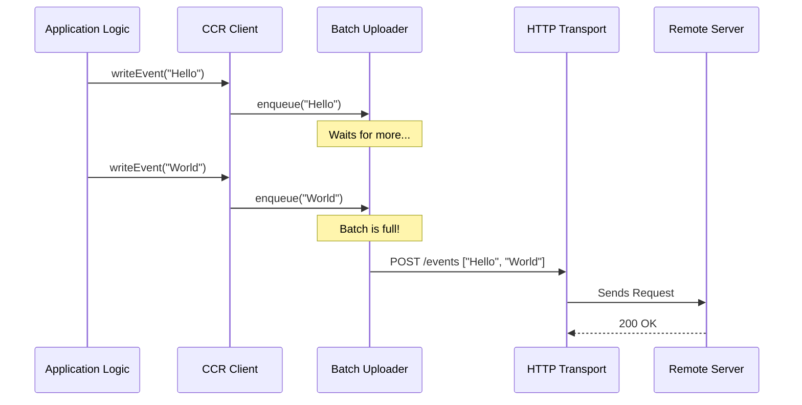

# Chapter 5: CCR State Synchronization

In the previous chapter, [Transport Strategies](04_transport_strategies.md), we built the "highway" for our data. We learned how to send raw messages using WebSockets or HTTP/SSE.

However, a raw highway isn't enough. What happens if the internet blips for a second? What if the application tries to send 1,000 tiny messages in one second—will that clog the highway? What if the connection silently dies?

This brings us to **CCR (Cloud Code Runtime) State Synchronization**.

## Motivation: The Logistics Manager

Imagine you are running a shipping company using the highway (Transport) we built last chapter.

1.  **The Problem of Chatty Drivers:** If you send a separate delivery truck for every single envelope, you will run out of trucks and money.
2.  **The Problem of Silence:** If a truck driver stops radioing in, you don't know if they are stuck in traffic or if the truck broke down.
3.  **The Problem of Outdated Info:** If a driver radios "I'm at mile 10," then immediately "I'm at mile 11," you only really care about the latest update ("Mile 11").

The **CCR Client** acts as your Logistics Manager. It solves these problems by:
1.  **Batching:** Packing many envelopes into one truck (Efficiency).
2.  **Heartbeats:** Forcing drivers to check in every 20 seconds (Liveness).
3.  **Coalescing:** Merging rapid status updates so only the final result is sent (State Sync).

## Key Concept 1: The Heartbeat

The simplest but most crucial job of the CCR Client is keeping the session alive. The remote server needs to know your terminal is still there.

### How it works
Every 20 seconds, the client sends a "pulse" to the server. If the server stops receiving this pulse, it assumes the worker (your CLI) has disconnected and cleans up resources.

```typescript
// transports/ccrClient.ts (Simplified)

private startHeartbeat(): void {
  // Define the tick function
  const tick = async () => {
    // Send the "I am alive" signal
    await this.request('post', '/worker/heartbeat', ...);
    
    // Schedule the next beat (approx 20 seconds later)
    this.heartbeatTimer = setTimeout(tick, 20000);
  };

  // Start the loop
  tick();
}
```
*Explanation:* This creates an infinite loop (until stopped) that pokes the server periodically. It ensures the "phone line" doesn't hang up due to silence.

## Key Concept 2: Batching (The `SerialBatchEventUploader`)

When the AI generates code, it might stream hundreds of tiny text updates ("C", "o", "n", "s", "o", "l", "e"...). Sending an HTTP request for every letter is inefficient.

The `SerialBatchEventUploader` acts like a bus stop. It waits for passengers (events) to arrive. Once enough gather—or a specific time passes—the bus leaves.

### The Waiting Room (Queue)

```typescript
// SerialBatchEventUploader.ts (Simplified)

async enqueue(event: MyEvent): Promise<void> {
  // 1. Add item to the waiting list
  this.pending.push(event);

  // 2. Trigger the "bus driver" to check if it's time to go
  void this.drain(); 
}
```
*Explanation:* When `enqueue` is called, we don't send data immediately. We just add it to a list (`pending`) and check if we are ready to send (`drain`).

### The Bus Driver (Drain Loop)

```typescript
// SerialBatchEventUploader.ts (Simplified)

private async drain(): Promise<void> {
  // While we have passengers...
  while (this.pending.length > 0) {
    // Take a batch (e.g., up to 100 items)
    const batch = this.takeBatch(); 

    try {
      // Send the batch to the server
      await this.config.send(batch);
    } catch (err) {
      // If the bus breaks down, put passengers back and wait
      this.pending = batch.concat(this.pending);
      await this.sleep(1000); // Backoff retry
    }
  }
}
```
*Explanation:* The `drain` function grabs a chunk of events and tries to upload them. If it fails, it puts them back at the front of the line and tries again later. This ensures no data is lost even if the internet flickers.

## Key Concept 3: Coalescing State Updates

Sometimes, we update the "status" of the application rapidly.
*   0ms: Status = "Starting"
*   10ms: Status = "Loading"
*   20ms: Status = "Ready"

If we haven't sent "Starting" yet, we don't need to! We can just throw it away and send "Ready." This is called **Coalescing**.

### The `WorkerStateUploader`

This class handles updates to the worker's status. It ensures "Last One Wins."

```typescript
// transports/WorkerStateUploader.ts (Simplified Logic)

enqueue(patch: Record<string, unknown>): void {
  // If we already have a pending update, merge the new one on top
  if (this.pending) {
    this.pending = { ...this.pending, ...patch }; 
  } else {
    this.pending = patch;
  }
  
  // Try to send
  void this.drain();
}
```
*Explanation:* By using the spread operator `...`, new keys overwrite old keys. If `pending` was `{ status: 'Loading' }` and `patch` is `{ status: 'Ready' }`, the result is `{ status: 'Ready' }`. We saved network bandwidth by skipping the outdated step.

## Internal Implementation: The Data Flow

Let's visualize how a message travels from the CLI logic to the Server using the CCR Client.



## Resilience: Retries and Backoff

The internet is unreliable. The CCR layer handles this so the rest of the app doesn't have to.

If a request fails (e.g., Error 500 or Network Error), the uploaders use **Exponential Backoff**.

1.  **Attempt 1:** Fails.
2.  **Wait:** 500ms.
3.  **Attempt 2:** Fails.
4.  **Wait:** 1000ms.
5.  **Attempt 3:** Fails.
6.  **Wait:** 2000ms.

This logic is baked into the `drain` loops we saw earlier.

```typescript
// WorkerStateUploader.ts (Simplified)

private async sendWithRetry(payload): Promise<void> {
  let failures = 0;
  
  while (true) {
    const success = await this.config.send(payload);
    if (success) return; // Done!

    failures++;
    // Calculate delay: 500ms * 2^(failures)
    const delay = 500 * Math.pow(2, failures);
    await sleep(delay); 
  }
}
```
*Explanation:* This simple math ensures we don't spam the server if it's having a bad day, giving it time to recover.

## Putting it Together: `CCRClient`

The `CCRClient` class orchestrates all these pieces. It initializes the uploaders and manages the lifecycle.

### Initialization

When the application starts, `CCRClient` introduces itself to the server.

```typescript
// transports/ccrClient.ts (Simplified)

async initialize(epoch: number): Promise<void> {
  this.workerEpoch = epoch;

  // 1. Tell server: "I am the new worker, here is my ID (epoch)"
  await this.request('put', '/worker', {
    worker_status: 'idle',
    worker_epoch: this.workerEpoch
  }, ...);

  // 2. Start the heartbeat to keep connection alive
  this.startHeartbeat();
}
```
*Explanation:* The `epoch` is a unique ID. If an old, zombie process tries to talk to the server with an old epoch, the server will reject it. This ensures only *one* CLI is controlling the brain at a time.

### Sending Data

When the app needs to show something to the user, it calls `writeEvent`.

```typescript
// transports/ccrClient.ts (Simplified)

async writeEvent(message: StdoutMessage): Promise<void> {
  // Add a unique ID if missing
  const event = this.toClientEvent(message);
  
  // Put it in the batch queue
  await this.eventUploader.enqueue(event);
}
```
*Explanation:* The application just says "write this." The CCR Client handles tagging it with an ID and putting it into the safe, reliable batching system.

## Conclusion

**CCR State Synchronization** is the heavy lifter that ensures reliability.
1.  It **Batches** small messages to save efficiency.
2.  It **Coalesces** state updates so we only send the latest info.
3.  It **Heartbeats** to prove we are alive.
4.  It **Retries** automatically when the internet fails.

By wrapping the raw transport from [Chapter 4](04_transport_strategies.md) in this intelligent layer, we create a robust connection that feels seamless to the user, even on shaky Wi-Fi.

Now that we have a solid communication foundation, how do we extend the capabilities of the AI beyond just chatting? How do we give it tools?

[Next Chapter: Plugin Management](06_plugin_management.md)

---

Generated by [Code IQ](https://github.com/adityasoni99/Code-IQ)