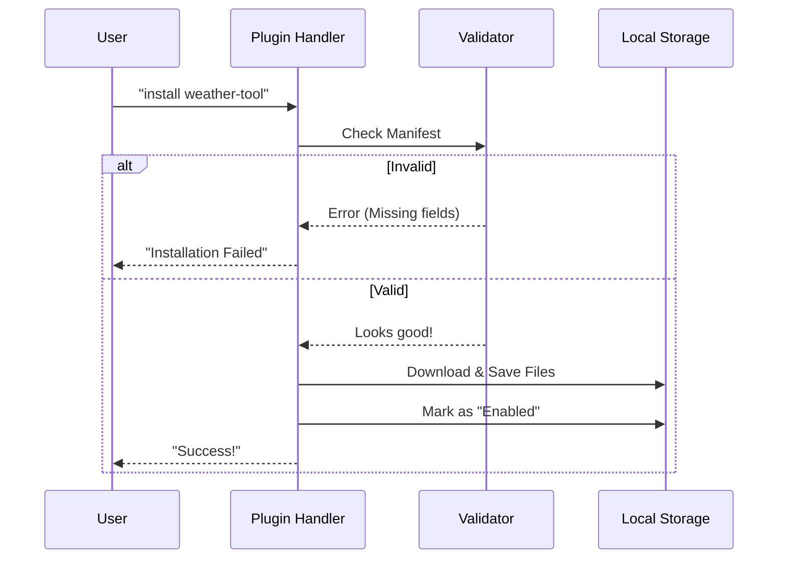

# Chapter 6: Plugin Management

In the previous chapter, [CCR State Synchronization](05_ccr_state_synchronization.md), we built a reliable "highway" ensuring our connection to the AI remains stable and synchronized.

Now that we have a stable connection, we want to make the AI more useful. A basic AI is like a fresh smartphone: it has a great operating system, but it becomes truly powerful when you install **Apps**.

In this project, these apps are called **Plugins**.

## Motivation: The App Store Logic

Imagine you want the AI to interact with your specific database or control your smart home lights. The AI model (in the cloud) doesn't know how to talk to your local lightbulbs natively.

We need a way to:
1.  **Find** a tool (Plugin) that knows how to talk to lightbulbs.
2.  **Install** it safely on your computer.
3.  **Enable** the AI to use it.

The **Plugin Management** system handles this lifecycle. It acts exactly like an "App Store" and "Package Manager" for the CLI.

## Key Concept 1: The Marketplace

Before we can install anything, we need to know where to look. We call these sources **Marketplaces**.

A Marketplace can be:
- A **GitHub Repository** (e.g., `owner/cool-plugins`).
- A **Local Directory** (e.g., `./my-plugins`).

### Adding a Source

The handler `marketplaceAddHandler` takes a user's input (like a URL) and registers it as a valid source of plugins.

```typescript
// handlers/plugins.ts (Simplified)

export async function marketplaceAddHandler(source: string, options: any) {
  // 1. Parse the input (is it a URL? a path?)
  const parsed = await parseMarketplaceInput(source);
  
  // 2. Add it to the system and download the catalog
  const { name } = await addMarketplaceSource(parsed, (msg) => console.log(msg));

  // 3. Save this choice to the user's settings
  saveMarketplaceToSettings(name, { source: parsed }, 'user');
  
  console.log(`Successfully added marketplace: ${name}`);
}
```
*Explanation:* The code figures out if you gave it a GitHub link or a local folder. It then downloads the "catalog" (list of available plugins) and saves this source so it remembers it next time you restart.

## Key Concept 2: Installation and Validation

When you run `claude plugin install <name>`, the CLI doesn't just blindly download files. It performs a safety check called **Validation**.

Plugins are defined by a `manifest` (usually a JSON file) that describes what the plugin does.

### The Installation Flow



### The Code: Installing

The `pluginInstallHandler` coordinates this process.

```typescript
// handlers/plugins.ts (Simplified)

export async function pluginInstallHandler(plugin: string, options: any) {
  // 1. Determine where to install (User vs Project scope)
  const scope = options.scope || 'user';

  // 2. Log analytics (tracking popularity of plugins)
  logEvent('tengu_plugin_install_command', { 
    scope: scope 
  });

  // 3. Trigger the heavy lifting
  await installPlugin(plugin, scope);
}
```
*Explanation:* The handler is lightweight. It checks your preferences (Scope) and then delegates the complex work to `installPlugin`. This keeps the command-line interface responsive and clean.

## Key Concept 3: Scopes (Who can use this?)

Not all plugins should be available everywhere.
- **User Scope:** Available to *you* in every folder (e.g., a Calculator).
- **Project Scope:** Available only in *this specific project* (e.g., a specific database tool for a work project).

This logic is enforced during commands like `enable`, `disable`, and `install`.

```typescript
// handlers/plugins.ts (Simplified Logic)

export async function pluginDisableHandler(plugin: string, options: any) {
  // Check if the user wants to disable EVERYTHING
  if (options.all) {
    await disableAllPlugins();
    return;
  }

  // Otherwise, disable just the specific plugin
  await disablePlugin(plugin, options.scope || 'user');
}
```
*Explanation:* The system allows granular control. You can turn off a plugin globally (`disableAllPlugins`) if you suspect a bug, or just remove it from your current user profile.

## Key Concept 4: Listing and Status

How do you know what is installed? The `plugin list` command merges data from two sources:
1.  **Disk:** What files physically exist?
2.  **Memory:** What is currently loaded and running?

This is crucial because a plugin might be *installed* but *crashed*.

```typescript
// handlers/plugins.ts (Simplified)

export async function pluginListHandler(options: any) {
  // 1. Get list of what is physically on disk
  const installedData = loadInstalledPluginsV2();
  
  // 2. Get list of what is actually running (or failed to load)
  const { enabled, errors } = await loadAllPlugins();

  // 3. Print the status for each
  for (const pluginId of Object.keys(installedData.plugins)) {
    console.log(`Plugin: ${pluginId}`);
    // Check if it has errors
    const hasError = errors.find(e => e.source === pluginId);
    console.log(`Status: ${hasError ? 'Failed' : 'Active'}`);
  }
}
```
*Explanation:* This handler is a "dashboard." It cross-references the list of files on your hard drive with the live status of the application to tell you if your plugins are healthy.

## Putting it together: The User Journey

1.  **Add Marketplace:** `claude marketplace add owner/repo`
    *   *Result:* The CLI knows where to look for tools.
2.  **List Available:** `claude plugin list --available`
    *   *Result:* You see a list of tools you can download.
3.  **Install:** `claude plugin install weather-tool`
    *   *Result:* The code is downloaded, validated, and saved to your `user` scope.
4.  **Use:** The AI (connected via [Remote I/O Bridge](01_remote_i_o_bridge.md)) can now "see" this tool and uses it to answer questions about the weather.

## Conclusion

**Plugin Management** turns the CLI from a simple chat interface into an extensible platform. It handles the logistics of finding, checking, and loading external code safely.

But wait—what exactly *is* the code inside a plugin? How does the plugin define "I can check the weather" in a way the AI understands?

Most plugins in this ecosystem use a standard called **MCP (Model Context Protocol)**.

[Next Chapter: MCP Integration](07_mcp_integration.md)

---

Generated by [Code IQ](https://github.com/adityasoni99/Code-IQ)